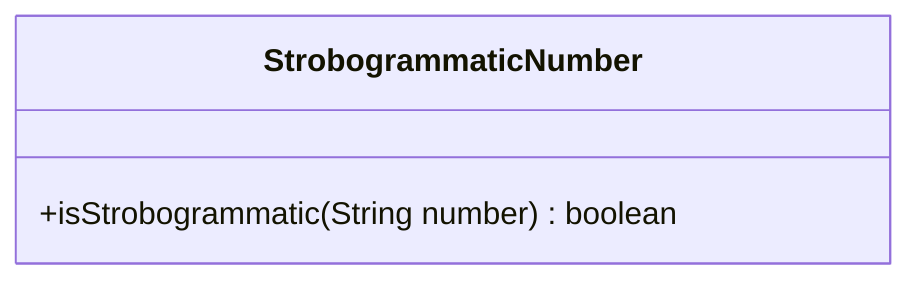
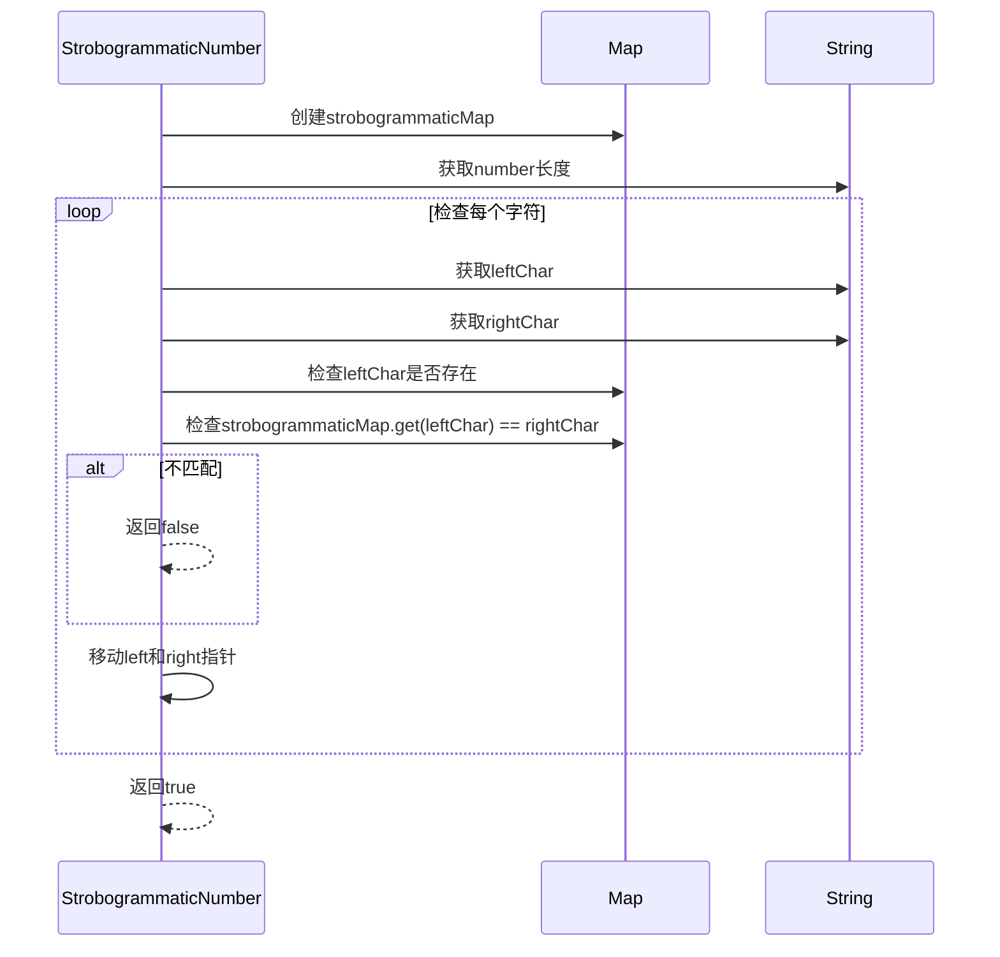
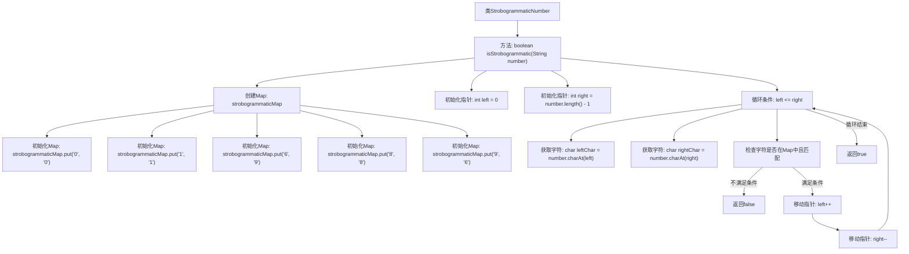

# 基础信息

|      |      |
|------|------|
| 名称 | StrobogrammaticNumber |
| 编码语言 | .java |
| 代码路径 | Java/src/main/java/com/thealgorithms/maths/StrobogrammaticNumber.java |
| 包名 | com.thealgorithms.maths |
| 依赖项 | ['java.util.HashMap', 'java.util.Map'] |
| 概述说明 | 验证数字对称性并检查字符映射关系。 |

# 说明

该描述涉及检查一个数字是否为对称数字，即该数字在前后读取时字符顺序一致。同时，使用映射表来验证字符之间的对应关系，确保每个字符在对称位置上有正确的匹配。这一过程主要关注数字的对称性和字符的对应性，以确保数字在结构上完全对称。

# 类列表 Class Summary

| 名称   | 类型  | 说明 |
|-------|------|-------------|
| StrobogrammaticNumber | class | 检查数字是否为对称数字，使用映射表验证字符对应关系。 |

## 类 StrobogrammaticNumber

|      |      |
|------|------|
| 访问范围 | public |
| 类型 | class |
| 名称 | StrobogrammaticNumber |
| 说明 | 检查数字是否为对称数字，使用映射表验证字符对应关系。 |

### UML类图

这段代码定义了一个`StrobogrammaticNumber`类，其中包含一个`isStrobogrammatic`方法，用于检查给定的字符串是否为“Strobogrammatic Number”（即旋转180度后仍然有效的数字）。该方法通过使用一个映射表来存储有效数字及其对应的旋转字符，并通过双指针法从字符串的两端向中间遍历，检查每对字符是否满足映射关系。如果所有字符对都满足条件，则返回`true`，否则返回`false`。

### 内部方法调用关系图

这段代码用于判断一个数字是否是“对称数”（Strobogrammatic Number），即该数字在旋转180度后仍然保持不变。代码通过一个Map来存储数字字符及其对应的旋转字符，然后使用双指针从字符串的两端向中间遍历，检查每个字符是否在Map中且与其对应的字符匹配。如果所有字符都匹配，则返回true，否则返回false。

### 字段列表 Field List

| 名称  | 类型  | 说明 |
|-------|-------|------|

### 方法列表 Method List

| 名称  | 类型  | 说明 |
|-------|-------|------|
| isStrobogrammatic | boolean | 检查数字是否为旋转对称数，使用映射表验证字符对。 |

