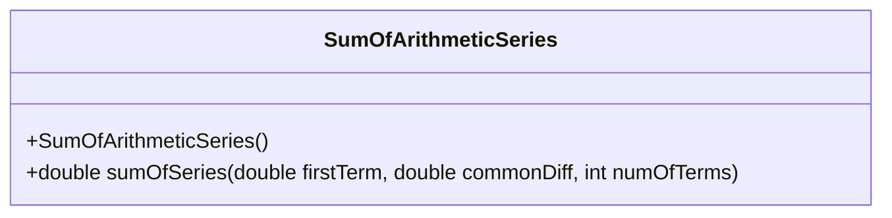
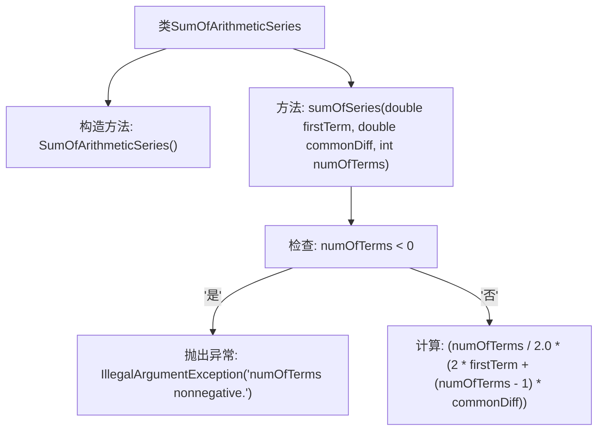

# 基础信息

|      |      |
|------|------|
| 名称 | SumOfArithmeticSeries |
| 编码语言 | .java |
| 代码路径 | Java/src/main/java/com/thealgorithms/maths/SumOfArithmeticSeries.java |
| 包名 | com.thealgorithms.maths |
| 依赖项 | [] |
| 概述说明 | SumOfArithmeticSeries类用于计算等差数列和，参数为首项、公差和项数。 |

# 说明

SumOfArithmeticSeries类设计用于计算等差数列的和。该类包含一个方法，通过接收等差数列的首项、公差和项数作为参数，执行计算并返回等差数列的和。该方法能够准确处理等差数列的求和问题，适用于需要计算等差数列总和的场景。

# 类列表 Class Summary

| 名称   | 类型  | 说明 |
|-------|------|-------------|
| SumOfArithmeticSeries | class | SumOfArithmeticSeries类提供计算等差数列和的方法，参数为首项、公差和项数。 |

## 类 SumOfArithmeticSeries

|      |      |
|------|------|
| 访问范围 | public final |
| 类型 | class |
| 名称 | SumOfArithmeticSeries |
| 说明 | SumOfArithmeticSeries类提供计算等差数列和的方法，参数为首项、公差和项数。 |

### UML类图

这段代码定义了一个名为 `SumOfArithmeticSeries` 的类，该类包含一个私有的构造函数和一个公有的静态方法 `sumOfSeries`。`sumOfSeries` 方法用于计算等差数列的和，接受三个参数：首项 `firstTerm`、公差 `commonDiff` 和项数 `numOfTerms`。如果项数为负数，方法会抛出 `IllegalArgumentException` 异常。类图展示了类的结构及其公有方法，强调了类的不可实例化特性（通过私有构造函数实现）。

### 内部方法调用关系图

这段代码定义了一个名为 `SumOfArithmeticSeries` 的类，其中包含一个静态方法 `sumOfSeries`，用于计算等差数列的和。方法首先检查 `numOfTerms` 是否为负数，如果是则抛出 `IllegalArgumentException` 异常；否则，按照等差数列的求和公式计算结果并返回。流程图清晰地展示了类的结构、方法的调用流程以及异常处理的逻辑。

### 字段列表 Field List

| 名称  | 类型  | 说明 |
|-------|-------|------|

### 方法列表 Method List

| 名称  | 类型  | 说明 |
|-------|-------|------|
| sumOfSeries | double | 计算等差数列和的静态方法，需首项、公差和项数，项数为负时抛出异常。 |

