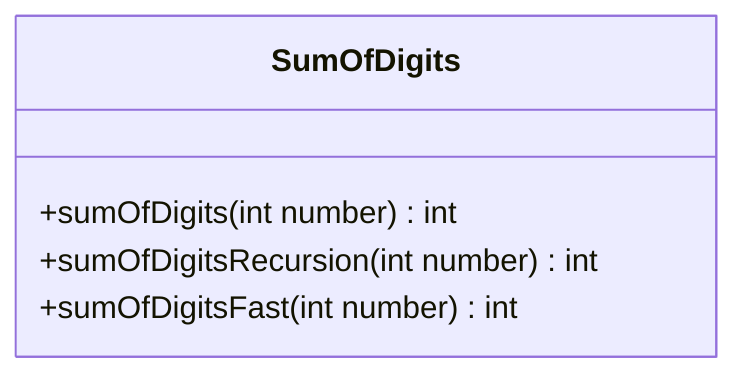
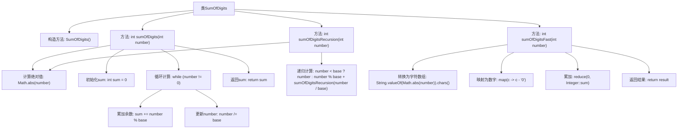

# 基础信息

|      |      |
|------|------|
| 名称 | SumOfDigits |
| 编码语言 | .java |
| 代码路径 | Java/src/main/java/com/thealgorithms/maths/SumOfDigits.java |
| 包名 | com.thealgorithms.maths |
| 依赖项 | [] |
| 概述说明 | SumOfDigits类提供三种计算数字各位之和的方法：循环、递归和字符数组法。 |

# 说明

SumOfDigits类提供了三种计算数字各位之和的方法：循环法、递归法和字符数组法。循环法通过迭代数字的每一位进行累加；递归法通过不断分解数字并调用自身实现求和；字符数组法将数字转换为字符数组后逐字符转换为数字并累加。这三种方法各有特点，适用于不同场景，用户可根据需求选择合适的方法进行计算。

# 类列表 Class Summary

| 名称   | 类型  | 说明 |
|-------|------|-------------|
| SumOfDigits | class | SumOfDigits类提供三种方法计算数字各位之和：循环、递归和字符数组法。 |

## 类 SumOfDigits

|      |      |
|------|------|
| 访问范围 | public final |
| 类型 | class |
| 名称 | SumOfDigits |
| 说明 | SumOfDigits类提供三种方法计算数字各位之和：循环、递归和字符数组法。 |

### UML类图

这段代码定义了一个名为 `SumOfDigits` 的类，该类包含三个静态方法，分别用于计算一个整数的各位数字之和。`sumOfDigits` 方法通过循环实现，`sumOfDigitsRecursion` 方法通过递归实现，而 `sumOfDigitsFast` 方法则通过将数字转换为字符数组并映射为数字来实现。这些方法都处理了负数的输入情况，确保计算的是数字的绝对值。类图展示了 `SumOfDigits` 类的结构，突出了其公有方法的功能和返回类型。

### 内部方法调用关系图

这段代码定义了一个名为`SumOfDigits`的类，其中包含三个静态方法，分别用于计算一个整数的各位数字之和。`sumOfDigits`方法通过循环实现，`sumOfDigitsRecursion`方法通过递归实现，`sumOfDigitsFast`方法通过将数字转换为字符数组并映射为数字后累加实现。每个方法都首先计算输入数字的绝对值，然后通过不同的方式计算各位数字之和并返回结果。

### 字段列表 Field List

| 名称  | 类型  | 说明 |
|-------|-------|------|

### 方法列表 Method List

| 名称  | 类型  | 说明 |
|-------|-------|------|
| sumOfDigits | int | 计算整数各位数字之和的方法。 |
| sumOfDigitsFast | int | 快速计算整数各位数字之和的方法。 |
| sumOfDigitsRecursion | int | 递归计算整数各位数字之和，取绝对值后逐位相加。 |

