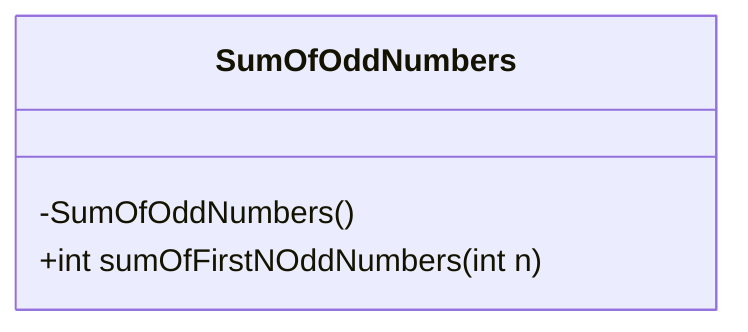
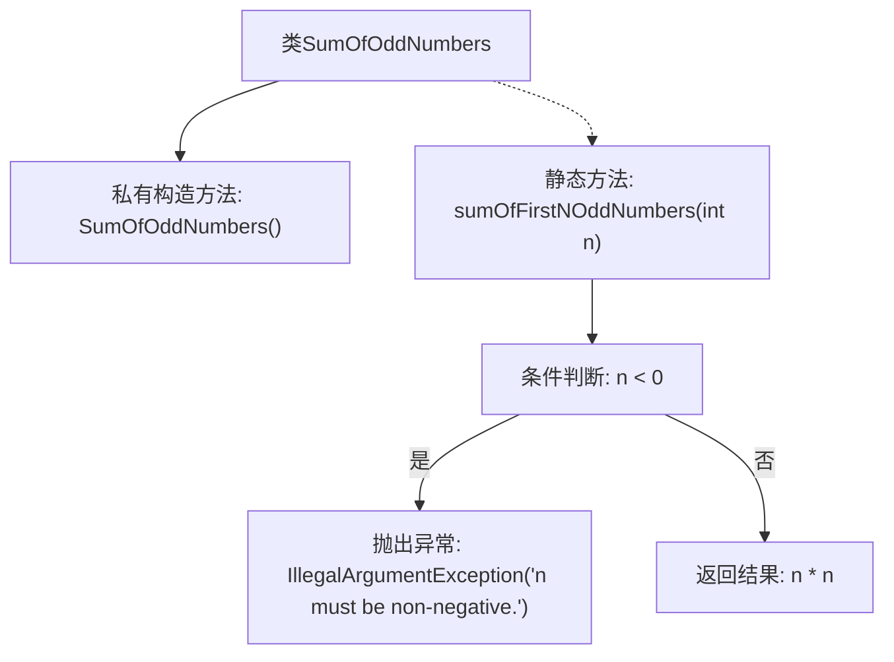

# 基础信息

|      |      |
|------|------|
| 名称 | SumOfOddNumbers |
| 编码语言 | .java |
| 代码路径 | Java/src/main/java/com/thealgorithms/maths/SumOfOddNumbers.java |
| 包名 | com.thealgorithms.maths |
| 依赖项 | [] |
| 概述说明 | SumOfOddNumbers类提供静态方法，计算前n个奇数和，返回n的平方。 |

# 说明

SumOfOddNumbers类包含一个静态方法sumOfFirstNOddNumbers，用于计算前n个奇数的和。该方法接受一个整数n作为参数，并返回n的平方作为结果。通过调用该方法，可以快速得到前n个奇数的总和，无需手动逐个计算。这一方法简化了奇数求和的流程，提高了计算效率。

# 类列表 Class Summary

| 名称   | 类型  | 说明 |
|-------|------|-------------|
| SumOfOddNumbers | class | SumOfOddNumbers类提供静态方法sumOfFirstNOddNumbers，计算前n个奇数和，返回n的平方。 |

## 类 SumOfOddNumbers

|      |      |
|------|------|
| 访问范围 | public final |
| 类型 | class |
| 名称 | SumOfOddNumbers |
| 说明 | SumOfOddNumbers类提供静态方法sumOfFirstNOddNumbers，计算前n个奇数和，返回n的平方。 |

### UML类图

这段代码定义了一个名为 `SumOfOddNumbers` 的类，该类包含一个私有的构造方法和一个公有的静态方法 `sumOfFirstNOddNumbers`。该方法用于计算前 `n` 个奇数的和，并在 `n` 为负数时抛出 `IllegalArgumentException` 异常。类图展示了 `SumOfOddNumbers` 类的结构，包括其私有构造方法和公有静态方法。该类是一个工具类，主要用于提供数学计算功能。

### 内部方法调用关系图

该流程图展示了`SumOfOddNumbers`类的结构及其核心方法`sumOfFirstNOddNumbers`的执行流程。首先，类包含一个私有构造方法，防止外部实例化。`sumOfFirstNOddNumbers`方法接收一个整数参数`n`，首先检查`n`是否为负数，如果是则抛出异常；否则返回`n`的平方作为前`n`个奇数的和。流程图清晰地描述了方法的分支逻辑和返回路径。

### 字段列表 Field List

| 名称  | 类型  | 说明 |
|-------|-------|------|

### 方法列表 Method List

| 名称  | 类型  | 说明 |
|-------|-------|------|
| sumOfFirstNOddNumbers | int | 计算前n个奇数和，若n为负则抛出异常。 |

