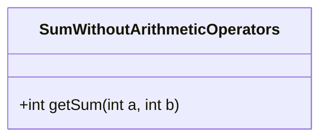
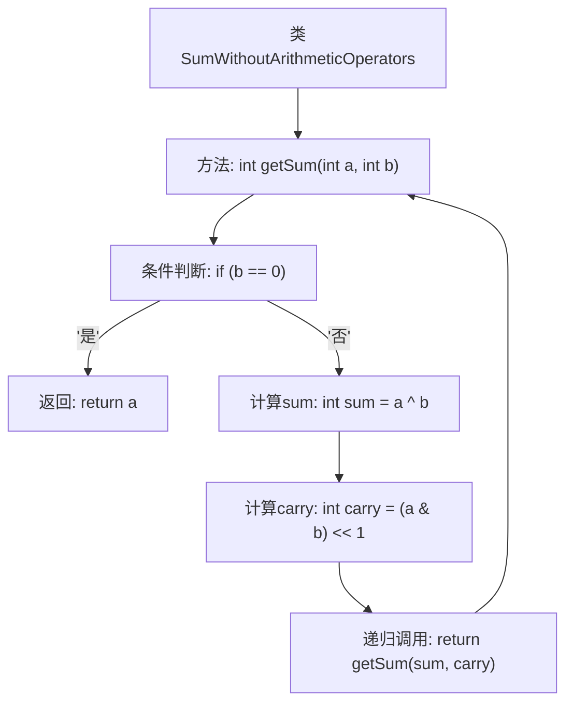

# 基础信息

|      |      |
|------|------|
| 名称 | SumWithoutArithmeticOperators |
| 编码语言 | .java |
| 代码路径 | Java/src/main/java/com/thealgorithms/maths/SumWithoutArithmeticOperators.java |
| 包名 | com.thealgorithms.maths |
| 依赖项 | [] |
| 概述说明 | 递归方法无需算术运算符实现两数相加。 |

# 说明

该方法通过递归实现两数之和的计算，而不使用任何算术运算符。具体步骤是：首先，利用位运算中的异或操作来模拟两数相加的结果，但不考虑进位。然后，通过位运算中的与操作和左移操作来计算进位值。接着，将这两个结果作为新的输入，继续递归调用该方法，直到进位值为零。最终，当进位值为零时，返回异或操作的结果，即为两数之和。该方法巧妙地利用位运算避免了直接使用算术运算符，实现了两数相加的功能。

# 类列表 Class Summary

| 名称   | 类型  | 说明 |
|-------|------|-------------|
| SumWithoutArithmeticOperators | class | 不使用算术运算符计算两数之和的递归方法。 |

## 类 SumWithoutArithmeticOperators

|      |      |
|------|------|
| 访问范围 | public |
| 类型 | class |
| 名称 | SumWithoutArithmeticOperators |
| 说明 | 不使用算术运算符计算两数之和的递归方法。 |

### UML类图

这段代码定义了一个名为 `SumWithoutArithmeticOperators` 的类，其中包含一个公有方法 `getSum`，用于计算两个整数的和，但不使用任何算术运算符（如 `+`, `-`, `*`, `/`）。该方法通过位操作实现加法，具体来说，使用异或运算（`^`）计算无进位的和，使用与运算（`&`）和左移运算（`<<`）计算进位，然后递归调用自身，直到进位为0。这种方法适用于32位无符号整数，展示了位操作在算法中的巧妙应用。

### 内部方法调用关系图

这段代码实现了一个不使用算术运算符（+、-、*、/）来计算两个整数之和的方法。通过位运算和递归调用，代码首先计算两个数的异或值作为部分和，然后计算它们的与操作并左移一位作为进位。如果进位为0，则返回部分和；否则，递归调用该方法，直到进位为0。流程图展示了方法的执行流程和递归调用关系。

### 字段列表 Field List

| 名称  | 类型  | 说明 |
|-------|-------|------|

### 方法列表 Method List

| 名称  | 类型  | 说明 |
|-------|-------|------|
| getSum | int | 该方法通过位运算实现两数相加，递归处理进位直至无进位。 |

