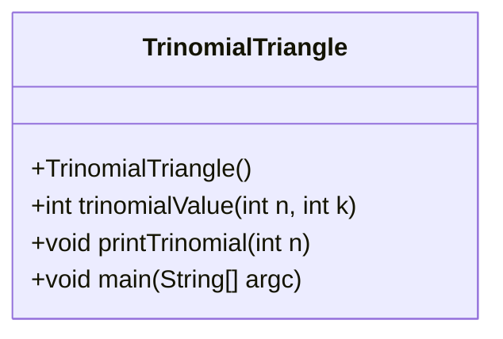
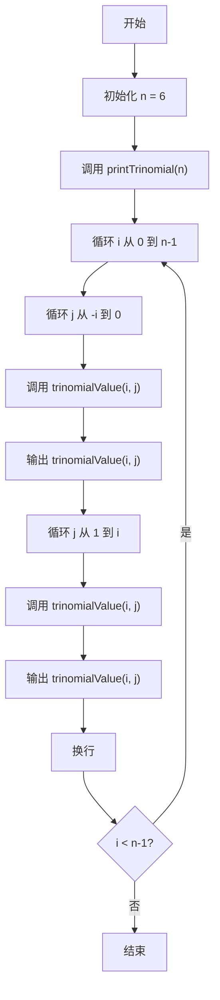
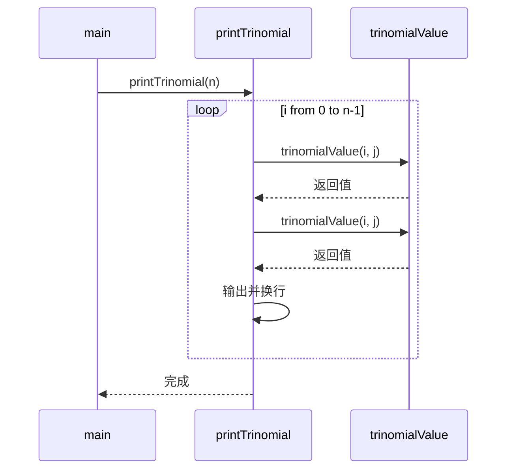
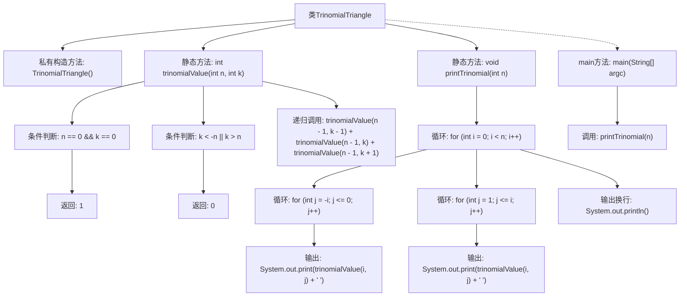

# 基础信息

|      |      |
|------|------|
| 名称 | TrinomialTriangle |
| 编码语言 | .java |
| 代码路径 | Java/src/main/java/com/thealgorithms/maths/TrinomialTriangle.java |
| 包名 | com.thealgorithms.maths |
| 依赖项 | [] |
| 概述说明 | TrinomialTriangle类实现三项式三角形计算与打印。 |

# 说明

TrinomialTriangle类专门用于计算和打印三项式三角形。该类通过实现核心算法，能够高效生成三项式三角形的各项数值，并提供了打印功能，以便用户能够直观地查看三角形的结构。该类的设计旨在简化三项式三角形的生成和展示过程，适用于需要此类计算的数学和编程场景。

# 类列表 Class Summary

| 名称   | 类型  | 说明 |
|-------|------|-------------|
| TrinomialTriangle | class | TrinomialTriangle类实现三项式三角形计算与打印功能。 |

## 类 TrinomialTriangle

|      |      |
|------|------|
| 访问范围 | public final |
| 类型 | class |
| 名称 | TrinomialTriangle |
| 说明 | TrinomialTriangle类实现三项式三角形计算与打印功能。 |

### UML类图

**描述**：`TrinomialTriangle` 类包含三个方法：`trinomialValue` 用于计算三项式系数，`printTrinomial` 用于打印三项式三角形，`main` 方法用于启动程序。流程图展示了程序的执行顺序，时序图展示了方法之间的调用关系。

### 内部方法调用关系图

这段代码定义了一个名为`TrinomialTriangle`的类，该类包含一个私有的构造方法和三个静态方法。`trinomialValue`方法用于计算三叉树的值，`printTrinomial`方法用于打印三叉树的结构，`main`方法则调用`printTrinomial`方法来展示结果。代码通过递归和循环实现了三叉树的计算和打印功能。

### 字段列表 Field List

| 名称  | 类型  | 说明 |
|-------|-------|------|

### 方法列表 Method List

| 名称  | 类型  | 说明 |
|-------|-------|------|
| printTrinomial | void | 打印三叉树数值，按行输出。 |
| trinomialValue | int | 递归计算三项式系数，边界条件返回1或0。 |
| main | void | Java主方法调用打印三项式函数，参数n为6。 |

