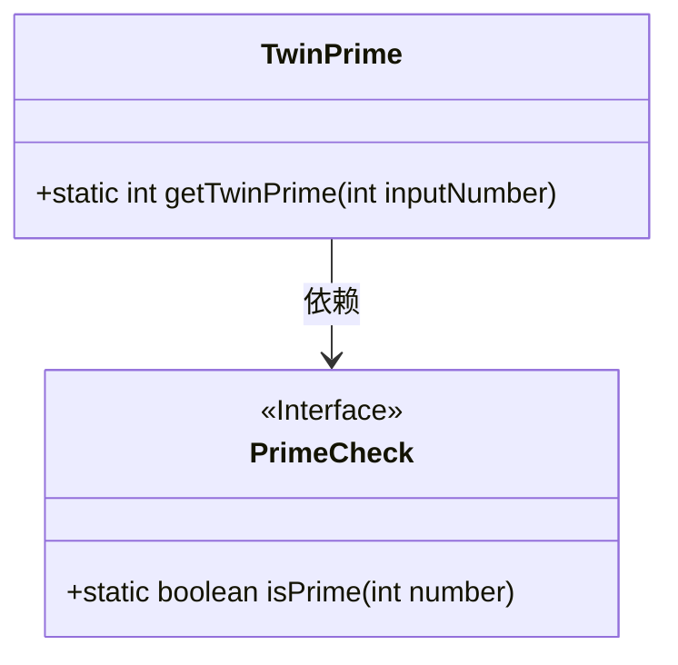
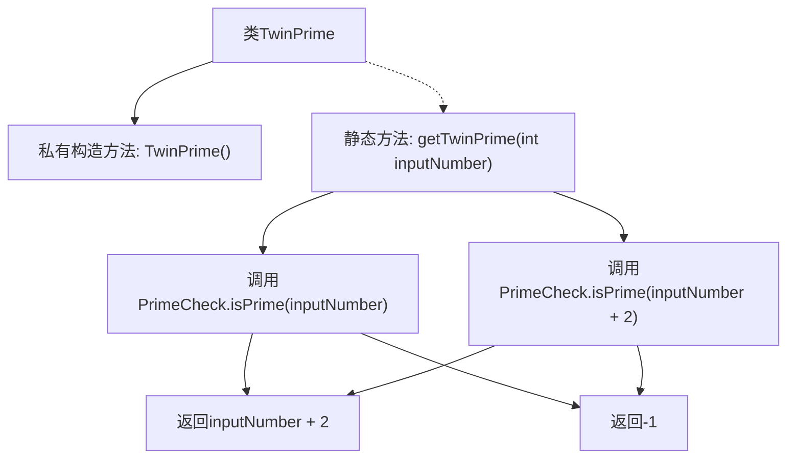

# 基础信息

|      |      |
|------|------|
| 名称 | TwinPrime |
| 编码语言 | .java |
| 代码路径 | Java/src/main/java/com/thealgorithms/maths/TwinPrime.java |
| 包名 | com.thealgorithms.maths |
| 依赖项 | ['com.thealgorithms.maths.Prime.PrimeCheck'] |
| 概述说明 | TwinPrime类通过检查输入数及其加2是否为素数，返回加2或-1。 |

# 说明

TwinPrime类包含一个用于获取孪生素数的方法。该方法接受一个输入数，检查该数及其加2后的数是否均为素数。如果两者都是素数，则返回加2后的数；如果不符合条件，则返回-1。该方法主要用于判断和获取与输入数相关的孪生素数。

# 类列表 Class Summary

| 名称   | 类型  | 说明 |
|-------|------|-------------|
| TwinPrime | class | TwinPrime类提供获取孪生素数的方法，若输入数及其加2均为素数则返回加2，否则返回-1。 |

## 类 TwinPrime

|      |      |
|------|------|
| 访问范围 | public final |
| 类型 | class |
| 名称 | TwinPrime |
| 说明 | TwinPrime类提供获取孪生素数的方法，若输入数及其加2均为素数则返回加2，否则返回-1。 |

### UML类图

这段代码定义了一个名为 `TwinPrime` 的类，其中包含一个静态方法 `getTwinPrime`，用于查找给定整数的孪生素数。该方法依赖于 `PrimeCheck` 接口中的 `isPrime` 方法来检查一个数是否为素数。如果输入的整数及其加2的数都是素数，则返回加2的数，否则返回-1。类图展示了 `TwinPrime` 类与 `PrimeCheck` 接口之间的依赖关系。

### 内部方法调用关系图

这段代码定义了一个名为`TwinPrime`的类，该类包含一个私有构造方法和一个静态方法`getTwinPrime`。`getTwinPrime`方法接受一个整数参数`inputNumber`，并通过调用`PrimeCheck.isPrime`方法检查`inputNumber`和`inputNumber + 2`是否都是质数。如果两者都是质数，则返回`inputNumber + 2`；否则返回`-1`。流程图展示了方法的调用逻辑和返回路径。

### 字段列表 Field List

| 名称  | 类型  | 说明 |
|-------|-------|------|

### 方法列表 Method List

| 名称  | 类型  | 说明 |
|-------|-------|------|
| getTwinPrime | int | 函数返回输入数的孪生素数，若无则返回-1。 |

