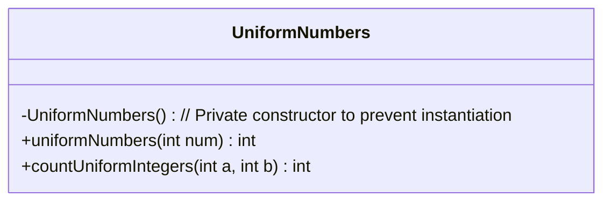
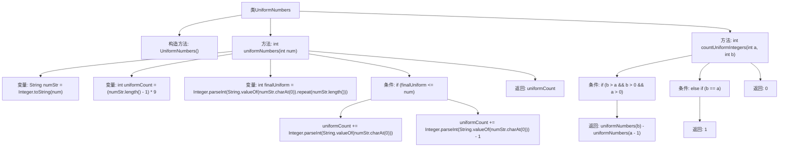

# 基础信息

|      |      |
|------|------|
| 名称 | UniformNumbers |
| 编码语言 | .java |
| 代码路径 | Java/src/main/java/com/thealgorithms/maths/UniformNumbers.java |
| 包名 | com.thealgorithms.maths |
| 依赖项 | [] |
| 概述说明 | UniformNumbers类计算1到num间均匀数，并统计a到b范围内的均匀数。 |

# 说明

UniformNumbers类的主要功能是计算从1到指定数字num之间的均匀数，并提供在给定范围a到b内的均匀数计数。均匀数是指在一定范围内均匀分布的数。该类通过计算和统计，帮助用户了解在特定区间内均匀数的分布情况，从而为相关分析或应用提供数据支持。

# 类列表 Class Summary

| 名称   | 类型  | 说明 |
|-------|------|-------------|
| UniformNumbers | class | UniformNumbers类用于计算1到num之间的均匀数，并提供范围a到b的均匀数计数。 |

## 类 UniformNumbers

|      |      |
|------|------|
| 访问范围 | public final |
| 类型 | class |
| 名称 | UniformNumbers |
| 说明 | UniformNumbers类用于计算1到num之间的均匀数，并提供范围a到b的均匀数计数。 |

### UML类图

**描述：**  
`UniformNumbers` 是一个工具类，提供了两个静态方法：`uniformNumbers` 和 `countUniformIntegers`。`uniformNumbers` 方法用于计算从1到给定数字之间的均匀数的数量，均匀数是指所有位数相同的数字。`countUniformIntegers` 方法用于计算在给定范围内的均匀数的数量。类通过私有构造函数防止实例化，确保其作为工具类的使用方式。

### 内部方法调用关系图

这段代码定义了一个`UniformNumbers`类，包含两个静态方法：`uniformNumbers`和`countUniformIntegers`。`uniformNumbers`方法计算从1到给定数字`num`之间的均匀数（即所有数字相同的数）的个数。`countUniformIntegers`方法计算在给定范围`[a, b]`内的均匀数的个数。代码通过将数字转换为字符串并分析其长度和首字符来实现这些计算。流程图展示了方法的调用顺序和条件判断的逻辑流程。

### 字段列表 Field List

| 名称  | 类型  | 说明 |
|-------|-------|------|

### 方法列表 Method List

| 名称  | 类型  | 说明 |
|-------|-------|------|
| uniformNumbers | int | 计算小于等于给定数字的均匀数字数量。 |
| countUniformIntegers | int | 计算区间[a,b]内各位数字相同的整数个数。 |

