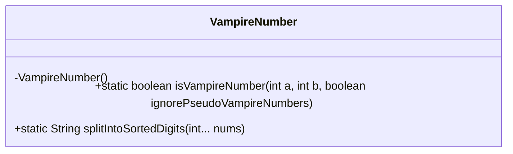
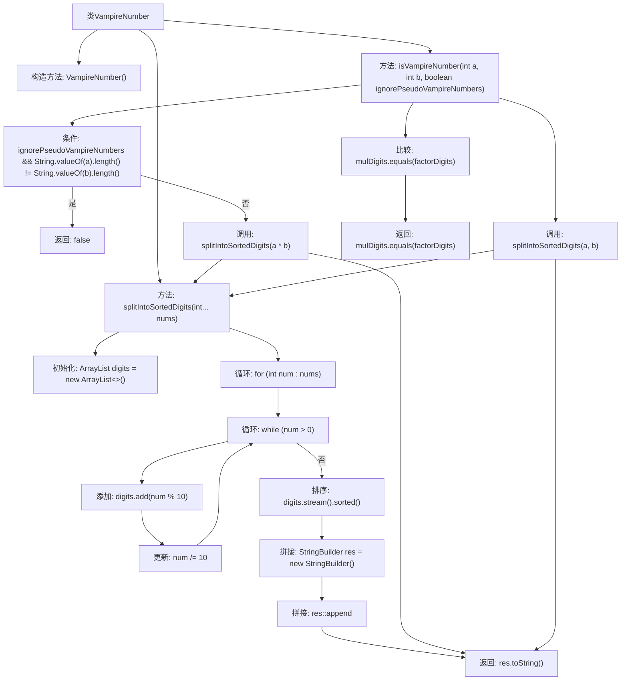

# 基础信息

|      |      |
|------|------|
| 名称 | VampireNumber |
| 编码语言 | .java |
| 代码路径 | Java/src/main/java/com/thealgorithms/maths/VampireNumber.java |
| 包名 | com.thealgorithms.maths |
| 依赖项 | ['java.util.ArrayList'] |
| 概述说明 | VampireNumber类用于判断两数是否为吸血鬼数，并可忽略伪吸血鬼数。 |

# 说明

VampireNumber类用于判断两个数字是否为吸血鬼数，并支持忽略伪吸血鬼数。吸血鬼数是指一个偶数位数的数字，可以分解为两个相同位数的因子，且这两个因子包含原始数字的所有数字，但不包含多余的数字。该类的功能包括验证输入数字是否符合吸血鬼数的定义，并提供选项以排除伪吸血鬼数，确保判断的准确性。

# 类列表 Class Summary

| 名称   | 类型  | 说明 |
|-------|------|-------------|
| VampireNumber | class | VampireNumber类判断两数是否为吸血鬼数，支持忽略伪吸血鬼数。 |

## 类 VampireNumber

|      |      |
|------|------|
| 访问范围 | public final |
| 类型 | class |
| 名称 | VampireNumber |
| 说明 | VampireNumber类判断两数是否为吸血鬼数，支持忽略伪吸血鬼数。 |

### UML类图

这段代码定义了一个名为 `VampireNumber` 的类，该类包含两个静态方法：`isVampireNumber` 和 `splitIntoSortedDigits`。`isVampireNumber` 方法用于判断两个整数是否构成吸血鬼数，`splitIntoSortedDigits` 方法用于将多个整数拆分为数字并按升序排序。`VampireNumber` 类的构造函数被私有化，禁止实例化该类。该类的主要功能是通过比较两个数的乘积与它们的数字组合来判断是否为吸血鬼数，并支持忽略伪吸血鬼数的选项。

### 内部方法调用关系图

这段代码定义了一个`VampireNumber`类，包含两个静态方法：`isVampireNumber`和`splitIntoSortedDigits`。`isVampireNumber`方法用于判断两个整数的乘积是否是一个吸血鬼数，而`splitIntoSortedDigits`方法则将多个整数的数字拆分并排序后拼接成字符串。流程图展示了方法之间的调用关系和逻辑判断过程。

### 字段列表 Field List

| 名称  | 类型  | 说明 |
|-------|-------|------|

### 方法列表 Method List

| 名称  | 类型  | 说明 |
|-------|-------|------|
| isVampireNumber | boolean | 判断两数是否为吸血鬼数，忽略伪吸血鬼数。 |
| splitIntoSortedDigits | String | 方法将整数拆分为数字并排序后拼接成字符串。 |

