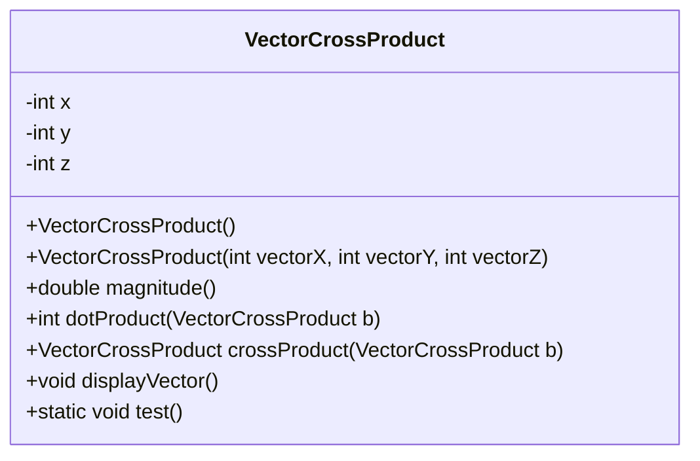
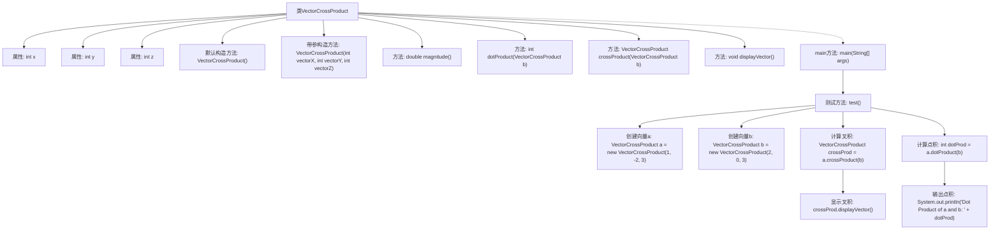

# 基础信息

|      |      |
|------|------|
| 名称 | VectorCrossProduct |
| 编码语言 | .java |
| 代码路径 | Java/src/main/java/com/thealgorithms/maths/VectorCrossProduct.java |
| 包名 | com.thealgorithms.maths |
| 依赖项 | [] |
| 概述说明 | 向量叉积类：含构造函数，计算大小、点积、叉积，显示向量。 |

# 说明

向量叉积类提供了默认构造函数和带参构造函数，用于初始化向量对象。该类包含计算向量大小的功能，能够返回向量的模长。此外，该类还支持计算两个向量的点积和叉积，点积用于衡量向量的相似度，叉积用于生成垂直于两个向量的新向量。最后，该类提供了显示向量的功能，能够输出向量的各个分量值。通过这些功能，该类实现了向量的基本运算和展示。

# 类列表 Class Summary

| 名称   | 类型  | 说明 |
|-------|------|-------------|
| VectorCrossProduct | class | 向量叉积类，包含默认和带参构造函数，计算向量大小、点积和叉积，并显示向量。 |

## 类 VectorCrossProduct

|      |      |
|------|------|
| 访问范围 | public |
| 类型 | class |
| 名称 | VectorCrossProduct |
| 说明 | 向量叉积类，包含默认和带参构造函数，计算向量大小、点积和叉积，并显示向量。 |

### UML类图

这段代码定义了一个 `VectorCrossProduct` 类，用于表示三维向量，并提供了向量的基本操作。类中包含三个私有成员变量 `x`、`y` 和 `z`，分别表示向量的三个方向分量。类提供了两个构造函数，一个默认构造函数将向量初始化为零向量，另一个构造函数允许用户指定向量的方向分量。类中还提供了计算向量模长的方法 `magnitude`、计算两个向量点积的方法 `dotProduct`、计算两个向量叉积的方法 `crossProduct`，以及显示向量内容的方法 `displayVector`。最后，类中包含一个静态方法 `test`，用于测试向量的叉积和点积计算功能。

### 内部方法调用关系图

这段代码定义了一个`VectorCrossProduct`类，用于表示三维向量，并提供了计算向量大小、点积和叉积的功能。代码通过默认构造方法和带参构造方法初始化向量，并通过`magnitude`、`dotProduct`和`crossProduct`方法进行向量运算。`test`方法演示了如何创建两个向量并计算它们的叉积和点积，最后输出结果。流程图展示了类的结构和方法调用关系，帮助理解代码的执行流程。

### 字段列表 Field List

| 名称  | 类型  | 说明 |
|-------|-------|------|
| x | int | 声明一个整型变量x。 |
| z | int | 定义整型变量z。 |
| y | int | 定义了一个整型变量y。 |

### 方法列表 Method List

| 名称  | 类型  | 说明 |
|-------|-------|------|
| displayVector | void | 显示向量坐标x、y、z的值。 |
| main | void | Java主方法调用test函数。 |
| magnitude | double | 计算三维向量的模长。 |
| crossProduct | VectorCrossProduct | 计算两个向量的叉积并返回结果向量。 |
| dotProduct | int | 计算两个向量的点积。 |
| test | void | 创建两个向量，计算叉积并显示，计算点积并输出。 |

