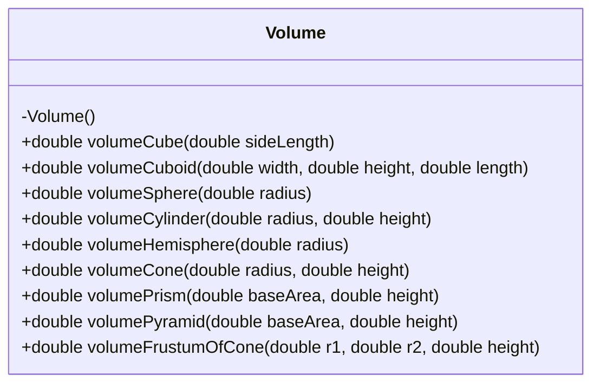
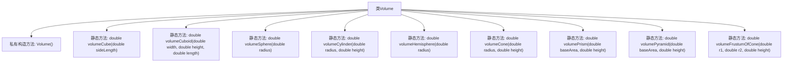

# 基础信息

|      |      |
|------|------|
| 名称 | Volume |
| 编码语言 | .java |
| 代码路径 | Java/src/main/java/com/thealgorithms/maths/Volume.java |
| 包名 | com.thealgorithms.maths |
| 依赖项 | [] |
| 概述说明 | Volume类提供多种几何体体积计算的静态方法。 |

# 说明

Volume类包含多个静态方法，用于计算不同几何体的体积。这些几何体包括立方体、长方体、球体、圆柱体、半球体、圆锥体、棱柱、棱锥和圆台。每个方法专门针对一种几何形状，提供精确的体积计算结果。

# 类列表 Class Summary

| 名称   | 类型  | 说明 |
|-------|------|-------------|
| Volume | class | Volume类提供计算立方体、长方体、球体、圆柱体、半球体、圆锥体、棱柱、棱锥和圆台体积的静态方法。 |

## 类 Volume

|      |      |
|------|------|
| 访问范围 | public final |
| 类型 | class |
| 名称 | Volume |
| 说明 | Volume类提供计算立方体、长方体、球体、圆柱体、半球体、圆锥体、棱柱、棱锥和圆台体积的静态方法。 |

### UML类图

这段代码定义了一个名为 `Volume` 的类，该类包含多个静态方法，用于计算不同几何体的体积。这些方法包括计算立方体、长方体、球体、圆柱体、半球体、圆锥体、棱柱体、棱锥体以及圆锥台（截头圆锥）的体积。每个方法都接受相应的几何参数（如边长、半径、高度等），并返回计算出的体积值。由于 `Volume` 类的构造函数是私有的，因此该类不能被实例化，只能通过类名直接调用其静态方法。

### 内部方法调用关系图

这段代码定义了一个名为 `Volume` 的类，该类包含多个静态方法，用于计算不同几何体的体积。每个方法都接收特定的参数并返回计算得到的体积值。类中的构造方法被私有化，防止外部实例化该类。所有方法都是静态的，可以直接通过类名调用，无需创建类的实例。

### 字段列表 Field List

| 名称  | 类型  | 说明 |
|-------|-------|------|

### 方法列表 Method List

| 名称  | 类型  | 说明 |
|-------|-------|------|
| volumePrism | double | 计算棱柱体积方法，输入底面积和高，返回底面积乘以高。 |
| volumeHemisphere | double | 计算半球体积的方法，输入半径，返回体积值。 |
| volumeCuboid | double | 计算长方体体积的静态方法，参数为宽、高、长。 |
| volumeSphere | double | 计算球体体积的静态方法，输入半径，返回体积。 |
| volumeCone | double | 计算圆锥体积的静态方法，输入半径和高度，返回体积值。 |
| volumeFrustumOfCone | double | 计算圆台体积的静态方法，参数为上下半径和高度。 |
| volumePyramid | double | 计算金字塔体积的方法，参数为底面积和高度，返回体积值。 |
| volumeCube | double | 计算立方体体积的方法，输入边长返回体积。 |
| volumeCylinder | double | 计算圆柱体积的静态方法，参数为半径和高度。 |

