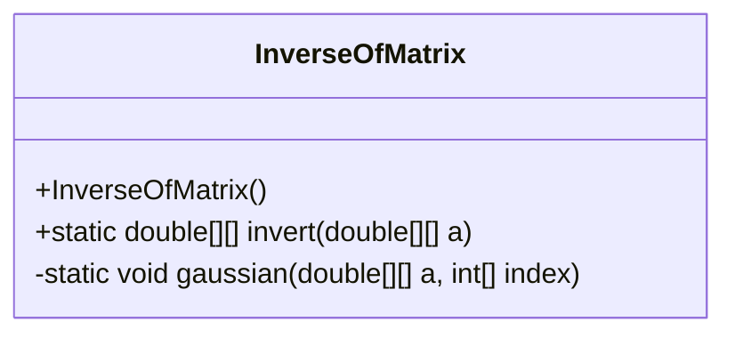
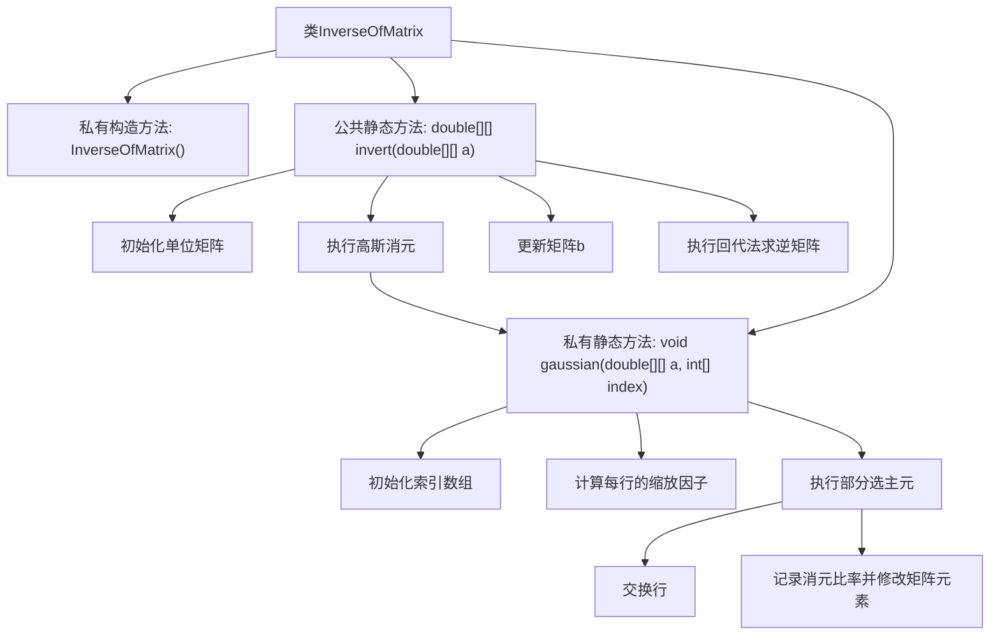

# 基础信息

|      |      |
|------|------|
| 名称 | InverseOfMatrix |
| 编码语言 | .java |
| 代码路径 | Java/src/main/java/com/thealgorithms/matrix/InverseOfMatrix.java |
| 包名 | com.thealgorithms.matrix |
| 依赖项 | [] |
| 概述说明 | 该类通过高斯消元法和回代法实现矩阵求逆。 |

# 说明

该内容描述了一个用于实现矩阵求逆的类，其核心算法基于高斯消元法和回代法。高斯消元法通过将矩阵转换为上三角矩阵来简化计算，而回代法则用于从上三角矩阵逐步求解逆矩阵。这种方法确保了计算的准确性和效率，适用于处理各种规模的矩阵求逆问题。

# 类列表 Class Summary

| 名称   | 类型  | 说明 |
|-------|------|-------------|
| InverseOfMatrix | class | 实现矩阵求逆的类，使用高斯消元法和回代法计算逆矩阵。 |

## 类 InverseOfMatrix

|      |      |
|------|------|
| 访问范围 | public final |
| 类型 | class |
| 名称 | InverseOfMatrix |
| 说明 | 实现矩阵求逆的类，使用高斯消元法和回代法计算逆矩阵。 |

### UML类图

**类图描述：**  
`InverseOfMatrix` 类是一个工具类，用于计算矩阵的逆矩阵。它包含一个私有的构造函数，防止实例化。类中提供了两个静态方法：`invert` 用于计算给定矩阵的逆矩阵，`gaussian` 用于执行部分主元高斯消元法。`invert` 方法依赖于 `gaussian` 方法来完成矩阵的逆运算。

### 内部方法调用关系图

这段代码实现了矩阵的逆矩阵计算。`InverseOfMatrix`类包含一个私有构造方法和两个静态方法。`invert`方法通过初始化单位矩阵、执行高斯消元、更新矩阵和回代法来计算逆矩阵。`gaussian`方法负责执行部分选主元的高斯消元，包括初始化索引数组、计算缩放因子、交换行以及记录消元比率并修改矩阵元素。整个过程通过多个步骤逐步完成矩阵的逆运算。

### 字段列表 Field List

| 名称  | 类型  | 说明 |
|-------|-------|------|

### 方法列表 Method List

| 名称  | 类型  | 说明 |
|-------|-------|------|
| invert | double[][] | 该方法通过高斯消元和回代计算矩阵的逆矩阵。 |
| gaussian | void | 高斯消元法实现矩阵行交换与消元。 |

