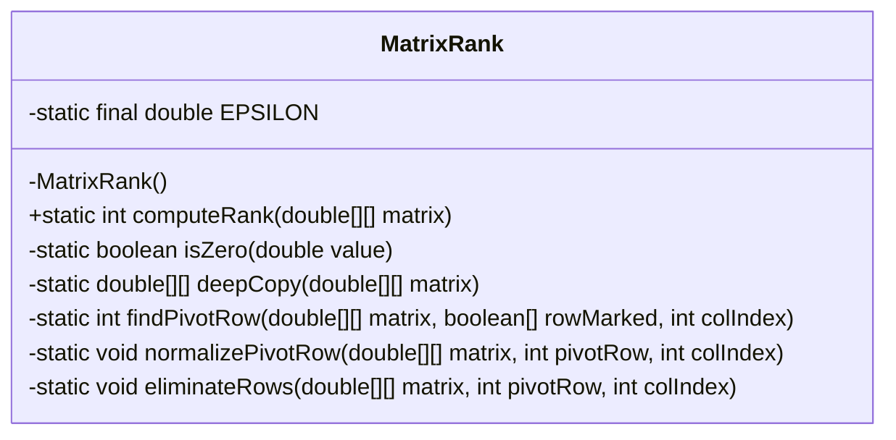
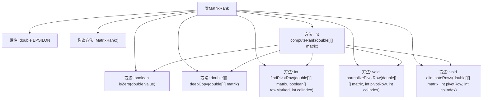

# 基础信息

|      |      |
|------|------|
| 名称 | MatrixRank |
| 编码语言 | .java |
| 代码路径 | Java/src/main/java/com/thealgorithms/matrix/MatrixRank.java |
| 包名 | com.thealgorithms.matrix |
| 依赖项 | ['com.thealgorithms.matrix.utils.MatrixUtil.validateInputMatrix'] |
| 概述说明 | MatrixRank类通过行阶梯形变换计算矩阵秩。 |

# 说明

MatrixRank类的主要功能是计算矩阵的秩，其实现方法是通过行阶梯形变换来完成。行阶梯形变换是一种将矩阵转换为特定形式的过程，便于确定矩阵的秩。该类的设计旨在提供一种有效且准确的方式来计算矩阵的秩，适用于各种需要矩阵秩计算的场景。

# 类列表 Class Summary

| 名称   | 类型  | 说明 |
|-------|------|-------------|
| MatrixRank | class | MatrixRank类用于计算矩阵的秩，通过行阶梯形变换实现。 |

## 类 MatrixRank

|      |      |
|------|------|
| 访问范围 | public final |
| 类型 | class |
| 名称 | MatrixRank |
| 说明 | MatrixRank类用于计算矩阵的秩，通过行阶梯形变换实现。 |

### UML类图

**描述：**  
`MatrixRank` 类是一个用于计算矩阵秩的工具类。它包含一个私有的构造方法以防止实例化，并定义了一个常量 `EPSILON` 用于判断浮点数是否为零。`computeRank` 方法是该类的核心方法，用于计算输入矩阵的秩。类中还包含多个私有辅助方法，如 `isZero` 用于判断数值是否为零，`deepCopy` 用于深拷贝矩阵，`findPivotRow` 用于查找主元行，`normalizePivotRow` 用于归一化主元行，`eliminateRows` 用于消除其他行中的主元列元素。这些方法共同协作，通过高斯消元法将矩阵转换为行阶梯形，最终得到矩阵的秩。

### 内部方法调用关系图

该流程图展示了`MatrixRank`类的结构及其内部方法之间的调用关系。`MatrixRank`类包含一个常量`EPSILON`和一个私有构造方法，主要功能由`computeRank`方法实现，该方法通过调用`isZero`、`deepCopy`、`findPivotRow`、`normalizePivotRow`和`eliminateRows`等辅助方法，计算输入矩阵的秩。每个方法在流程图中都有明确的表示，并且方法之间的调用关系通过箭头清晰地展示出来。

### 字段列表 Field List

| 名称  | 类型  | 说明 |
|-------|-------|------|
| EPSILON = 1e-10 | double | 定义常量EPSILON，值为1e-10，用于精度控制。 |

### 方法列表 Method List

| 名称  | 类型  | 说明 |
|-------|-------|------|
| deepCopy | double[][] | 该方法用于深度复制二维双精度数组，返回新数组。 |
| normalizePivotRow | void | 归一化矩阵的指定行，使指定列的元素为1。 |
| findPivotRow | int | 查找矩阵中未标记行且列值非零的枢轴行。 |
| isZero | boolean | 判断浮点数是否为零，精度由EPSILON控制。 |
| eliminateRows | void | 消除矩阵中非主元行的相关列元素。 |
| computeRank | int | 计算矩阵秩的方法，验证输入，复制矩阵，查找主元，归一化并消元。 |

