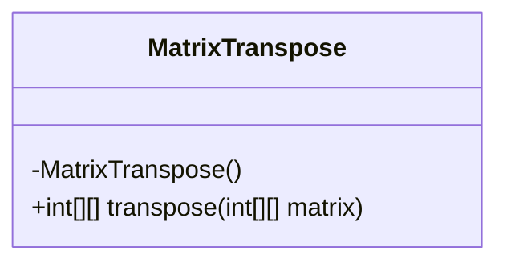
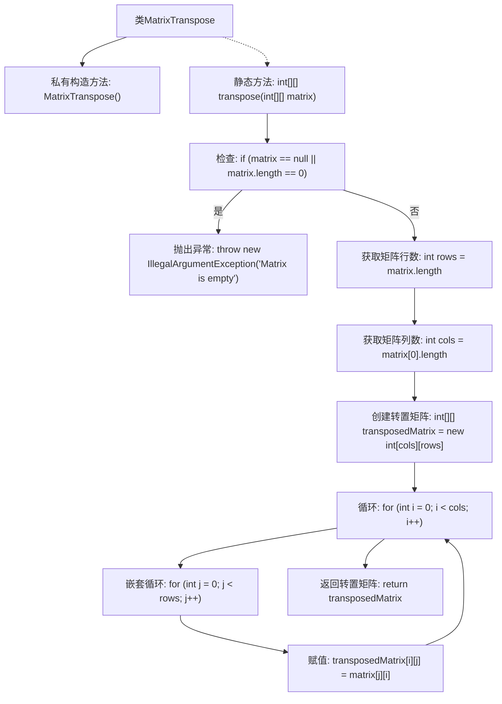

# 基础信息

|      |      |
|------|------|
| 名称 | MatrixTranspose |
| 编码语言 | .java |
| 代码路径 | Java/src/main/java/com/thealgorithms/matrix/MatrixTranspose.java |
| 包名 | com.thealgorithms.matrix |
| 依赖项 | [] |
| 概述说明 | 矩阵转置类，处理空矩阵和空指针异常。 |

# 说明

矩阵转置类主要用于计算给定矩阵的转置，确保能够正确处理空矩阵和空指针异常。该类的核心功能是将矩阵的行和列进行互换，生成新的转置矩阵。在处理过程中，系统会检查输入矩阵是否为空或指针是否为空，以避免程序崩溃或错误结果。通过异常处理机制，确保在异常情况下程序能够稳定运行，并提供相应的错误提示。该类设计旨在提高矩阵操作的可靠性和健壮性。

# 类列表 Class Summary

| 名称   | 类型  | 说明 |
|-------|------|-------------|
| MatrixTranspose | class | 矩阵转置类，计算给定矩阵的转置，处理空矩阵和空指针异常。 |

## 类 MatrixTranspose

|      |      |
|------|------|
| 访问范围 | public final |
| 类型 | class |
| 名称 | MatrixTranspose |
| 说明 | 矩阵转置类，计算给定矩阵的转置，处理空矩阵和空指针异常。 |

### UML类图

这段代码定义了一个名为 `MatrixTranspose` 的类，该类包含一个私有的构造函数和一个公有的静态方法 `transpose`。`transpose` 方法接受一个二维整数数组作为参数，并返回其转置矩阵。如果输入的矩阵为空或为 `null`，方法会抛出 `IllegalArgumentException` 异常。该方法通过双重循环遍历输入矩阵，并将其转置到新的矩阵中。由于 `MatrixTranspose` 类的构造函数是私有的，因此该类不能被实例化，只能通过静态方法 `transpose` 来使用其功能。

### 内部方法调用关系图

这段代码定义了一个名为 `MatrixTranspose` 的类，其中包含一个静态方法 `transpose`，用于计算给定矩阵的转置。方法首先检查矩阵是否为空或为 `null`，如果是则抛出异常。然后，它获取矩阵的行数和列数，并创建一个新的矩阵来存储转置结果。通过双重循环，将原矩阵的元素按转置规则赋值到新矩阵中，最后返回转置后的矩阵。

### 字段列表 Field List

| 名称  | 类型  | 说明 |
|-------|-------|------|

### 方法列表 Method List

| 名称  | 类型  | 说明 |
|-------|-------|------|
| transpose | int[][] | 该方法实现矩阵转置，若矩阵为空则抛出异常。 |

