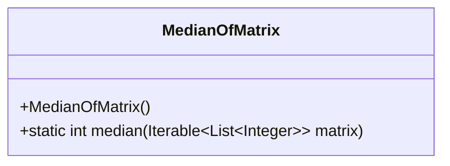
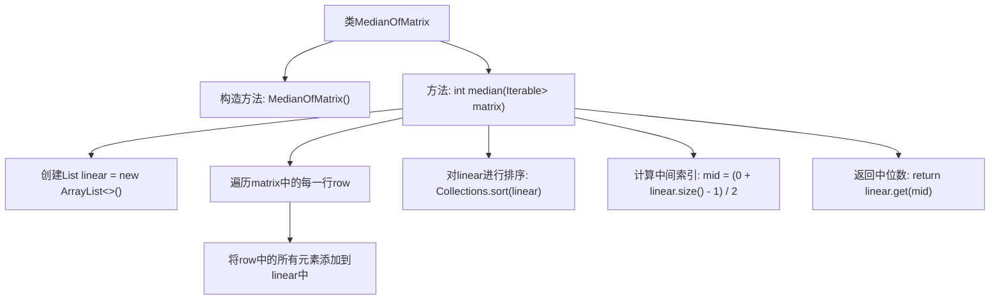

# 基础信息

|      |      |
|------|------|
| 名称 | MedianOfMatrix |
| 编码语言 | .java |
| 代码路径 | Java/src/main/java/com/thealgorithms/matrix/MedianOfMatrix.java |
| 包名 | com.thealgorithms.matrix |
| 依赖项 | ['java.util.ArrayList', 'java.util.Collections', 'java.util.List'] |
| 概述说明 | MedianOfMatrix类通过展平和排序二维矩阵计算中位数。 |

# 说明

`MedianOfMatrix`类用于计算二维矩阵的中位数。其实现方法是将矩阵展平为一维数组，对该数组进行排序，然后返回排序后数组的中间值作为中位数。该方法通过简单的步骤确保了中位数的准确计算。

# 类列表 Class Summary

| 名称   | 类型  | 说明 |
|-------|------|-------------|
| MedianOfMatrix | class | `MedianOfMatrix`类计算二维矩阵的中位数，通过展平、排序并返回中间值实现。 |

## 类 MedianOfMatrix

|      |      |
|------|------|
| 访问范围 | public final |
| 类型 | class |
| 名称 | MedianOfMatrix |
| 说明 | `MedianOfMatrix`类计算二维矩阵的中位数，通过展平、排序并返回中间值实现。 |

### UML类图

**描述：**
`MedianOfMatrix` 是一个工具类，用于计算二维矩阵的中位数。该类包含一个私有构造函数，防止实例化，以及一个静态方法 `median`，该方法接受一个 `Iterable<List<Integer>>` 类型的矩阵作为参数。该方法首先将矩阵展平为一维列表，然后对列表进行排序，最后返回排序后列表的中位数。由于 `median` 方法是静态的，因此可以直接通过类名调用，而无需创建类的实例。

### 内部方法调用关系图

这段代码定义了一个名为`MedianOfMatrix`的类，其中包含一个静态方法`median`，用于计算二维矩阵的中位数。首先，代码将二维矩阵展平为一维列表，然后对该列表进行排序，最后通过计算中间索引来返回中位数。流程图展示了从矩阵展平到排序再到返回中位数的完整过程。

### 字段列表 Field List

| 名称  | 类型  | 说明 |
|-------|-------|------|

### 方法列表 Method List

| 名称  | 类型  | 说明 |
|-------|-------|------|
| median | int | 将二维列表展平为一维，排序后返回中位数。 |

