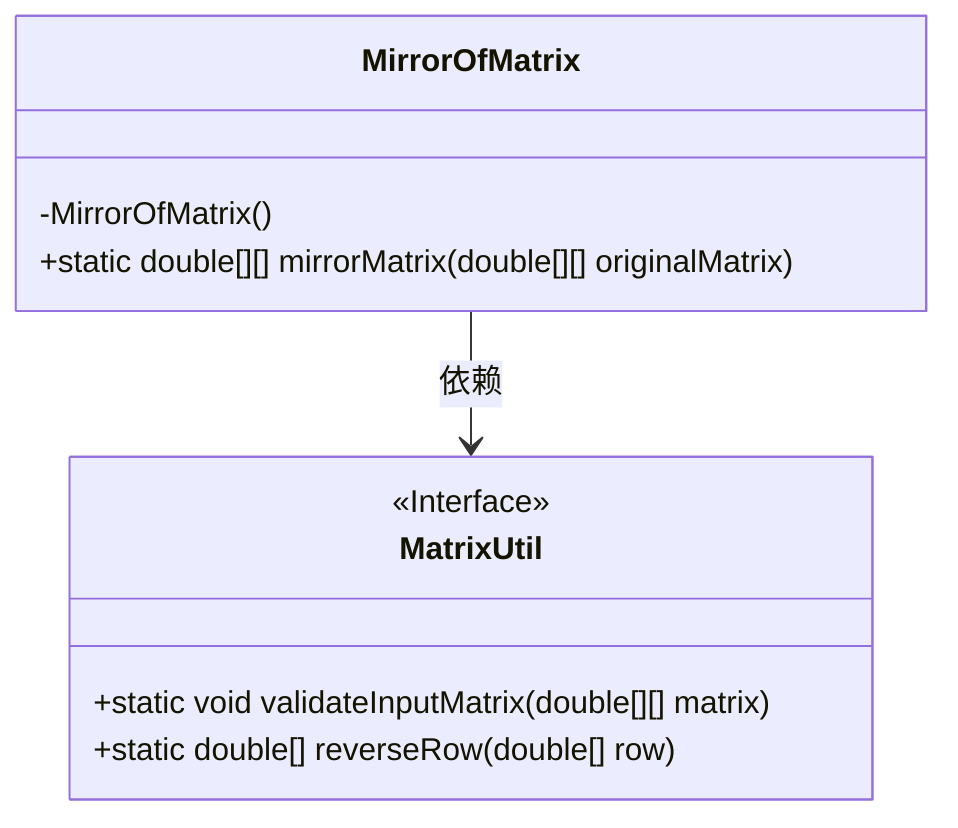
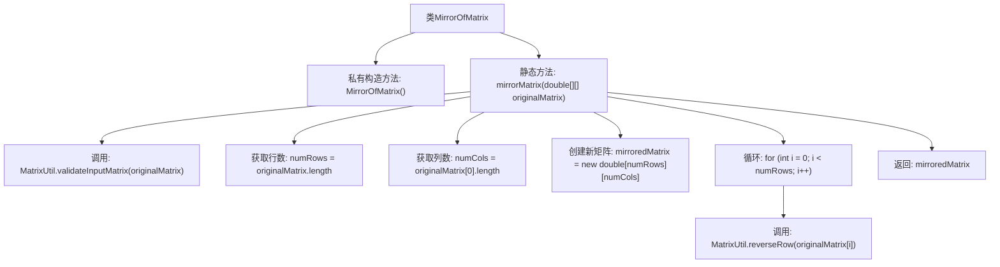

# 基础信息

|      |      |
|------|------|
| 名称 | MirrorOfMatrix |
| 编码语言 | .java |
| 代码路径 | Java/src/main/java/com/thealgorithms/matrix/MirrorOfMatrix.java |
| 包名 | com.thealgorithms.matrix |
| 依赖项 | ['com.thealgorithms.matrix.utils.MatrixUtil'] |
| 概述说明 | MirrorOfMatrix类提供mirrorMatrix方法生成矩阵镜像。 |

# 说明

MirrorOfMatrix类包含一个静态方法mirrorMatrix，该方法用于生成输入矩阵的镜像矩阵。该方法接收一个矩阵作为输入，并返回其镜像版本。镜像矩阵的生成过程涉及将矩阵的行或列进行反转，具体取决于镜像的方向。该方法不涉及具体的实现代码，仅提供了功能描述。

# 类列表 Class Summary

| 名称   | 类型  | 说明 |
|-------|------|-------------|
| MirrorOfMatrix | class | MirrorOfMatrix类提供静态方法mirrorMatrix，用于生成输入矩阵的镜像矩阵。 |

## 类 MirrorOfMatrix

|      |      |
|------|------|
| 访问范围 | public final |
| 类型 | class |
| 名称 | MirrorOfMatrix |
| 说明 | MirrorOfMatrix类提供静态方法mirrorMatrix，用于生成输入矩阵的镜像矩阵。 |

### UML类图

这段代码定义了一个 `MirrorOfMatrix` 类，该类包含一个私有构造函数和一个静态方法 `mirrorMatrix`，用于生成输入矩阵的镜像矩阵。`MirrorOfMatrix` 类依赖于 `MatrixUtil` 接口，该接口提供了验证输入矩阵和反转行的方法。`mirrorMatrix` 方法首先验证输入矩阵的有效性，然后逐行反转矩阵中的每一行，最终返回镜像矩阵。

### 内部方法调用关系图

这段代码定义了一个名为`MirrorOfMatrix`的类，其中包含一个私有构造方法和一个静态方法`mirrorMatrix`。该方法首先验证输入矩阵的有效性，然后获取矩阵的行数和列数，创建一个新的矩阵，并通过循环调用`MatrixUtil.reverseRow`方法将每一行反转，最终返回镜像后的矩阵。流程图展示了方法的调用顺序和逻辑流程。

### 字段列表 Field List

| 名称  | 类型  | 说明 |
|-------|-------|------|

### 方法列表 Method List

| 名称  | 类型  | 说明 |
|-------|-------|------|
| mirrorMatrix | double[][] | 方法mirrorMatrix生成并返回输入矩阵的镜像矩阵。 |

