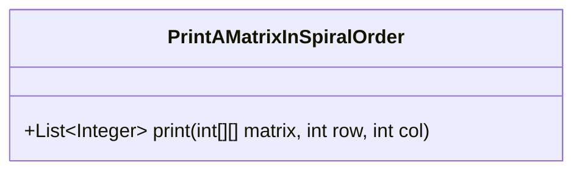
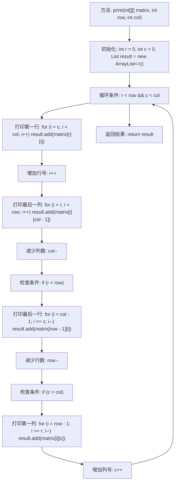

# 基础信息

|      |      |
|------|------|
| 名称 | PrintAMatrixInSpiralOrder |
| 编码语言 | .java |
| 代码路径 | Java/src/main/java/com/thealgorithms/matrix/PrintAMatrixInSpiralOrder.java |
| 包名 | com.thealgorithms.matrix |
| 依赖项 | ['java.util.ArrayList', 'java.util.List'] |
| 概述说明 | `PrintAMatrixInSpiralOrder`类实现螺旋顺序打印矩阵元素。 |

# 说明

类`PrintAMatrixInSpiralOrder`的主要功能是按照螺旋顺序打印矩阵中的元素。该类的实现逻辑通常涉及从矩阵的外层逐步向内层遍历，依次输出元素。具体步骤包括从左上角开始，先向右移动，到达边界后向下，再向左，最后向上，形成一个螺旋路径。这个过程会重复进行，直到所有元素都被访问并打印。该方法适用于任何二维矩阵，能够有效地按照螺旋顺序输出矩阵中的元素。

# 类列表 Class Summary

| 名称   | 类型  | 说明 |
|-------|------|-------------|
| PrintAMatrixInSpiralOrder | class | 类`PrintAMatrixInSpiralOrder`实现按螺旋顺序打印矩阵元素。 |

## 类 PrintAMatrixInSpiralOrder

|      |      |
|------|------|
| 访问范围 | public |
| 类型 | class |
| 名称 | PrintAMatrixInSpiralOrder |
| 说明 | 类`PrintAMatrixInSpiralOrder`实现按螺旋顺序打印矩阵元素。 |

### UML类图

这段代码定义了一个名为 `PrintAMatrixInSpiralOrder` 的类，其中包含一个公有方法 `print`。该方法接收一个二维整数数组 `matrix` 以及矩阵的行数 `row` 和列数 `col`，并返回一个按螺旋顺序遍历矩阵元素的整数列表。该方法通过四个循环分别处理矩阵的上行、右列、下行和左列，逐步缩小矩阵的边界，直到所有元素都被遍历并添加到结果列表中。这种螺旋遍历方式常用于处理二维数组的特定顺序访问需求。

### 内部方法调用关系图

这段代码实现了以螺旋顺序打印二维矩阵的功能。它通过初始化行和列的起始点，然后在循环中依次打印矩阵的第一行、最后一列、最后一行和第一列，并逐步缩小矩阵的边界。每次打印后，相应的行或列会被调整，直到所有元素都被遍历并添加到结果列表中。最终，返回包含螺旋顺序元素的列表。

### 字段列表 Field List

| 名称  | 类型  | 说明 |
|-------|-------|------|

### 方法列表 Method List

| 名称  | 类型  | 说明 |
|-------|-------|------|
| print | List<Integer> | 按螺旋顺序遍历二维矩阵并返回元素列表。 |

