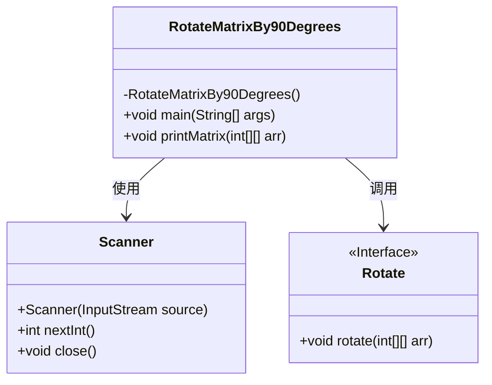
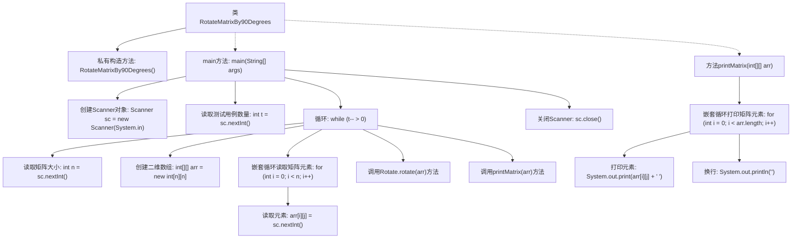
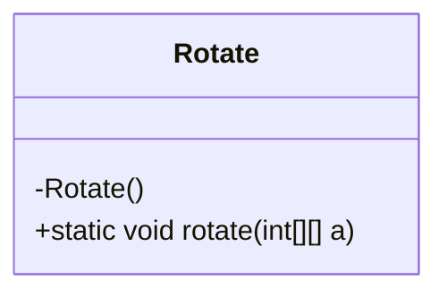
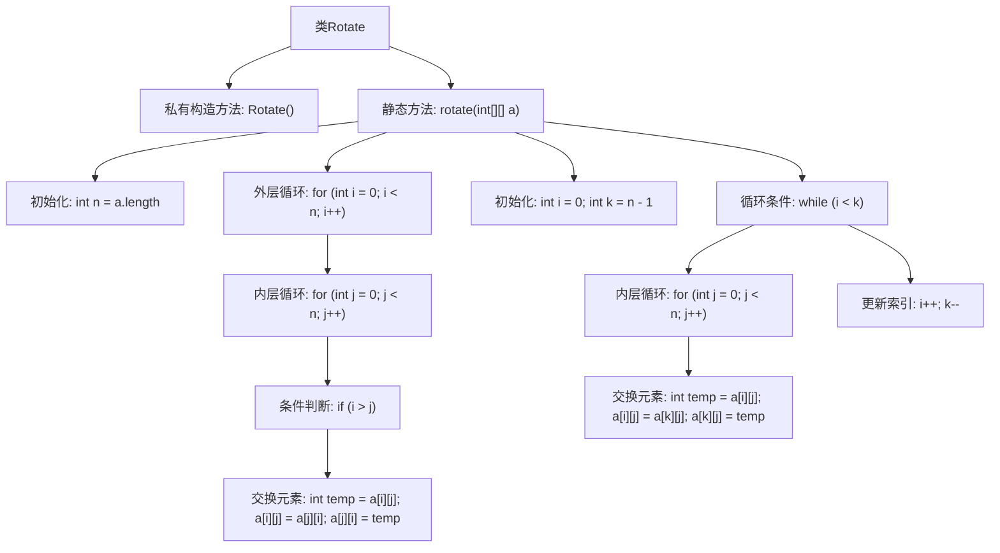

# 基础信息

|      |      |
|------|------|
| 名称 | RotateMatrixBy90Degrees |
| 编码语言 | .java |
| 代码路径 | Java/src/main/java/com/thealgorithms/matrix/RotateMatrixBy90Degrees.java |
| 包名 | com.thealgorithms.matrix |
| 依赖项 | ['java.util.Scanner'] |
| 概述说明 | Java程序实现二维数组顺时针旋转90度并打印结果。 |

# 说明

Java程序通过Rotate类实现二维数组的顺时针90度旋转，并打印旋转后的结果。该程序的核心功能是对给定的矩阵进行旋转操作，确保旋转后的矩阵能够正确显示。Rotate类负责处理旋转逻辑，通过调整数组元素的位置实现90度旋转。最终，程序会输出旋转后的矩阵，以验证旋转操作的正确性。

# 类列表 Class Summary

| 名称   | 类型  | 说明 |
|-------|------|-------------|
| RotateMatrixBy90Degrees | class | Java程序实现矩阵90度旋转并打印结果。 |
| Rotate | class | Rotate类实现二维数组顺时针旋转90度。 |

## 类 RotateMatrixBy90Degrees

|      |      |
|------|------|
| 访问范围 | final |
| 类型 | class |
| 名称 | RotateMatrixBy90Degrees |
| 说明 | Java程序实现矩阵90度旋转并打印结果。 |

### UML类图

### 描述
`RotateMatrixBy90Degrees` 类是一个用于旋转二维矩阵90度的工具类。它包含一个私有的构造方法，防止实例化，并提供了 `main` 方法作为程序的入口。`main` 方法通过 `Scanner` 类从用户输入中读取矩阵数据，并调用 `Rotate` 接口的 `rotate` 方法进行矩阵旋转。最后，使用 `printMatrix` 方法打印旋转后的矩阵。`Rotate` 接口定义了旋转矩阵的方法，具体的实现类未在代码中展示。

### 内部方法调用关系图

这段代码定义了一个名为 `RotateMatrixBy90Degrees` 的类，用于将输入的二维矩阵顺时针旋转90度并打印结果。代码首先读取测试用例的数量，然后依次处理每个测试用例，读取矩阵数据，调用 `Rotate.rotate` 方法进行旋转，最后通过 `printMatrix` 方法打印旋转后的矩阵。流程图展示了从输入读取到矩阵旋转和打印的完整流程。

### 字段列表 Field List

| 名称  | 类型  | 说明 |
|-------|-------|------|

### 方法列表 Method List

| 名称  | 类型  | 说明 |
|-------|-------|------|
| main | void | Java程序读取输入矩阵并调用旋转方法。 |
| printMatrix | void | 打印二维数组矩阵，每行元素以空格分隔。 |

## 类 Rotate

|      |      |
|------|------|
| 访问范围 | final |
| 类型 | class |
| 名称 | Rotate |
| 说明 | Rotate类实现二维数组顺时针旋转90度。 |

### UML类图

这段代码定义了一个名为 `Rotate` 的类，该类包含一个私有的构造函数和一个静态方法 `rotate`。`rotate` 方法接受一个二维整数数组 `a` 作为参数，并对其进行旋转操作。首先，它通过交换元素实现矩阵的转置，然后通过交换行来实现矩阵的顺时针旋转。最终，该方法将输入的二维数组旋转了90度。由于 `Rotate` 类的构造函数是私有的，因此该类不能被实例化，只能通过静态方法 `rotate` 来调用其功能。

### 内部方法调用关系图

这段代码定义了一个名为`Rotate`的类，其中包含一个私有构造方法和一个静态方法`rotate`。`rotate`方法接受一个二维整数数组`a`作为参数，首先通过双重循环交换矩阵的上三角和下三角元素，然后通过循环交换矩阵的上下行，最终实现矩阵的旋转。流程图清晰地展示了方法的执行步骤和逻辑结构。

### 字段列表 Field List

| 名称  | 类型  | 说明 |
|-------|-------|------|

### 方法列表 Method List

| 名称  | 类型  | 说明 |
|-------|-------|------|
| rotate | void | 该方法实现二维数组的顺时针旋转90度。 |

