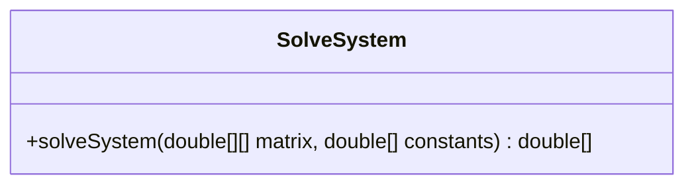
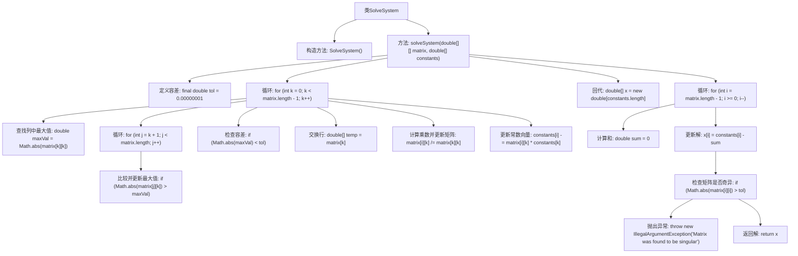

# 基础信息

|      |      |
|------|------|
| 名称 | SolveSystem |
| 编码语言 | .java |
| 代码路径 | Java/src/main/java/com/thealgorithms/matrix/SolveSystem.java |
| 包名 | com.thealgorithms.matrix |
| 依赖项 | [] |
| 概述说明 | 使用部分主元消元法解线性方程组Ax=b，优化内存占用。 |

# 说明

该方法用于解决线性方程组Ax=b，通过覆盖输入矩阵来节省内存空间。采用部分主元消元法，确保数值稳定性并减少计算误差。整个过程高效且节省资源，适用于大规模线性方程组的求解。

# 类列表 Class Summary

| 名称   | 类型  | 说明 |
|-------|------|-------------|
| SolveSystem | class | 解决线性方程组Ax=b，覆盖输入矩阵以节省内存，使用部分主元消元法。 |

## 类 SolveSystem

|      |      |
|------|------|
| 访问范围 | public final |
| 类型 | class |
| 名称 | SolveSystem |
| 说明 | 解决线性方程组Ax=b，覆盖输入矩阵以节省内存，使用部分主元消元法。 |

### UML类图

**描述：**  
`SolveSystem` 类是一个工具类，提供了一个静态方法 `solveSystem`，用于求解线性方程组 `Ax = b`。该方法通过高斯消元法实现，首先进行部分主元选择以避免零主元，然后进行前向消元和回代操作。该方法会覆盖输入的矩阵以节省内存，并在矩阵接近奇异时抛出异常。

### 内部方法调用关系图

这段代码实现了一个用于求解线性方程组的类 `SolveSystem`。通过高斯消元法，代码首先对矩阵进行行变换以避免零主元，然后通过回代法求解方程组的解。代码中包含了容差检查、行交换、乘数计算和回代等步骤，最终返回解向量。如果矩阵被发现是奇异的，代码会抛出异常。

### 字段列表 Field List

| 名称  | 类型  | 说明 |
|-------|-------|------|

### 方法列表 Method List

| 名称  | 类型  | 说明 |
|-------|-------|------|
| solveSystem | double[] | 该方法通过高斯消元法求解线性方程组，包含行交换和回代步骤，确保矩阵非奇异。 |

