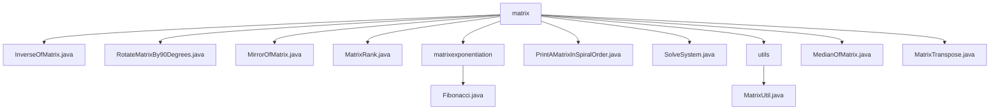

# 基础信息

|      |      |
|------|------|
| 名称 | matrix |
| 编码语言 | .java |
| 代码路径 | Java/src/main/java/com/thealgorithms/matrix |
| 包名 | Java.src.main.java.com.thealgorithms.matrix |
| 概述说明 | 矩阵操作类库，包含求逆、旋转、镜像、秩计算、斐波那契、螺旋打印、线性方程组求解、工具类、中位数计算和转置功能。 |

# 说明

## 概述
该代码模块是一个用于处理矩阵操作的Java工具集，提供了多种矩阵相关的算法和功能。模块的核心目标是通过高效且准确的方式执行各种矩阵操作，包括矩阵求逆、旋转、镜像、秩计算、转置、中位数计算、螺旋顺序打印、线性方程组求解以及矩阵的基本运算（加法、减法、乘法）等。这些功能广泛应用于数学计算、数据处理、图像处理等领域，能够满足不同场景下的矩阵操作需求。

## 主要业务场景
1. **矩阵求逆**：通过高斯消元法和回代法实现矩阵的逆矩阵计算，适用于需要求解逆矩阵的数学问题。
2. **矩阵旋转**：实现二维矩阵的顺时针90度旋转，适用于图像处理或矩阵变换场景。
3. **矩阵镜像**：生成矩阵的镜像版本，适用于需要对矩阵进行镜像操作的场景。
4. **矩阵秩计算**：通过行阶梯形变换计算矩阵的秩，适用于线性代数中的矩阵分析。
5. **矩阵幂运算**：利用矩阵幂运算高效计算斐波那契数列的第n项，适用于大规模数值计算。
6. **螺旋顺序打印矩阵**：按照螺旋顺序打印矩阵中的元素，适用于需要特定顺序遍历矩阵的场景。
7. **线性方程组求解**：通过部分主元消元法求解线性方程组，适用于大规模线性方程组的求解。
8. **矩阵基本运算**：支持矩阵的加法、减法、乘法运算，适用于常规的矩阵数学操作。
9. **矩阵中位数计算**：通过展平矩阵并排序计算中位数，适用于统计和数据分析。
10. **矩阵转置**：计算矩阵的转置，适用于需要行列互换的矩阵操作。

这些功能通过模块化的设计，提供了高效、稳定且易于使用的矩阵操作工具，能够满足多种复杂矩阵处理需求。

### 包内部结构视图

该流程图展示了`matrix`目录下的文件及子目录结构。`matrix`目录包含多个Java文件，如`InverseOfMatrix.java`和`RotateMatrixBy90Degrees.java`，以及两个子目录`matrixexponentiation`和`utils`。`matrixexponentiation`子目录中包含`Fibonacci.java`，而`utils`子目录中包含`MatrixUtil.java`。

# 文件列表 File List

| 名称   | 类型  | 说明 |
|-------|------|-------------|
| [MatrixRank.java](MatrixRank.md) | file | MatrixRank类通过行阶梯形变换计算矩阵秩。 |
| [InverseOfMatrix.java](InverseOfMatrix.md) | file | 该类通过高斯消元法和回代法实现矩阵求逆。 |
| [MatrixTranspose.java](MatrixTranspose.md) | file | 矩阵转置类，处理空矩阵和空指针异常。 |
| [SolveSystem.java](SolveSystem.md) | file | 使用部分主元消元法解线性方程组Ax=b，优化内存占用。 |
| [MedianOfMatrix.java](MedianOfMatrix.md) | file | MedianOfMatrix类通过展平和排序二维矩阵计算中位数。 |
| [PrintAMatrixInSpiralOrder.java](PrintAMatrixInSpiralOrder.md) | file | `PrintAMatrixInSpiralOrder`类实现螺旋顺序打印矩阵元素。 |
| [MirrorOfMatrix.java](MirrorOfMatrix.md) | file | MirrorOfMatrix类提供mirrorMatrix方法生成矩阵镜像。 |
| [RotateMatrixBy90Degrees.java](RotateMatrixBy90Degrees.md) | file | Java程序实现二维数组顺时针旋转90度并打印结果。 |
| [utils](utils/_module.md) | package | MatrixUtil类支持矩阵验证、加减乘运算和行反转功能。 |
| [matrixexponentiation](matrixexponentiation/_module.md) | package | 斐波那契数列第n项可通过矩阵幂运算快速计算。 |

