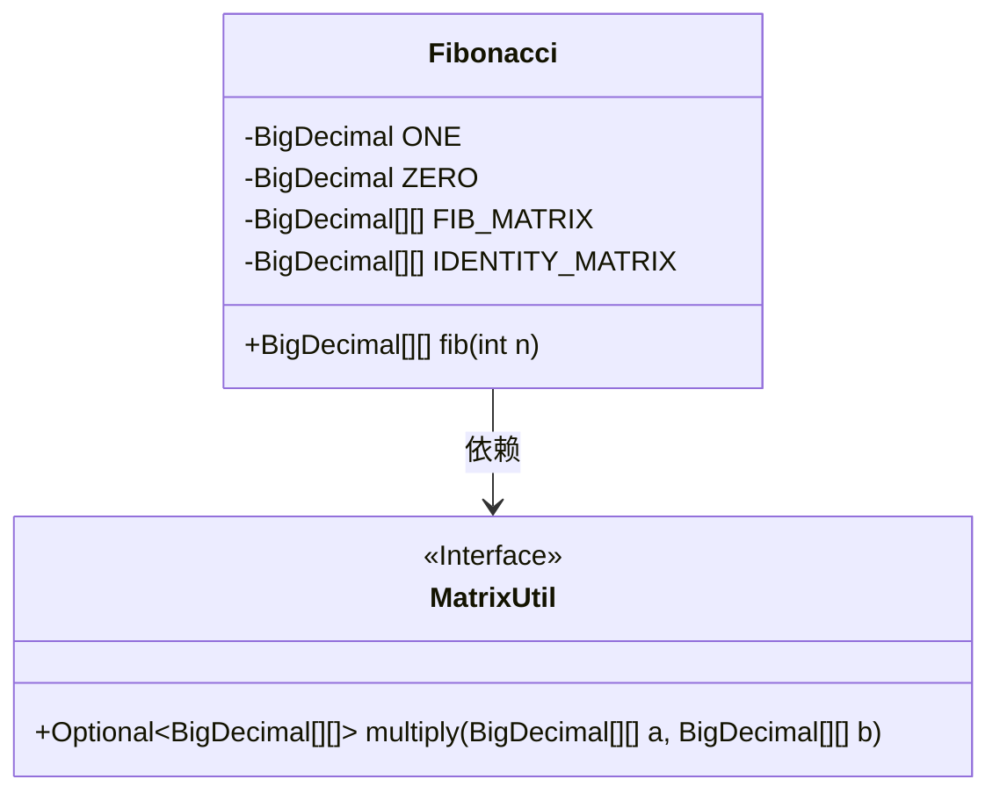
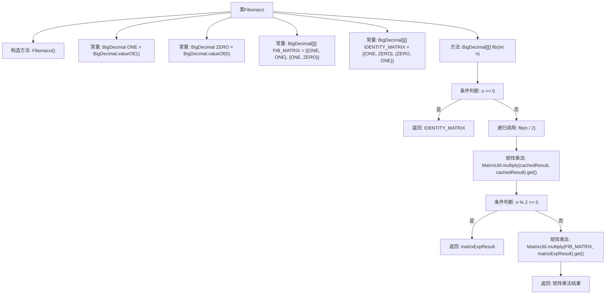

# 基础信息

|      |      |
|------|------|
| 名称 | Fibonacci |
| 编码语言 | .java |
| 代码路径 | Java/src/main/java/com/thealgorithms/matrix/matrixexponentiation/Fibonacci.java |
| 包名 | com.thealgorithms.matrix.matrixexponentiation |
| 依赖项 | ['com.thealgorithms.matrix.utils.MatrixUtil', 'java.math.BigDecimal'] |
| 概述说明 | 斐波那契数列第n项可通过矩阵幂运算快速计算。 |

# 说明

斐波那契数列的第n项可以通过矩阵幂运算来计算。具体方法是利用斐波那契数列的递推关系，将其转化为矩阵形式。通过计算该矩阵的n次幂，可以高效地得到第n项的值。这种方法避免了传统递归或迭代计算的低效性，特别适用于大规模计算。矩阵幂运算的实现通常依赖于快速幂算法，进一步提升了计算效率。

# 类列表 Class Summary

| 名称   | 类型  | 说明 |
|-------|------|-------------|
| Fibonacci | class | 斐波那契数列通过矩阵幂运算计算第n项。 |

## 类 Fibonacci

|      |      |
|------|------|
| 访问范围 | public final |
| 类型 | class |
| 名称 | Fibonacci |
| 说明 | 斐波那契数列通过矩阵幂运算计算第n项。 |

### UML类图

类图描述：`Fibonacci`类用于计算斐波那契数列，使用了矩阵指数化技术。它包含两个常量矩阵`FIB_MATRIX`和`IDENTITY_MATRIX`，以及一个静态方法`fib`用于递归计算斐波那契数。`Fibonacci`类依赖于`MatrixUtil`接口，该接口提供了矩阵乘法的方法。通过递归和矩阵乘法，`Fibonacci`类能够高效地计算斐波那契数列中的第n个数。

### 内部方法调用关系图

这段代码定义了一个名为`Fibonacci`的类，该类使用矩阵乘法和递归的方法来计算斐波那契数列的第n项。代码首先定义了一些常量矩阵，然后通过递归和矩阵乘法来计算结果。流程图展示了从类定义到方法调用、条件判断和返回结果的完整流程。

### 字段列表 Field List

| 名称  | 类型  | 说明 |
|-------|-------|------|
| ONE = BigDecimal.valueOf(1) | BigDecimal | 定义了一个不可变的BigDecimal常量ONE，其值为1。 |
| IDENTITY_MATRIX = {{ONE, ZERO}, {ZERO, ONE}} | BigDecimal[][] | 定义了一个私有的静态二维BigDecimal数组，表示单位矩阵。 |
| ZERO = BigDecimal.valueOf(0) | BigDecimal | 定义了一个私有的静态常量ZERO，其值为BigDecimal类型的0。 |
| FIB_MATRIX = {{ONE, ONE}, {ONE, ZERO}} | BigDecimal[][] | 定义了一个二维BigDecimal数组FIB_MATRIX，包含两个子数组，每个子数组有两个元素。 |

### 方法列表 Method List

| 名称  | 类型  | 说明 |
|-------|-------|------|
| fib | BigDecimal[][] | 该方法计算斐波那契矩阵的幂，通过递归和矩阵乘法优化实现。 |

