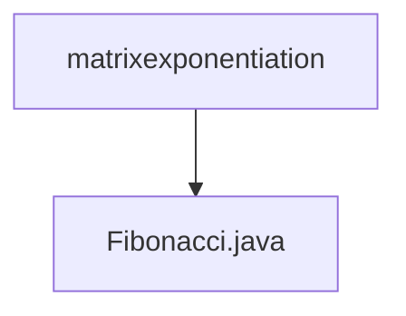

# 基础信息

|      |      |
|------|------|
| 名称 | matrixexponentiation |
| 编码语言 | .java |
| 代码路径 | Java/src/main/java/com/thealgorithms/matrix/matrixexponentiation |
| 包名 | Java.src.main.java.com.thealgorithms.matrix.matrixexponentiation |
| 概述说明 | 斐波那契数列第n项可通过矩阵幂运算快速计算。 |

# 说明

斐波那契数列的第n项可以通过矩阵幂运算来计算。具体方法是利用斐波那契数列的递推关系，将其转化为矩阵形式。通过计算该矩阵的n次幂，可以高效地得到第n项的值。这种方法避免了传统递归或迭代计算的低效性，特别适用于大规模计算。矩阵幂运算的实现通常依赖于快速幂算法，进一步提升了计算效率。

### 包内部结构视图

该流程图展示了`matrixexponentiation`文件夹与`Fibonacci.java`文件之间的层级关系。`matrixexponentiation`是父节点，`Fibonacci.java`是其子节点，表示`Fibonacci.java`文件位于`matrixexponentiation`文件夹内。这种层级关系清晰明了，便于理解文件在项目结构中的位置。

# 文件列表 File List

| 名称   | 类型  | 说明 |
|-------|------|-------------|
| [Fibonacci.java](Fibonacci.md) | file | 斐波那契数列第n项可通过矩阵幂运算快速计算。 |

