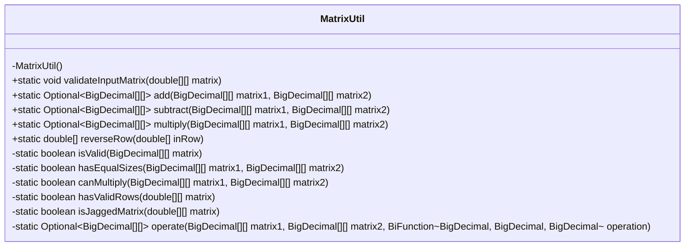
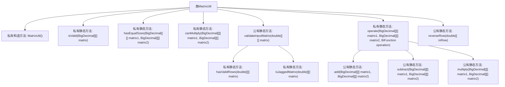

# 基础信息

|      |      |
|------|------|
| 名称 | MatrixUtil |
| 编码语言 | .java |
| 代码路径 | Java/src/main/java/com/thealgorithms/matrix/utils/MatrixUtil.java |
| 包名 | com.thealgorithms.matrix.utils |
| 依赖项 | ['java.math.BigDecimal', 'java.util.Optional', 'java.util.function.BiFunction', 'java.util.stream.IntStream'] |
| 概述说明 | MatrixUtil类支持矩阵验证、加减乘运算和行反转功能。 |

# 说明

MatrixUtil类是一个功能丰富的工具类，专门用于处理矩阵操作。它提供了矩阵验证功能，确保矩阵的合法性和正确性。此外，该类支持矩阵的加法、减法和乘法运算，能够高效地执行这些常见的数学操作。MatrixUtil类还具备行反转功能，可以轻松地对矩阵中的行进行反转操作。这些功能使得MatrixUtil类在处理矩阵相关任务时非常实用和高效。

# 类列表 Class Summary

| 名称   | 类型  | 说明 |
|-------|------|-------------|
| MatrixUtil | class | MatrixUtil类提供矩阵验证、加减乘运算及行反转功能。 |

## 类 MatrixUtil

|      |      |
|------|------|
| 访问范围 | public final |
| 类型 | class |
| 名称 | MatrixUtil |
| 说明 | MatrixUtil类提供矩阵验证、加减乘运算及行反转功能。 |

### UML类图

**描述：**
`MatrixUtil` 是一个工具类，提供了对矩阵的多种操作和验证功能。它包含私有方法用于检查矩阵的有效性、大小是否相等以及是否可以相乘。公有方法包括矩阵的加法、减法、乘法操作，以及反转矩阵行的功能。所有操作都返回 `Optional` 类型，以确保在输入无效时不会抛出异常。

### 内部方法调用关系图

这段代码定义了一个名为 `MatrixUtil` 的工具类，用于处理矩阵操作。类中包含多个静态方法，用于验证矩阵的有效性、判断矩阵是否具有相同的大小、判断矩阵是否可以相乘、执行矩阵的加法、减法和乘法操作，以及反转矩阵的行。代码通过 `Optional` 类来处理可能的空值情况，并使用 `BiFunction` 接口来定义矩阵元素之间的操作。流程图展示了类中各个方法的调用关系，帮助理解代码的结构和逻辑。

### 字段列表 Field List

| 名称  | 类型  | 说明 |
|-------|-------|------|

### 方法列表 Method List

| 名称  | 类型  | 说明 |
|-------|-------|------|
| hasEqualSizes | boolean | 检查两个BigDecimal矩阵维度是否相等。 |
| isJaggedMatrix | boolean | 判断二维数组是否为不规则矩阵。 |
| validateInputMatrix | void | 验证输入矩阵非空、无空行且非锯齿状。 |
| reverseRow | double[] | 该方法反转输入数组元素顺序并返回新数组。 |
| multiply | Optional<BigDecimal[][]> | 实现矩阵乘法，返回Optional结果。 |
| isValid | boolean | 检查二维BigDecimal数组是否非空且行列均大于零。 |
| subtract | Optional<BigDecimal[][]> | 静态方法subtract用于矩阵减法，返回Optional<BigDecimal[][]>。 |
| hasValidRows | boolean | 检查矩阵每行是否非空且有效。 |
| operate | Optional<BigDecimal[][]> | 对两个大小相同的矩阵执行操作，返回结果矩阵。 |
| canMultiply | boolean | 检查两个BigDecimal矩阵是否可乘，需均为有效且矩阵1列数等于矩阵2行数。 |
| add | Optional<BigDecimal[][]> | 静态方法`add`用于两矩阵相加，返回`BigDecimal`类型的二维数组。 |

