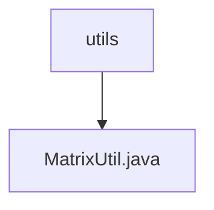

# 基础信息

|      |      |
|------|------|
| 名称 | utils |
| 编码语言 | .java |
| 代码路径 | Java/src/main/java/com/thealgorithms/matrix/utils |
| 包名 | Java.src.main.java.com.thealgorithms.matrix.utils |
| 概述说明 | MatrixUtil类支持矩阵验证、加减乘运算和行反转功能。 |

# 说明

MatrixUtil类是一个功能丰富的工具类，专门用于处理矩阵操作。它提供了矩阵验证功能，确保矩阵的合法性和正确性。此外，该类支持矩阵的加法、减法和乘法运算，能够高效地执行这些常见的数学操作。MatrixUtil类还具备行反转功能，可以轻松地对矩阵中的行进行反转操作。这些功能使得MatrixUtil类在处理矩阵相关任务时非常实用和高效。

### 包内部结构视图

[描述]  
该流程图展示了路径的层级关系，`utils` 是父节点，包含一个子节点 `MatrixUtil.java`。`utils` 是路径中的文件夹，而 `MatrixUtil.java` 是该文件夹下的文件。流程图简洁明了，清晰地表示了文件与文件夹之间的从属关系。

# 文件列表 File List

| 名称   | 类型  | 说明 |
|-------|------|-------------|
| [MatrixUtil.java](MatrixUtil.md) | file | MatrixUtil类支持矩阵验证、加减乘运算和行反转功能。 |

