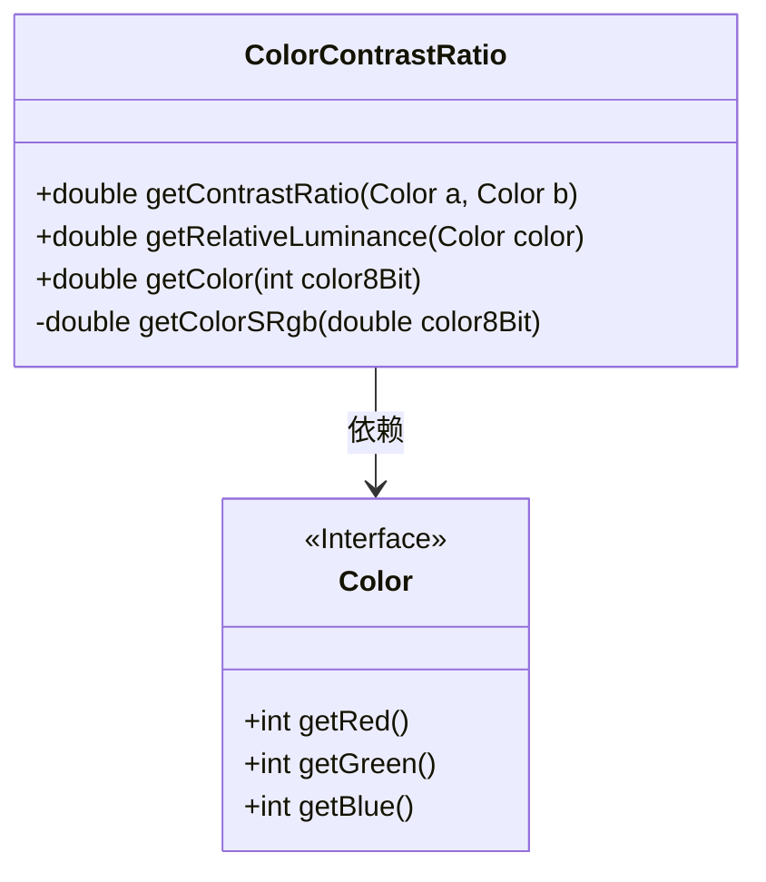
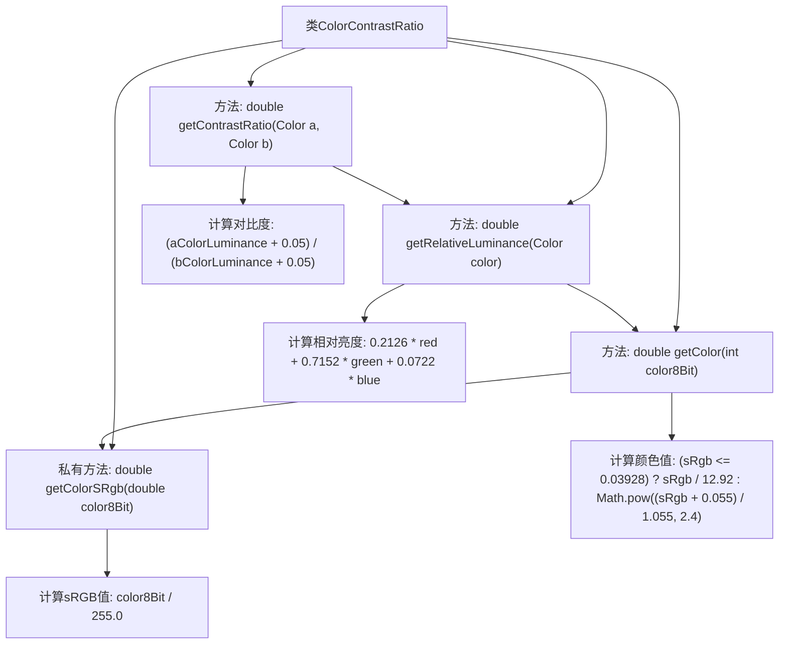

# 基础信息

|      |      |
|------|------|
| 名称 | ColorContrastRatio |
| 编码语言 | .java |
| 代码路径 | Java/src/main/java/com/thealgorithms/misc/ColorContrastRatio.java |
| 包名 | com.thealgorithms.misc |
| 依赖项 | ['java.awt.Color'] |
| 概述说明 | 计算颜色对比度与相对亮度。 |

# 说明

该功能用于计算两种颜色之间的对比度和相对亮度。对比度是指两种颜色在视觉上的差异程度，通常用于确保文本和背景颜色之间的可读性。相对亮度则是衡量颜色在视觉上的明亮程度，基于人眼对不同颜色的敏感度。通过计算这两种指标，可以评估颜色组合的视觉效果，确保其在设计中的适用性和可读性。

# 类列表 Class Summary

| 名称   | 类型  | 说明 |
|-------|------|-------------|
| ColorContrastRatio | class | 计算两种颜色的对比度和相对亮度。 |

## 类 ColorContrastRatio

|      |      |
|------|------|
| 访问范围 | public |
| 类型 | class |
| 名称 | ColorContrastRatio |
| 说明 | 计算两种颜色的对比度和相对亮度。 |

### UML类图

这段代码定义了一个 `ColorContrastRatio` 类，用于计算两种颜色之间的对比度。该类通过 `getContrastRatio` 方法计算两种颜色的对比度，`getRelativeLuminance` 方法计算颜色的相对亮度，`getColor` 方法用于获取颜色分量值，`getColorSRgb` 方法则用于计算颜色的 sRGB 值。`Color` 接口定义了获取颜色分量（红、绿、蓝）的方法。`ColorContrastRatio` 类依赖于 `Color` 接口来获取颜色信息。

### 内部方法调用关系图

这段代码定义了一个 `ColorContrastRatio` 类，用于计算两种颜色之间的对比度。首先，`getContrastRatio` 方法调用 `getRelativeLuminance` 方法分别计算两种颜色的相对亮度，然后根据亮度值计算对比度。`getRelativeLuminance` 方法通过 `getColor` 方法获取颜色的红、绿、蓝分量值，并计算相对亮度。`getColor` 方法进一步调用 `getColorSRgb` 方法将8位颜色值转换为sRGB值，最终返回用于相对亮度公式的颜色值。整个流程展示了从颜色值到对比度的完整计算过程。

### 字段列表 Field List

| 名称  | 类型  | 说明 |
|-------|-------|------|

### 方法列表 Method List

| 名称  | 类型  | 说明 |
|-------|-------|------|
| getColorSRgb | double | 将8位颜色值转换为sRGB颜色空间的标准值。 |
| getContrastRatio | double | 计算两种颜色的对比度，基于相对亮度值进行比值计算。 |
| getColor | double | 根据8位颜色值计算标准RGB值，并进行伽马校正。 |
| getRelativeLuminance | double | 计算颜色相对亮度，基于RGB分量加权求和。 |

