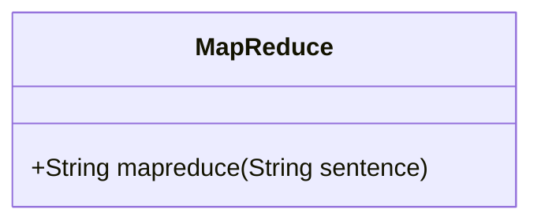
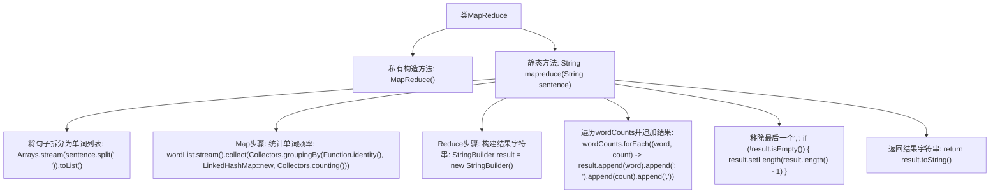

# 基础信息

|      |      |
|------|------|
| 名称 | MapReduce |
| 编码语言 | .java |
| 代码路径 | Java/src/main/java/com/thealgorithms/misc/MapReduce.java |
| 包名 | com.thealgorithms.misc |
| 依赖项 | ['java.util.Arrays', 'java.util.LinkedHashMap', 'java.util.List', 'java.util.Map', 'java.util.function.Function', 'java.util.stream.Collectors'] |
| 概述说明 | MapReduce类统计句子单词频率并输出结果。 |

# 说明

MapReduce类用于统计句子中单词的出现频率，并返回统计结果。该方法通过将句子分解为单词，并对每个单词进行计数，最终汇总所有单词的频率。整个过程分为映射和归约两个阶段：映射阶段将句子拆分为单词并生成键值对，归约阶段对相同单词的计数进行累加，最终输出每个单词及其对应的频率。该方法适用于大规模文本数据的并行处理，能够高效地完成单词频率统计任务。

# 类列表 Class Summary

| 名称   | 类型  | 说明 |
|-------|------|-------------|
| MapReduce | class | MapReduce类统计句子中单词频率并返回结果。 |

## 类 MapReduce

|      |      |
|------|------|
| 访问范围 | public final |
| 类型 | class |
| 名称 | MapReduce |
| 说明 | MapReduce类统计句子中单词频率并返回结果。 |

### UML类图

这段代码定义了一个名为 `MapReduce` 的类，该类包含一个静态方法 `mapreduce`，用于统计句子中每个单词的出现频率。该方法首先将句子拆分为单词列表，然后通过 `Map` 步骤对单词进行分组计数，最后通过 `Reduce` 步骤将结果格式化为字符串输出。类图展示了 `MapReduce` 类的结构，其中 `mapreduce` 方法是公有的，用于处理字符串输入并返回统计结果。

### 内部方法调用关系图

这段代码定义了一个`MapReduce`类，其中包含一个静态方法`mapreduce`，用于统计句子中每个单词的出现频率。方法首先将句子拆分为单词列表，然后通过`Map`步骤统计每个单词的频率，接着通过`Reduce`步骤将结果构建为字符串，并移除最后一个多余的逗号，最后返回结果字符串。

### 字段列表 Field List

| 名称  | 类型  | 说明 |
|-------|-------|------|

### 方法列表 Method List

| 名称  | 类型  | 说明 |
|-------|-------|------|
| mapreduce | String | 静态方法mapreduce统计句子中单词出现次数并格式化输出。 |

