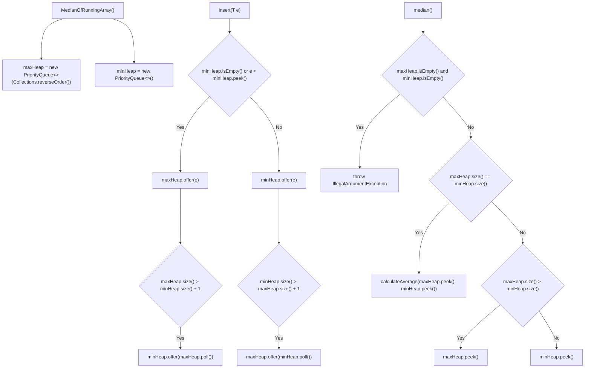
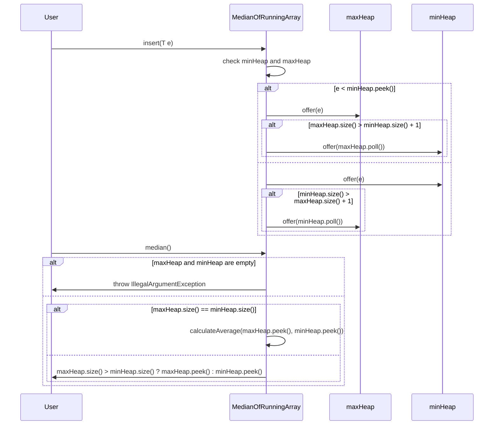
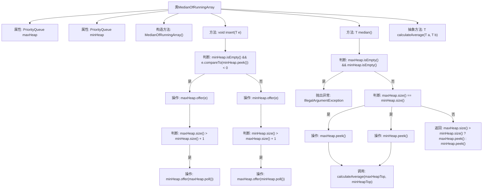

# 基础信息

|      |      |
|------|------|
| 名称 | MedianOfRunningArray |
| 编码语言 | .java |
| 代码路径 | Java/src/main/java/com/thealgorithms/misc/MedianOfRunningArray.java |
| 包名 | com.thealgorithms.misc |
| 依赖项 | ['java.util.Collections', 'java.util.PriorityQueue'] |
| 概述说明 | 类使用最大堆和最小堆动态计算数组的中位数，支持插入和获取功能。 |

# 说明

该类用于动态数组的中位数计算，采用最大堆和最小堆来存储数据。最大堆用于存储较小的一半数据，最小堆用于存储较大的一半数据。通过这种方式，可以高效地维护数据的有序性。该类提供了插入功能，允许将新数据动态添加到堆中，并自动调整堆结构以保持平衡。同时，该类还提供了获取中位数的功能，能够根据当前数据的总数快速计算出中位数值。这种方法确保了中位数计算的效率和准确性，适用于需要频繁插入和查询中位数的场景。

# 类列表 Class Summary

| 名称   | 类型  | 说明 |
|-------|------|-------------|
| MedianOfRunningArray | class | 类用于动态数组的中位数计算，使用最大堆和最小堆存储数据，提供插入和获取中位数功能。 |


## 类 MedianOfRunningArray

|      |      |
|------|------|
| 访问范围 | public abstract |
| 类型 | class |
| 名称 | MedianOfRunningArray |
| 说明 | 类用于动态数组的中位数计算，使用最大堆和最小堆存储数据，提供插入和获取中位数功能。 |


### UML类图

```mermaid
classDiagram
    class MedianOfRunningArray~T extends Number & Comparable~T~~ {
        -PriorityQueue~T~ maxHeap
        -PriorityQueue~T~ minHeap
        +MedianOfRunningArray()
        +void insert(T e)
        +T median()
        +abstract T calculateAverage(T a, T b)
    }
```





### 描述
`MedianOfRunningArray` 是一个抽象类，用于动态计算流式数据的中位数。它使用两个优先队列（最大堆和最小堆）来维护数据的有序性。`insert` 方法将新元素插入到适当的堆中，并保持两个堆的大小平衡。`median` 方法根据堆的大小返回当前的中位数，若堆为空则抛出异常。抽象方法 `calculateAverage` 用于计算两个数的平均值，具体实现由子类提供。


### 内部方法调用关系图



这段代码实现了一个用于计算运行中数组中位数的类。该类使用两个优先队列（最大堆和最小堆）来维护数组的上下半部分。插入元素时，根据元素大小将其放入适当的堆中，并保持两堆的大小平衡。计算中位数时，如果两堆大小相等，则返回两堆顶元素的平均值；否则返回较大的堆的堆顶元素。抽象方法 `calculateAverage` 用于计算两个数的平均值，具体实现由子类提供。

### 字段列表 Field List

| 名称  | 类型  | 说明 |
|-------|-------|------|
| maxHeap | PriorityQueue<T> | 声明一个私有优先队列maxHeap，用于存储类型为T的元素。 |
| minHeap | PriorityQueue<T> | 私有优先队列minHeap用于存储最小堆。 |

### 方法列表 Method List

| 名称  | 类型  | 说明 |
|-------|-------|------|
| calculateAverage | T | 抽象方法用于计算两个泛型参数的平均值。 |
| insert | void | 插入元素时，根据大小比较将其放入最小堆或最大堆，并保持两堆大小平衡。 |
| median | T | 计算中位数，处理空堆和大小相等情况，返回平均值或较大堆顶元素。 |


