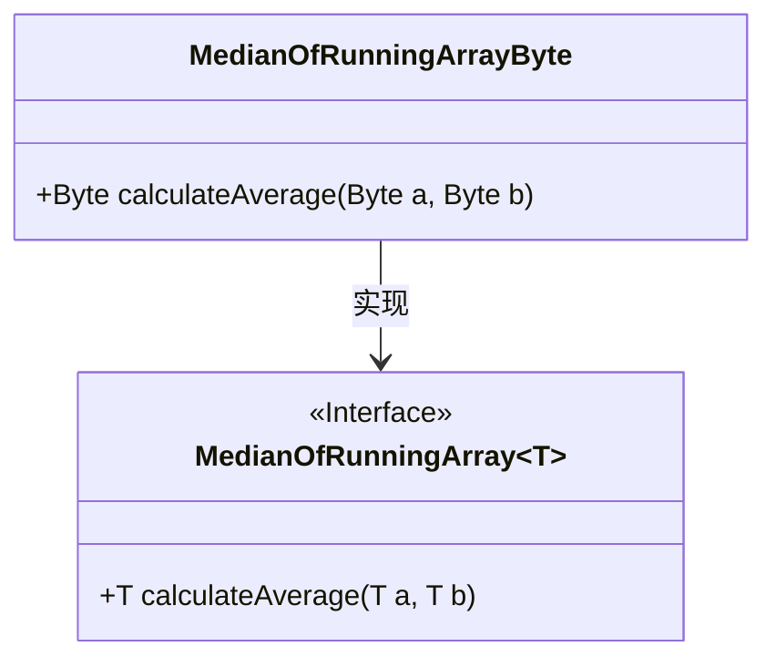
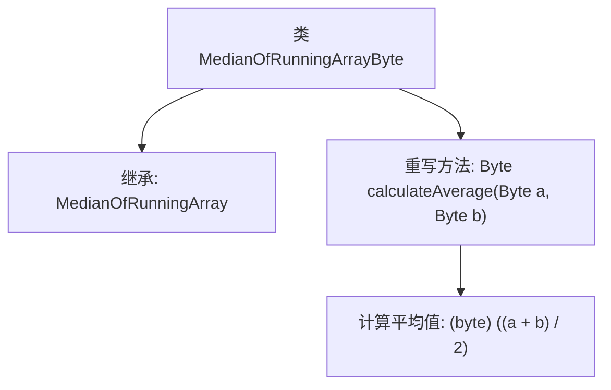

# 基础信息

|      |      |
|------|------|
| 名称 | MedianOfRunningArrayByte |
| 编码语言 | .java |
| 代码路径 | Java/src/main/java/com/thealgorithms/misc/MedianOfRunningArrayByte.java |
| 包名 | com.thealgorithms.misc |
| 依赖项 | [] |
| 概述说明 | MedianOfRunningArrayByte继承父类，重写calculateAverage方法计算Byte平均值。 |

# 说明

MedianOfRunningArrayByte类继承自MedianOfRunningArray类，并重写了calculateAverage方法，用于计算Byte类型数据的平均值。该方法专门处理Byte类型的数据，确保在计算平均值时能够准确处理Byte值的范围和特性。通过重写该方法，MedianOfRunningArrayByte类能够更精确地适应Byte数据类型的需求，提供更有效的平均值计算功能。

# 类列表 Class Summary

| 名称   | 类型  | 说明 |
|-------|------|-------------|
| MedianOfRunningArrayByte | class | MedianOfRunningArrayByte类继承MedianOfRunningArray，重写calculateAverage方法计算Byte平均值。 |

## 类 MedianOfRunningArrayByte

|      |      |
|------|------|
| 访问范围 | public final |
| 类型 | class |
| 名称 | MedianOfRunningArrayByte |
| 说明 | MedianOfRunningArrayByte类继承MedianOfRunningArray，重写calculateAverage方法计算Byte平均值。 |

### UML类图

这段代码展示了一个泛型接口 `MedianOfRunningArray` 和其具体实现类 `MedianOfRunningArrayByte`。接口 `MedianOfRunningArray` 定义了一个方法 `calculateAverage`，用于计算两个泛型类型 `T` 的平均值。`MedianOfRunningArrayByte` 类实现了该接口，并针对 `Byte` 类型提供了具体的计算逻辑，返回两个 `Byte` 类型值的平均值。类图清晰地展示了接口与实现类之间的继承关系。

### 内部方法调用关系图

这段代码定义了一个名为 `MedianOfRunningArrayByte` 的类，它继承自 `MedianOfRunningArray<Byte>`。类中重写了 `calculateAverage` 方法，该方法接受两个 `Byte` 类型的参数，并返回它们的平均值。平均值通过将两个参数相加后除以 2 并转换为 `byte` 类型来得到。这个类主要用于计算运行中数组的中位数，特别适用于处理 `Byte` 类型的数据。

### 字段列表 Field List

| 名称  | 类型  | 说明 |
|-------|-------|------|

### 方法列表 Method List

| 名称  | 类型  | 说明 |
|-------|-------|------|
| calculateAverage | Byte | 重写方法计算两个Byte值的平均值并返回Byte类型结果。 |

