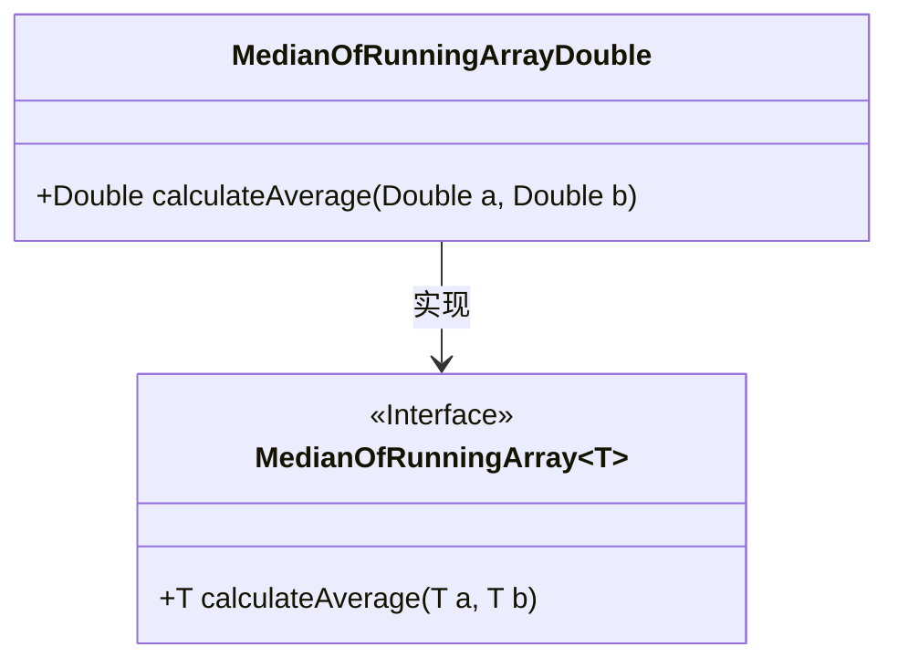
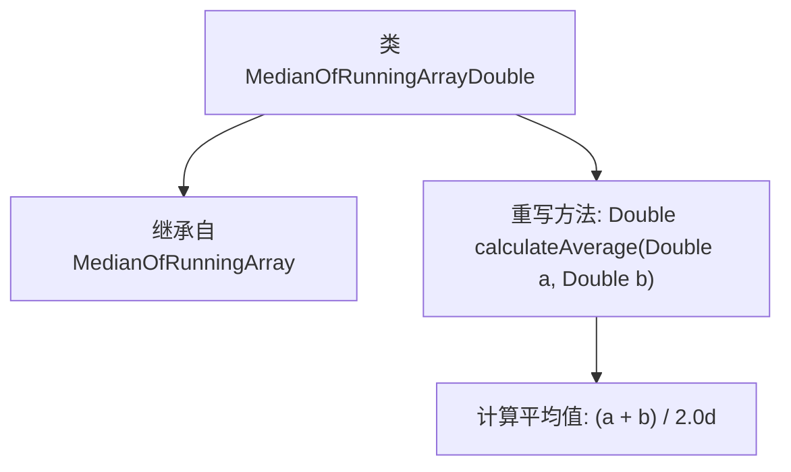

# 基础信息

|      |      |
|------|------|
| 名称 | MedianOfRunningArrayDouble |
| 编码语言 | .java |
| 代码路径 | Java/src/main/java/com/thealgorithms/misc/MedianOfRunningArrayDouble.java |
| 包名 | com.thealgorithms.misc |
| 依赖项 | [] |
| 概述说明 | MedianOfRunningArrayDouble继承MedianOfRunningArray，计算双精度浮点数平均值。 |

# 说明

MedianOfRunningArrayDouble类继承自MedianOfRunningArray类，专门用于处理Double类型的数据。该类的主要功能是计算两个Double数值的平均值。通过继承，它保留了父类的基本特性，同时针对Double数据类型进行了特定的实现，确保能够准确地进行平均值计算。

# 类列表 Class Summary

| 名称   | 类型  | 说明 |
|-------|------|-------------|
| MedianOfRunningArrayDouble | class | MedianOfRunningArrayDouble类继承MedianOfRunningArray，计算两个Double的平均值。 |

## 类 MedianOfRunningArrayDouble

|      |      |
|------|------|
| 访问范围 | public final |
| 类型 | class |
| 名称 | MedianOfRunningArrayDouble |
| 说明 | MedianOfRunningArrayDouble类继承MedianOfRunningArray，计算两个Double的平均值。 |

### UML类图

**描述：**  
`MedianOfRunningArrayDouble` 是一个具体的类，它实现了泛型接口 `MedianOfRunningArray~T~`，其中 `T` 被指定为 `Double` 类型。该类重写了 `calculateAverage` 方法，用于计算两个 `Double` 类型数值的平均值。通过这种方式，`MedianOfRunningArrayDouble` 提供了对 `Double` 类型数据的特定处理逻辑，同时保持了与泛型接口的一致性。

### 内部方法调用关系图

这段代码定义了一个名为 `MedianOfRunningArrayDouble` 的类，该类继承自 `MedianOfRunningArray<Double>`。类中重写了 `calculateAverage` 方法，用于计算两个 `Double` 类型数值的平均值。该方法通过将两个数相加并除以 2.0 来返回平均值。流程图展示了类的继承关系以及方法的重写和计算过程。

### 字段列表 Field List

| 名称  | 类型  | 说明 |
|-------|-------|------|

### 方法列表 Method List

| 名称  | 类型  | 说明 |
|-------|-------|------|
| calculateAverage | Double | 计算两个双精度数的平均值。 |

