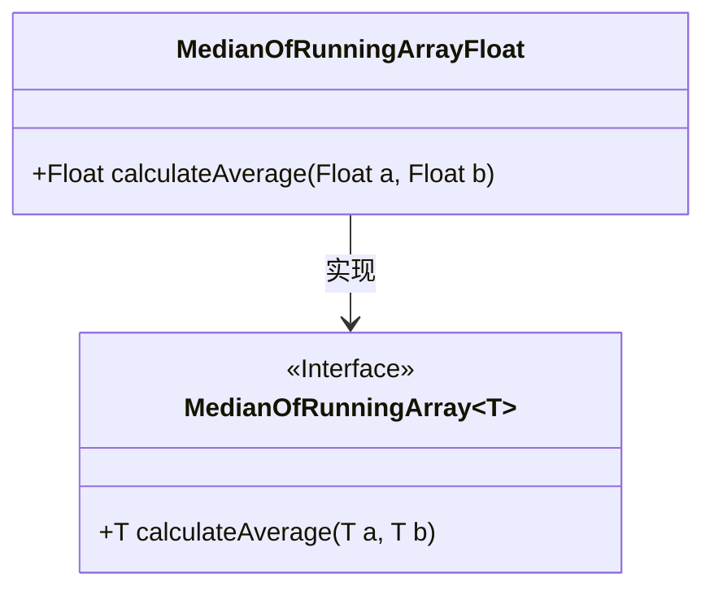
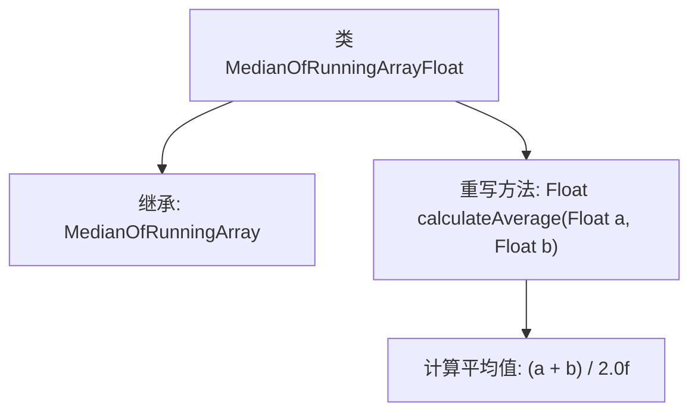

# 基础信息

|      |      |
|------|------|
| 名称 | MedianOfRunningArrayFloat |
| 编码语言 | .java |
| 代码路径 | Java/src/main/java/com/thealgorithms/misc/MedianOfRunningArrayFloat.java |
| 包名 | com.thealgorithms.misc |
| 依赖项 | [] |
| 概述说明 | MedianOfRunningArrayFloat继承MedianOfRunningArray，计算Float类型平均值。 |

# 说明

MedianOfRunningArrayFloat类继承自MedianOfRunningArray类，专门用于处理Float类型数据的平均值计算。该类在继承的基础上，针对Float类型进行了优化和实现，确保能够准确计算并返回运行数组中Float类型数据的平均值。这一设计使得该类在处理浮点数数据时更加高效和精确，满足了特定场景下的计算需求。

# 类列表 Class Summary

| 名称   | 类型  | 说明 |
|-------|------|-------------|
| MedianOfRunningArrayFloat | class | MedianOfRunningArrayFloat类继承MedianOfRunningArray，实现Float类型平均值计算。 |

## 类 MedianOfRunningArrayFloat

|      |      |
|------|------|
| 访问范围 | public final |
| 类型 | class |
| 名称 | MedianOfRunningArrayFloat |
| 说明 | MedianOfRunningArrayFloat类继承MedianOfRunningArray，实现Float类型平均值计算。 |

### UML类图

**描述：**  
`MedianOfRunningArrayFloat` 类继承自泛型接口 `MedianOfRunningArray~T~`，并实现了 `calculateAverage` 方法，用于计算两个 `Float` 类型数值的平均值。类图展示了 `MedianOfRunningArrayFloat` 与 `MedianOfRunningArray~Float~` 之间的实现关系，表明 `MedianOfRunningArrayFloat` 是 `MedianOfRunningArray~Float~` 的具体实现类。

### 内部方法调用关系图

这段代码定义了一个名为`MedianOfRunningArrayFloat`的类，该类继承自`MedianOfRunningArray<Float>`。类中重写了`calculateAverage`方法，该方法接受两个`Float`类型的参数`a`和`b`，并返回它们的平均值。计算方式是将两个数相加后除以2.0f。流程图展示了类的继承关系以及方法的重写和计算过程。

### 字段列表 Field List

| 名称  | 类型  | 说明 |
|-------|-------|------|

### 方法列表 Method List

| 名称  | 类型  | 说明 |
|-------|-------|------|
| calculateAverage | Float | 计算两个浮点数的平均值。 |

