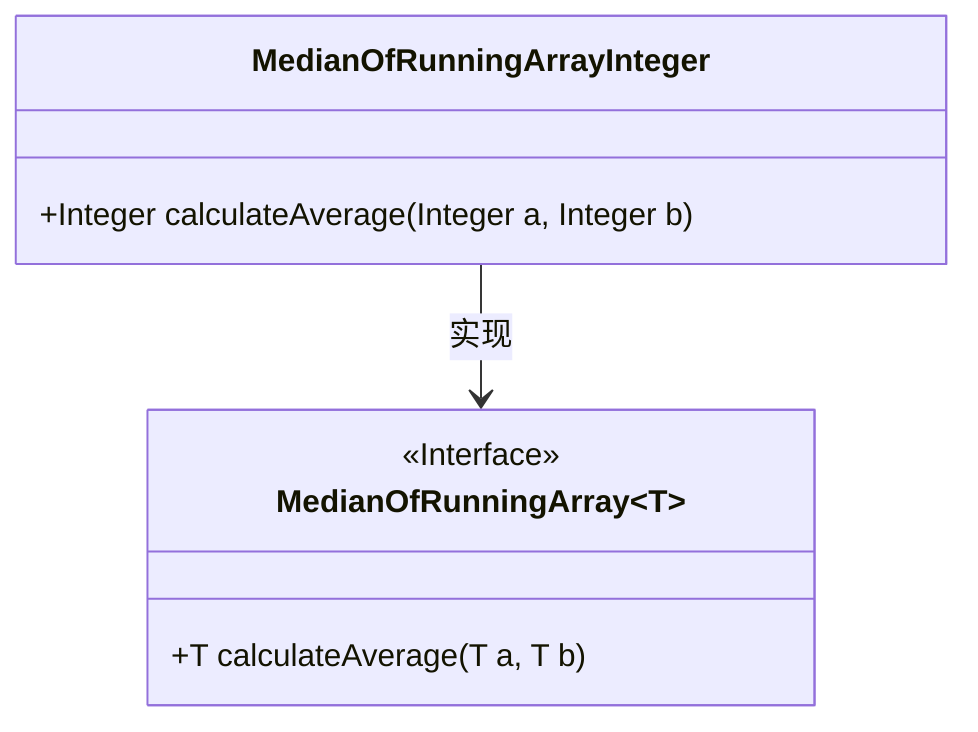
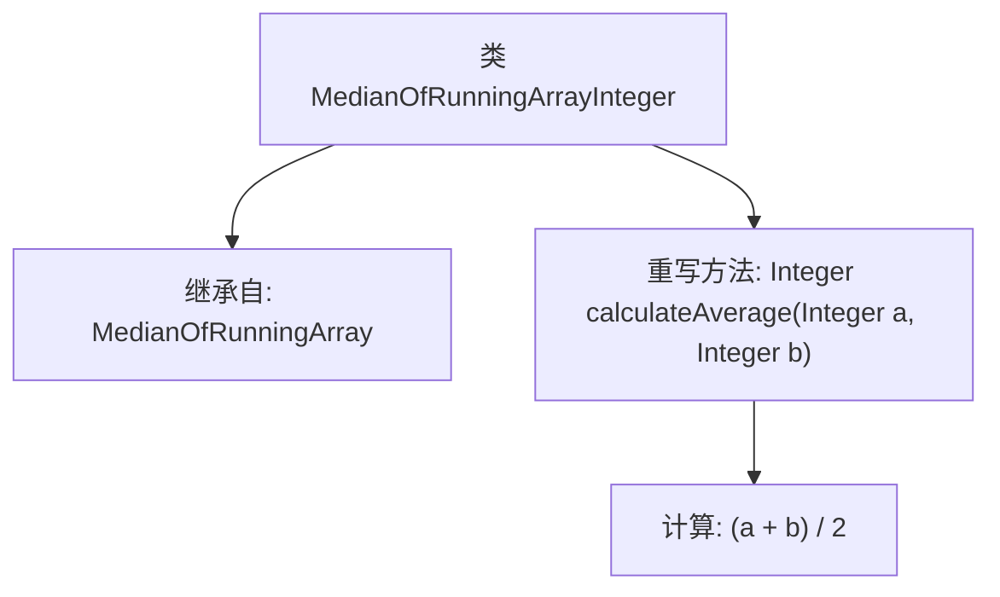

# 基础信息

|      |      |
|------|------|
| 名称 | MedianOfRunningArrayInteger |
| 编码语言 | .java |
| 代码路径 | Java/src/main/java/com/thealgorithms/misc/MedianOfRunningArrayInteger.java |
| 包名 | com.thealgorithms.misc |
| 依赖项 | [] |
| 概述说明 | MedianOfRunningArrayInteger继承MedianOfRunningArray，用于计算整数平均。 |

# 说明

MedianOfRunningArrayInteger类继承自MedianOfRunningArray类，专门用于计算整数序列的中位数。该类在原有功能的基础上，针对整数数据类型进行了优化和实现，确保在处理整数数据时能够高效准确地计算中位数。通过继承，MedianOfRunningArrayInteger类继承了父类的基本结构和功能，同时根据整数特性进行了必要的调整和扩展，以满足特定场景下的需求。

# 类列表 Class Summary

| 名称   | 类型  | 说明 |
|-------|------|-------------|
| MedianOfRunningArrayInteger | class | MedianOfRunningArrayInteger类继承MedianOfRunningArray，实现整数平均计算。 |

## 类 MedianOfRunningArrayInteger

|      |      |
|------|------|
| 访问范围 | public final |
| 类型 | class |
| 名称 | MedianOfRunningArrayInteger |
| 说明 | MedianOfRunningArrayInteger类继承MedianOfRunningArray，实现整数平均计算。 |

### UML类图

### 描述
这段代码定义了一个泛型接口 `MedianOfRunningArray~T~`，其中包含一个抽象方法 `calculateAverage`，用于计算两个元素的平均值。`MedianOfRunningArrayInteger` 类实现了该接口，并具体化了泛型类型为 `Integer`，提供了 `calculateAverage` 方法的具体实现，返回两个整数的平均值。类图展示了接口与实现类之间的继承关系。

### 内部方法调用关系图

这段代码定义了一个名为 `MedianOfRunningArrayInteger` 的类，该类继承自 `MedianOfRunningArray<Integer>`。该类重写了父类的 `calculateAverage` 方法，用于计算两个整数的平均值。方法通过将两个整数相加后除以2来得到结果。流程图展示了类的继承关系以及方法的调用和计算过程。

### 字段列表 Field List

| 名称  | 类型  | 说明 |
|-------|-------|------|

### 方法列表 Method List

| 名称  | 类型  | 说明 |
|-------|-------|------|
| calculateAverage | Integer | 重写calculateAverage方法，计算两个整数的平均值。 |

