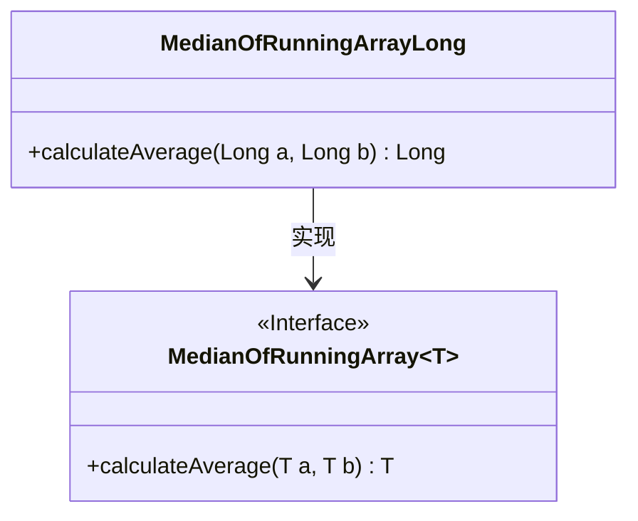
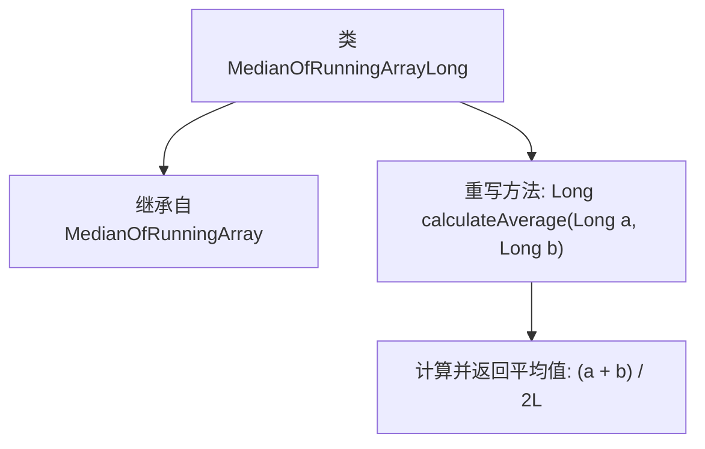

# 基础信息

|      |      |
|------|------|
| 名称 | MedianOfRunningArrayLong |
| 编码语言 | .java |
| 代码路径 | Java/src/main/java/com/thealgorithms/misc/MedianOfRunningArrayLong.java |
| 包名 | com.thealgorithms.misc |
| 依赖项 | [] |
| 概述说明 | MedianOfRunningArrayLong继承MedianOfRunningArray，计算Long类型平均值。 |

# 说明

MedianOfRunningArrayLong类继承自MedianOfRunningArray类，专门用于处理Long类型数据的平均值计算。该类通过继承父类的功能，进一步扩展和优化了对Long类型数据的处理能力，确保能够准确、高效地计算运行数组的中位数。

# 类列表 Class Summary

| 名称   | 类型  | 说明 |
|-------|------|-------------|
| MedianOfRunningArrayLong | class | MedianOfRunningArrayLong类继承自MedianOfRunningArray，实现Long类型平均值计算。 |

## 类 MedianOfRunningArrayLong

|      |      |
|------|------|
| 访问范围 | public final |
| 类型 | class |
| 名称 | MedianOfRunningArrayLong |
| 说明 | MedianOfRunningArrayLong类继承自MedianOfRunningArray，实现Long类型平均值计算。 |

### UML类图

这段代码定义了一个名为 `MedianOfRunningArrayLong` 的类，它继承自泛型接口 `MedianOfRunningArray`，并实现了 `calculateAverage` 方法。`MedianOfRunningArrayLong` 类专门用于处理 `Long` 类型的数据，计算两个 `Long` 类型数值的平均值。类图中的 `MedianOfRunningArray` 接口定义了通用的计算平均值的方法，而 `MedianOfRunningArrayLong` 类则具体实现了该方法。

### 内部方法调用关系图

这段代码定义了一个名为 `MedianOfRunningArrayLong` 的类，该类继承自泛型类 `MedianOfRunningArray<Long>`。类中重写了 `calculateAverage` 方法，用于计算两个 `Long` 类型数值的平均值，并返回结果。方法的实现逻辑是将两个数值相加后除以2，返回一个 `Long` 类型的平均值。

### 字段列表 Field List

| 名称  | 类型  | 说明 |
|-------|-------|------|

### 方法列表 Method List

| 名称  | 类型  | 说明 |
|-------|-------|------|
| calculateAverage | Long | 重写calculateAverage方法，计算两数平均值。 |

