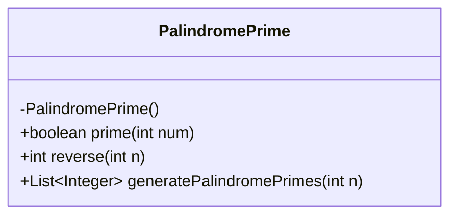
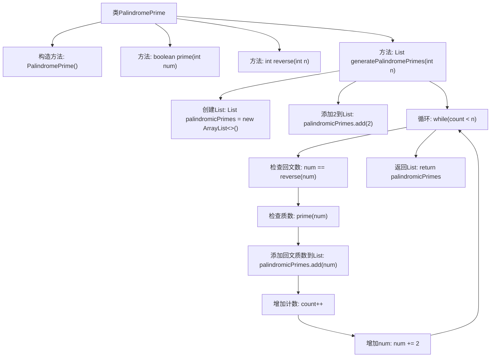

# 基础信息

|      |      |
|------|------|
| 名称 | PalindromePrime |
| 编码语言 | .java |
| 代码路径 | Java/src/main/java/com/thealgorithms/misc/PalindromePrime.java |
| 包名 | com.thealgorithms.misc |
| 依赖项 | ['java.util.ArrayList', 'java.util.List'] |
| 概述说明 | 类PalindromePrime包含质数判断、数字反转及回文质数生成方法。 |

# 说明

类PalindromePrime包含三个主要功能：判断质数、数字反转及生成回文质数。判断质数方法用于确定一个数字是否为质数。数字反转方法将给定数字的各位数字顺序反转。生成回文质数方法结合前两个功能，生成并返回回文质数，即既是质数又是回文的数字。

# 类列表 Class Summary

| 名称   | 类型  | 说明 |
|-------|------|-------------|
| PalindromePrime | class | 类PalindromePrime包含判断质数、数字反转及生成回文质数的方法。 |

## 类 PalindromePrime

|      |      |
|------|------|
| 访问范围 | public final |
| 类型 | class |
| 名称 | PalindromePrime |
| 说明 | 类PalindromePrime包含判断质数、数字反转及生成回文质数的方法。 |

### UML类图

这段代码定义了一个名为 `PalindromePrime` 的类，该类包含三个静态方法：`prime`、`reverse` 和 `generatePalindromePrimes`。`prime` 方法用于判断一个整数是否为质数，`reverse` 方法用于反转一个整数，`generatePalindromePrimes` 方法用于生成指定数量的回文质数。类图展示了 `PalindromePrime` 类的结构，包括其私有构造函数和三个公有方法。这些方法共同协作，生成并返回符合条件的回文质数列表。

### 内部方法调用关系图

该流程图描述了`PalindromePrime`类的内部结构和方法调用关系。`PalindromePrime`类包含三个主要方法：`prime`用于判断一个数是否为质数，`reverse`用于反转一个整数，`generatePalindromePrimes`用于生成指定数量的回文质数。流程图展示了`generatePalindromePrimes`方法中的主要逻辑，包括初始化列表、循环检查回文数和质数、以及最终返回结果的过程。

### 字段列表 Field List

| 名称  | 类型  | 说明 |
|-------|-------|------|

### 方法列表 Method List

| 名称  | 类型  | 说明 |
|-------|-------|------|
| generatePalindromePrimes | List<Integer> | 生成n个回文质数的Java方法。 |
| prime | boolean | 判断整数是否为质数的静态方法。 |
| reverse | int | 该方法用于反转整数，通过循环取余和除法实现。 |

