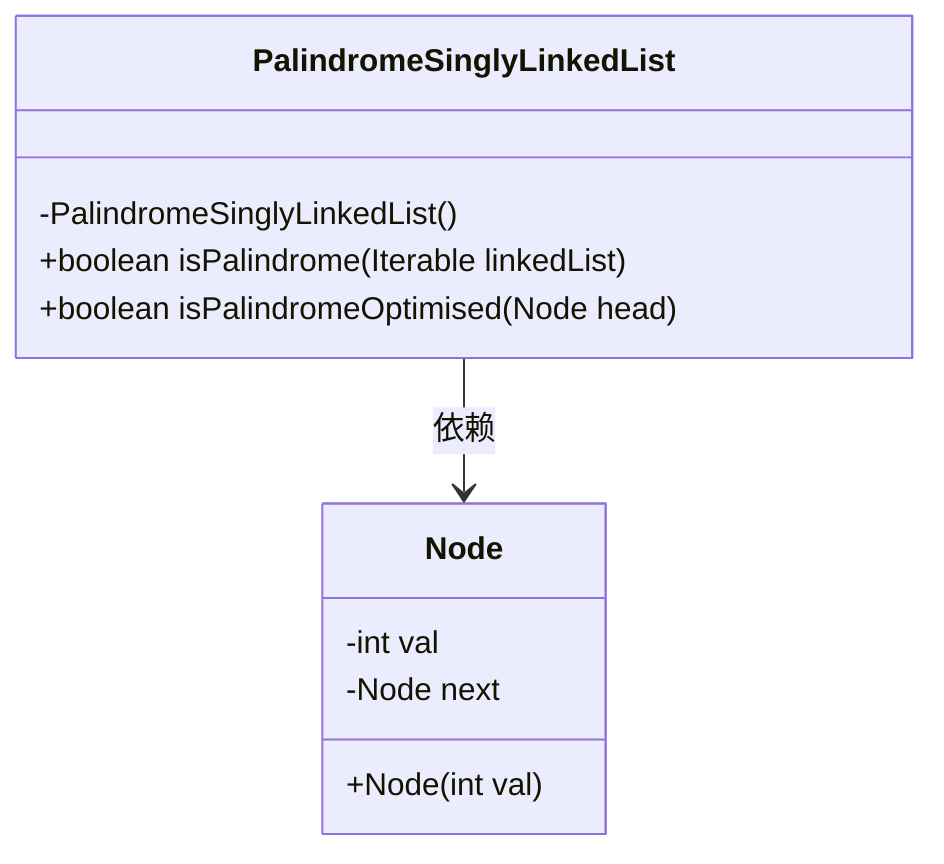
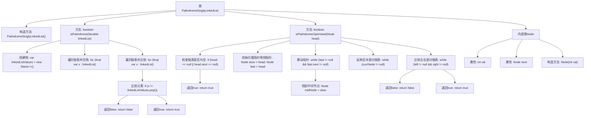

# 基础信息

|      |      |
|------|------|
| 名称 | PalindromeSinglyLinkedList |
| 编码语言 | .java |
| 代码路径 | Java/src/main/java/com/thealgorithms/misc/PalindromeSinglyLinkedList.java |
| 包名 | com.thealgorithms.misc |
| 依赖项 | ['java.util.Stack'] |
| 概述说明 | 类PalindromeSinglyLinkedList提供栈和优化两种方法判断单链表回文。 |

# 说明

类PalindromeSinglyLinkedList提供了两种方法来判断单链表是否为回文。第一种方法是使用栈，通过将链表元素压入栈中，再逐个弹出并与链表元素比较，从而判断是否为回文。第二种方法是优化方法，通过找到链表的中点，反转后半部分链表，然后与前半部分进行比较，最终判断是否为回文。这两种方法分别利用了栈的数据结构和链表反转的技巧，能够有效地判断单链表是否为回文。

# 类列表 Class Summary

| 名称   | 类型  | 说明 |
|-------|------|-------------|
| PalindromeSinglyLinkedList | class | 类PalindromeSinglyLinkedList提供两种方法判断单链表是否为回文，包括栈方法和优化方法。 |

## 类 PalindromeSinglyLinkedList

|      |      |
|------|------|
| 访问范围 | public final |
| 类型 | class |
| 名称 | PalindromeSinglyLinkedList |
| 说明 | 类PalindromeSinglyLinkedList提供两种方法判断单链表是否为回文，包括栈方法和优化方法。 |

### UML类图

类图描述：
`PalindromeSinglyLinkedList` 是一个工具类，提供了两种方法来判断单链表是否为回文。`isPalindrome` 方法使用栈结构来比较链表元素，而 `isPalindromeOptimised` 方法通过快慢指针和链表反转来实现更高效的回文检测。`Node` 类表示链表节点，包含一个整数值和指向下一个节点的引用。`PalindromeSinglyLinkedList` 类依赖于 `Node` 类来实现链表操作。

### 内部方法调用关系图

这段代码定义了一个名为 `PalindromeSinglyLinkedList` 的类，包含两个静态方法 `isPalindrome` 和 `isPalindromeOptimised`，用于判断单链表是否为回文。`isPalindrome` 方法通过栈来比较链表的前后部分，而 `isPalindromeOptimised` 方法则通过反转链表的后半部分来实现更高效的回文检测。代码中还定义了一个内部类 `Node`，用于表示链表的节点。流程图展示了类的方法调用关系和逻辑流程。

### 字段列表 Field List

| 名称  | 类型  | 说明 |
|-------|-------|------|

### 方法列表 Method List

| 名称  | 类型  | 说明 |
|-------|-------|------|
| isPalindrome | boolean | 判断链表是否为回文，使用栈辅助比较。 |
| isPalindromeOptimised | boolean | 优化判断链表是否为回文的方法，使用快慢指针找中点并反转后半部分进行比较。 |

