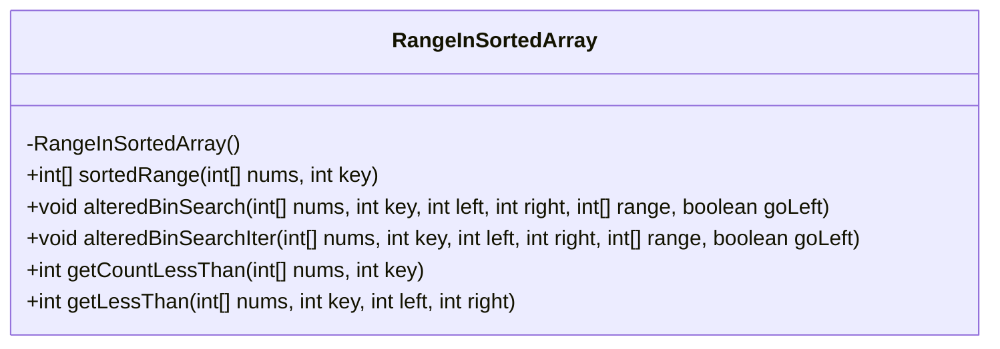
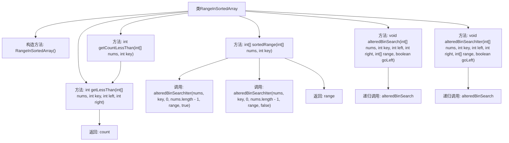

# 基础信息

|      |      |
|------|------|
| 名称 | RangeInSortedArray |
| 编码语言 | .java |
| 代码路径 | Java/src/main/java/com/thealgorithms/misc/RangeInSortedArray.java |
| 包名 | com.thealgorithms.misc |
| 依赖项 | [] |
| 概述说明 | RangeInSortedArray类用于查找有序数组中指定元素的起止位置及小于该值的元素数量。 |

# 说明

类RangeInSortedArray用于在有序数组中查找指定元素的起始和结束位置，并计算小于指定值的元素数量。该功能适用于需要精确定位元素范围或统计特定范围内元素数量的场景，帮助用户高效处理有序数据。

# 类列表 Class Summary

| 名称   | 类型  | 说明 |
|-------|------|-------------|
| RangeInSortedArray | class | 类RangeInSortedArray用于查找有序数组中指定元素的起始和结束位置，并提供小于指定值的元素计数。 |

## 类 RangeInSortedArray

|      |      |
|------|------|
| 访问范围 | public final |
| 类型 | class |
| 名称 | RangeInSortedArray |
| 说明 | 类RangeInSortedArray用于查找有序数组中指定元素的起始和结束位置，并提供小于指定值的元素计数。 |

### UML类图

**描述：**  
`RangeInSortedArray` 类提供了一系列静态方法，用于在非递减数组中查找特定元素的首次和最后一次出现的位置，以及计算小于特定键值的元素数量。`sortedRange` 方法通过调用 `alteredBinSearchIter` 来查找键值的范围，返回一个包含首次和最后一次出现位置的数组。`alteredBinSearch` 和 `alteredBinSearchIter` 分别以递归和迭代的方式实现二分查找，用于查找键值的左边界和右边界。`getCountLessThan` 和 `getLessThan` 方法则用于计算数组中小于指定键值的元素数量。

### 内部方法调用关系图

这段代码定义了一个名为 `RangeInSortedArray` 的类，主要用于在非递减数组中查找某个关键字的第一个和最后一个出现的位置。类中包含多个方法，包括递归和迭代的二分查找算法，用于确定关键字的范围。此外，还提供了计算数组中小于某个关键字的元素数量的功能。流程图展示了类中各方法的调用关系，以及它们之间的数据流动。

### 字段列表 Field List

| 名称  | 类型  | 说明 |
|-------|-------|------|

### 方法列表 Method List

| 名称  | 类型  | 说明 |
|-------|-------|------|
| getCountLessThan | int | 静态方法getCountLessThan返回数组中小于指定值的元素个数。 |
| sortedRange | int[] | 查找数组中指定值的起始和结束位置，返回范围数组。 |
| getLessThan | int | 二分查找统计小于等于key的元素个数。 |
| alteredBinSearchIter | void | 迭代二分查找，调整左右边界，确定目标值范围。 |
| alteredBinSearch | void | 递归二分查找，根据方向更新目标值范围。 |

