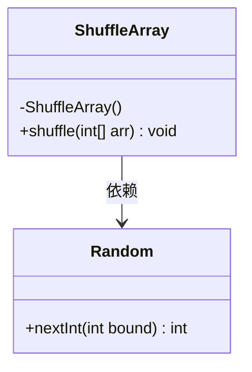
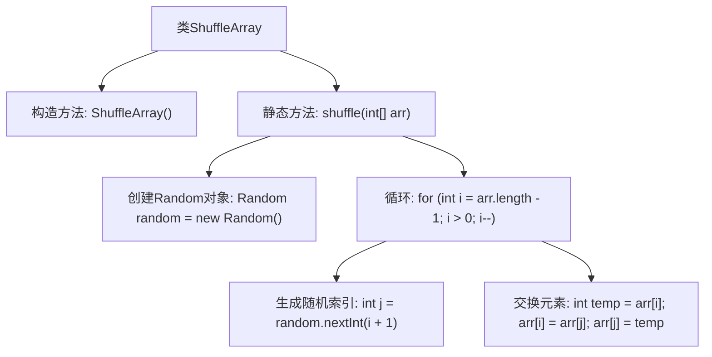

# 基础信息

|      |      |
|------|------|
| 名称 | ShuffleArray |
| 编码语言 | .java |
| 代码路径 | Java/src/main/java/com/thealgorithms/misc/ShuffleArray.java |
| 包名 | com.thealgorithms.misc |
| 依赖项 | ['java.util.Random'] |
| 概述说明 | ShuffleArray类采用Fisher-Yates算法实现数组随机打乱。 |

# 说明

ShuffleArray类采用了Fisher-Yates算法来打乱数组的顺序。Fisher-Yates算法是一种经典的随机排列算法，通过遍历数组并在每一步随机选择一个未处理的元素进行交换，确保每个元素都有均等的机会出现在任何位置，从而实现数组的完全随机化。这种方法简单高效，适用于各种需要随机排列的场景。

# 类列表 Class Summary

| 名称   | 类型  | 说明 |
|-------|------|-------------|
| ShuffleArray | class | ShuffleArray类使用Fisher-Yates算法打乱数组。 |

## 类 ShuffleArray

|      |      |
|------|------|
| 访问范围 | public final |
| 类型 | class |
| 名称 | ShuffleArray |
| 说明 | ShuffleArray类使用Fisher-Yates算法打乱数组。 |

### UML类图

**描述：**
`ShuffleArray` 是一个工具类，提供了 `shuffle` 方法用于对整数数组进行随机打乱。该方法使用 Fisher-Yates 算法，通过 `Random` 类生成随机索引来实现数组元素的交换。`ShuffleArray` 类的构造函数被私有化，防止外部实例化，确保该类仅作为工具类使用。`Random` 类被 `ShuffleArray` 依赖，用于生成随机数。

### 内部方法调用关系图

这段代码定义了一个名为`ShuffleArray`的类，该类包含一个私有的构造方法以防止实例化，以及一个静态方法`shuffle`，该方法使用Fisher-Yates算法对输入的整数数组进行随机洗牌。流程图展示了从类的定义到方法的执行过程，包括随机对象的创建、循环遍历数组、生成随机索引以及交换数组元素的具体步骤。

### 字段列表 Field List

| 名称  | 类型  | 说明 |
|-------|-------|------|

### 方法列表 Method List

| 名称  | 类型  | 说明 |
|-------|-------|------|
| shuffle | void | 该方法使用随机数打乱整数数组的顺序。 |

