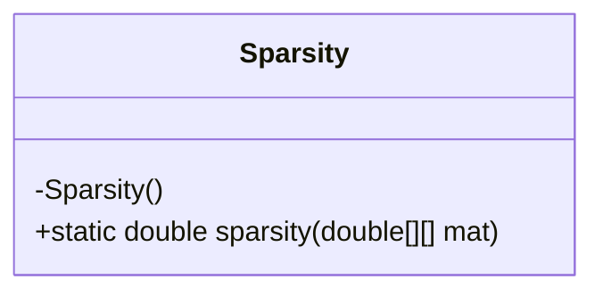
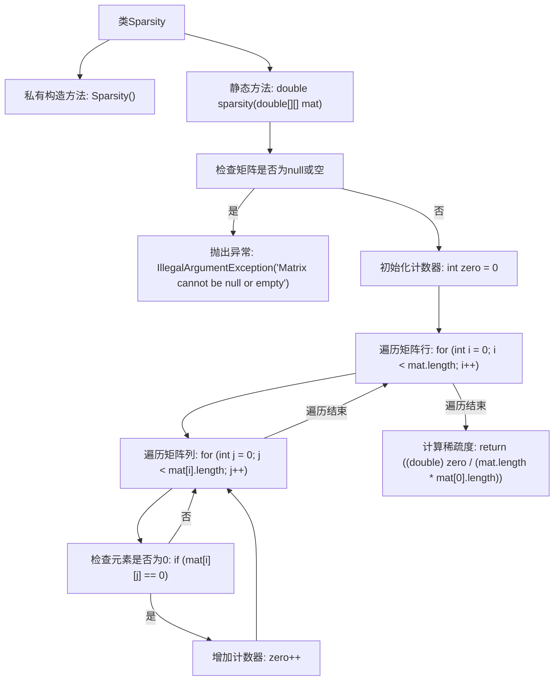

# 基础信息

|      |      |
|------|------|
| 名称 | Sparsity |
| 编码语言 | .java |
| 代码路径 | Java/src/main/java/com/thealgorithms/misc/Sparsity.java |
| 包名 | com.thealgorithms.misc |
| 依赖项 | [] |
| 概述说明 | Sparsity类通过零元素数除以矩阵总元素数计算矩阵稀疏度。 |

# 说明

Sparsity类用于计算矩阵的稀疏度，其公式为矩阵中零元素的数量除以矩阵的总元素数。该计算过程通过统计矩阵中的零元素和总元素数，最终得出稀疏度的数值。稀疏度反映了矩阵中零元素所占的比例，是衡量矩阵稀疏程度的重要指标。

# 类列表 Class Summary

| 名称   | 类型  | 说明 |
|-------|------|-------------|
| Sparsity | class | Sparsity类计算矩阵稀疏度，公式为零元素数除以矩阵总元素数。 |

## 类 Sparsity

|      |      |
|------|------|
| 访问范围 | final |
| 类型 | class |
| 名称 | Sparsity |
| 说明 | Sparsity类计算矩阵稀疏度，公式为零元素数除以矩阵总元素数。 |

### UML类图

**描述：**
`Sparsity` 类是一个工具类，用于计算矩阵的稀疏度。稀疏度定义为矩阵中零元素的数量与矩阵总元素数量的比值。类中的 `sparsity` 方法接受一个二维数组作为输入，首先检查矩阵是否为空或无效，然后遍历矩阵计算零元素的数量，最后返回稀疏度。由于 `Sparsity` 类的构造函数是私有的，因此该类不能被实例化，只能通过静态方法 `sparsity` 来使用。

### 内部方法调用关系图

这段代码定义了一个名为 `Sparsity` 的类，其中包含一个私有构造方法和一个静态方法 `sparsity`。`sparsity` 方法用于计算矩阵的稀疏度，即矩阵中零元素的数量与矩阵总元素数量的比值。首先，方法会检查输入矩阵是否为 `null` 或空，如果是则抛出异常。然后，通过双重循环遍历矩阵，统计零元素的数量，最后计算并返回稀疏度。

### 字段列表 Field List

| 名称  | 类型  | 说明 |
|-------|-------|------|

### 方法列表 Method List

| 名称  | 类型  | 说明 |
|-------|-------|------|
| sparsity | double | 计算矩阵稀疏度，统计零元素占比。 |

