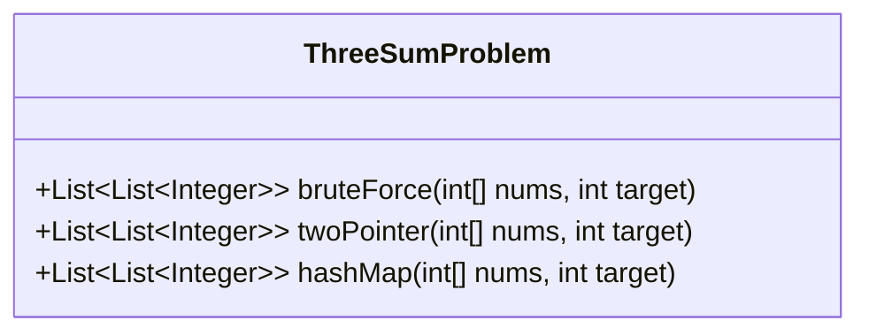
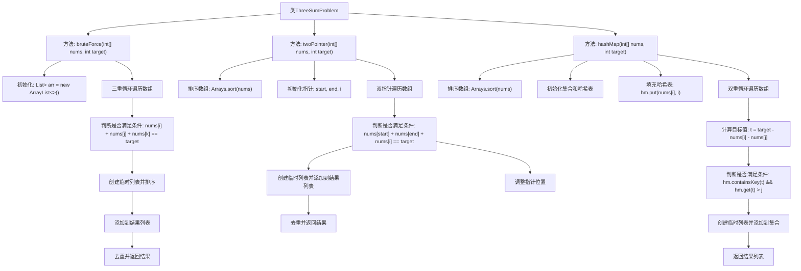

# 基础信息

|      |      |
|------|------|
| 名称 | ThreeSumProblem |
| 编码语言 | .java |
| 代码路径 | Java/src/main/java/com/thealgorithms/misc/ThreeSumProblem.java |
| 包名 | com.thealgorithms.misc |
| 依赖项 | ['java.util.ArrayList', 'java.util.Arrays', 'java.util.Collections', 'java.util.HashMap', 'java.util.HashSet', 'java.util.LinkedHashSet', 'java.util.List', 'java.util.Set'] |
| 概述说明 | 三数求和解法：暴力、双指针、哈希表。 |

# 说明

三数求和问题有三种常见解法。第一种是暴力枚举，通过三重循环遍历所有可能的三个数组合，检查其和是否为零，时间复杂度较高。第二种是双指针法，先对数组排序，然后固定一个数，使用双指针在剩余数组中寻找两数之和等于目标值的组合，时间复杂度较低。第三种是哈希表法，通过哈希表存储已遍历的数，固定一个数后，在哈希表中查找是否存在另外两个数满足条件，时间复杂度适中。

# 类列表 Class Summary

| 名称   | 类型  | 说明 |
|-------|------|-------------|
| ThreeSumProblem | class | 三数求和问题的三种解法：暴力枚举、双指针、哈希表。 |

## 类 ThreeSumProblem

|      |      |
|------|------|
| 访问范围 | public |
| 类型 | class |
| 名称 | ThreeSumProblem |
| 说明 | 三数求和问题的三种解法：暴力枚举、双指针、哈希表。 |

### UML类图

### 描述
`ThreeSumProblem` 类提供了三种不同的方法来解决三数之和问题：`bruteForce`、`twoPointer` 和 `hashMap`。`bruteForce` 方法通过三重循环暴力枚举所有可能的三元组，并检查其和是否等于目标值。`twoPointer` 方法先对数组排序，然后使用双指针技术来高效地找到满足条件的三元组。`hashMap` 方法利用哈希表来存储数组元素及其索引，通过查找目标值与当前两数之和的差值来找到三元组。所有方法都返回不重复的三元组列表。

### 内部方法调用关系图

这段代码实现了三种不同的方法来解决三数之和问题：暴力法、双指针法和哈希表法。每种方法都通过不同的策略来找到数组中三个数之和等于目标值的组合，并返回这些组合的列表。流程图清晰地展示了每种方法的执行步骤，包括初始化、遍历数组、判断条件、创建临时列表、去重和返回结果等关键步骤。

### 字段列表 Field List

| 名称  | 类型  | 说明 |
|-------|-------|------|

### 方法列表 Method List

| 名称  | 类型  | 说明 |
|-------|-------|------|
| bruteForce | List<List<Integer>> | 暴力搜索数组中三数之和等于目标值的组合。 |
| twoPointer | List<List<Integer>> | 双指针法查找数组中三数之和等于目标值的组合。 |
| hashMap | List<List<Integer>> | 排序数组，哈希表查找三数之和等于目标值的组合。 |

