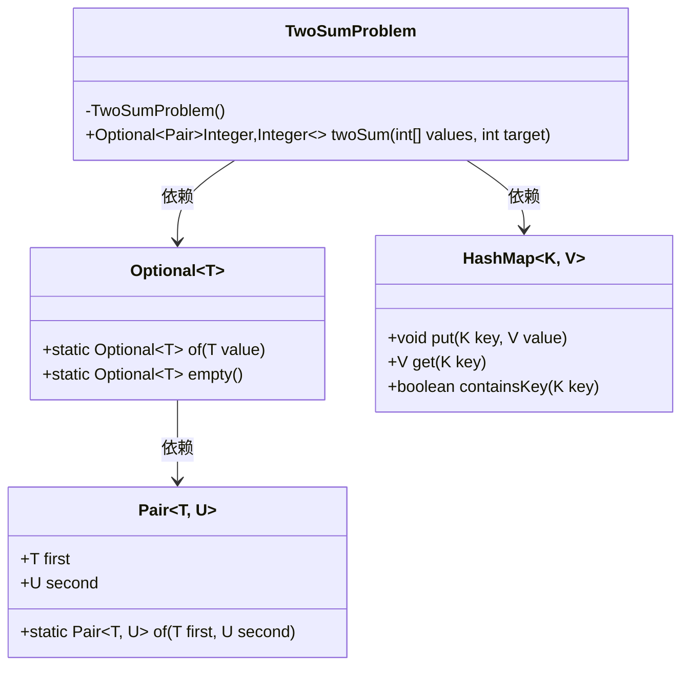
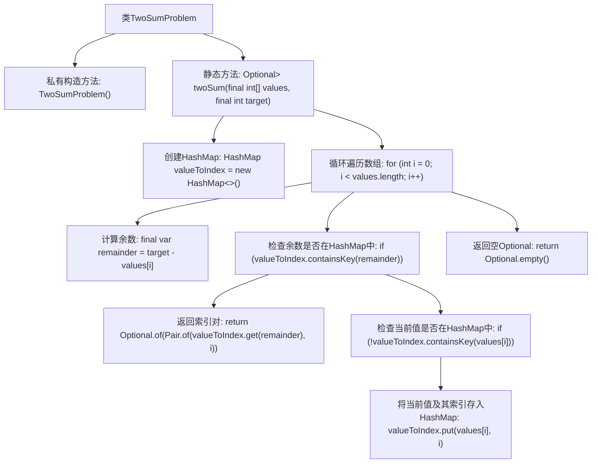

# 基础信息

|      |      |
|------|------|
| 名称 | TwoSumProblem |
| 编码语言 | .java |
| 代码路径 | Java/src/main/java/com/thealgorithms/misc/TwoSumProblem.java |
| 包名 | com.thealgorithms.misc |
| 依赖项 | ['java.util.HashMap', 'java.util.Optional', 'org.apache.commons.lang3.tuple.Pair'] |
| 概述说明 | TwoSumProblem类提供twoSum方法，查找数组中两数之和等于目标值的索引。 |

# 说明

TwoSumProblem类包含一个名为twoSum的方法，该方法用于在给定数组中查找两个数，使它们的和等于指定的目标值。该方法返回这两个数在数组中的索引。通过遍历数组，twoSum方法能够高效地找到满足条件的数对，并返回它们的索引位置。这一功能在解决与数组和求和相关的问题时非常实用。

# 类列表 Class Summary

| 名称   | 类型  | 说明 |
|-------|------|-------------|
| TwoSumProblem | class | TwoSumProblem类提供twoSum方法，查找数组中两数之和等于目标值的索引。 |

## 类 TwoSumProblem

|      |      |
|------|------|
| 访问范围 | public final |
| 类型 | class |
| 名称 | TwoSumProblem |
| 说明 | TwoSumProblem类提供twoSum方法，查找数组中两数之和等于目标值的索引。 |

### UML类图

### 描述
该代码实现了一个名为 `TwoSumProblem` 的类，用于解决两数之和问题。`twoSum` 方法接受一个整数数组和一个目标值，返回两个索引，使得数组中对应元素的和等于目标值。方法内部使用 `HashMap` 来存储数组元素及其索引，通过遍历数组查找满足条件的索引对。`Optional` 用于处理可能不存在解的情况，`Pair` 用于封装返回的索引对。

### 内部方法调用关系图

该流程图描述了`TwoSumProblem`类中的`twoSum`方法的执行流程。该方法通过遍历数组并使用`HashMap`来存储已访问过的值及其索引，寻找两个数的和等于目标值的情况。如果找到满足条件的两个数，则返回它们的索引；否则返回空`Optional`。整个流程展示了从初始化到最终返回结果的完整步骤。

### 字段列表 Field List

| 名称  | 类型  | 说明 |
|-------|-------|------|

### 方法列表 Method List

| 名称  | 类型  | 说明 |
|-------|-------|------|
| twoSum | Optional<Pair<Integer, Integer>> | 该方法通过哈希表查找数组中两数之和等于目标值的索引。 |

