# 基础信息

|      |      |
|------|------|
| 名称 | misc |
| 编码语言 | .java |
| 代码路径 | Java/src/main/java/com/thealgorithms/misc |
| 包名 | Java.src.main.java.com.thealgorithms.misc |
| 概述说明 | 功能涵盖颜色对比度、单词频率统计、中位数计算、回文判断、数组打乱、矩阵稀疏度、两数和、三数和、质数判断等。 |

# 说明

## 概述
该代码模块主要包含一系列用于处理常见算法和数据结构问题的工具类和方法。这些功能涵盖了颜色对比度计算、单词频率统计、中位数计算、回文判断、数组随机化、矩阵稀疏度计算、三数求和、两数求和、质数判断、数字反转、回文质数生成、有序数组范围查找等多个领域。通过这些工具类，开发者可以高效地解决各种与算法和数据处理相关的任务，提升代码的可读性和性能。

## 主要业务场景
1. **颜色对比度与亮度计算**：用于评估颜色组合的视觉效果，确保文本和背景颜色的可读性，适用于UI设计和可访问性优化。
2. **单词频率统计**：通过MapReduce方法统计大规模文本数据中单词的出现频率，适用于文本分析和数据处理任务。
3. **中位数计算**：支持动态数组的中位数计算，适用于需要频繁插入和查询中位数的场景，如实时数据处理和统计分析。
4. **回文判断**：提供两种方法判断单链表是否为回文，适用于链表数据结构的处理和验证。
5. **数组随机化**：采用Fisher-Yates算法打乱数组顺序，适用于需要随机排列数据的场景，如洗牌和随机抽样。
6. **矩阵稀疏度计算**：计算矩阵中零元素的比例，适用于稀疏矩阵的处理和优化。
7. **三数求和与两数求和**：分别解决三数之和为零和两数之和为目标值的问题，适用于数组处理和搜索算法。
8. **质数与回文质数生成**：判断质数、反转数字并生成回文质数，适用于数学计算和数字处理任务。
9. **有序数组范围查找**：在有序数组中查找指定元素的起始和结束位置，适用于数据范围查询和统计分析。

通过这些功能，该模块能够满足多种与算法和数据处理相关的业务需求，提升开发效率和代码质量。

### 包内部结构视图

```mermaid
graph TD
    misc --> ColorContrastRatio.java
    misc --> MapReduce.java
    misc --> MedianOfRunningArrayInteger.java
    misc --> MedianOfRunningArray.java
    misc --> MedianOfRunningArrayFloat.java
    misc --> PalindromeSinglyLinkedList.java
    misc --> ShuffleArray.java
    misc --> MedianOfRunningArrayLong.java
    misc --> MedianOfRunningArrayDouble.java
    misc --> ThreeSumProblem.java
    misc --> Sparsity.java
    misc --> TwoSumProblem.java
    misc --> MedianOfRunningArrayByte.java
    misc --> PalindromePrime.java
    misc --> RangeInSortedArray.java
```

该流程图展示了`misc`目录下的所有文件及其层级关系。`misc`作为根节点，直接连接了多个Java文件，这些文件涵盖了不同的算法和功能实现，如颜色对比度计算、数组洗牌、回文链表检测等。每个文件都直接依赖于`misc`目录，形成了一个简单的扁平结构。

# 文件列表 File List

| 名称   | 类型  | 说明 |
|-------|------|-------------|
| [RangeInSortedArray.java](RangeInSortedArray.md) | file | RangeInSortedArray类用于查找有序数组中指定元素的起止位置及小于该值的元素数量。 |
| [Sparsity.java](Sparsity.md) | file | Sparsity类通过零元素数除以矩阵总元素数计算矩阵稀疏度。 |
| [MedianOfRunningArrayLong.java](MedianOfRunningArrayLong.md) | file | MedianOfRunningArrayLong继承MedianOfRunningArray，计算Long类型平均值。 |
| [MedianOfRunningArrayInteger.java](MedianOfRunningArrayInteger.md) | file | MedianOfRunningArrayInteger继承MedianOfRunningArray，用于计算整数平均。 |
| [PalindromePrime.java](PalindromePrime.md) | file | 类PalindromePrime包含质数判断、数字反转及回文质数生成方法。 |
| [MedianOfRunningArrayByte.java](MedianOfRunningArrayByte.md) | file | MedianOfRunningArrayByte继承父类，重写calculateAverage方法计算Byte平均值。 |
| [TwoSumProblem.java](TwoSumProblem.md) | file | TwoSumProblem类提供twoSum方法，查找数组中两数之和等于目标值的索引。 |
| [ThreeSumProblem.java](ThreeSumProblem.md) | file | 三数求和解法：暴力、双指针、哈希表。 |
| [MedianOfRunningArrayDouble.java](MedianOfRunningArrayDouble.md) | file | MedianOfRunningArrayDouble继承MedianOfRunningArray，计算双精度浮点数平均值。 |
| [ShuffleArray.java](ShuffleArray.md) | file | ShuffleArray类采用Fisher-Yates算法实现数组随机打乱。 |
| [PalindromeSinglyLinkedList.java](PalindromeSinglyLinkedList.md) | file | 类PalindromeSinglyLinkedList提供栈和优化两种方法判断单链表回文。 |
| [MedianOfRunningArrayFloat.java](MedianOfRunningArrayFloat.md) | file | MedianOfRunningArrayFloat继承MedianOfRunningArray，计算Float类型平均值。 |
| [MedianOfRunningArray.java](MedianOfRunningArray.md) | file | 类使用最大堆和最小堆动态计算数组的中位数，支持插入和获取功能。 |
| [MapReduce.java](MapReduce.md) | file | MapReduce类统计句子单词频率并输出结果。 |
| [ColorContrastRatio.java](ColorContrastRatio.md) | file | 计算颜色对比度与相对亮度。 |

