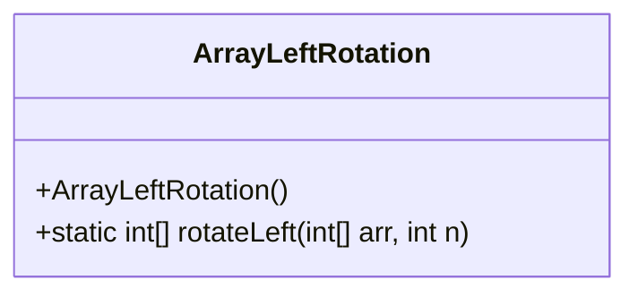
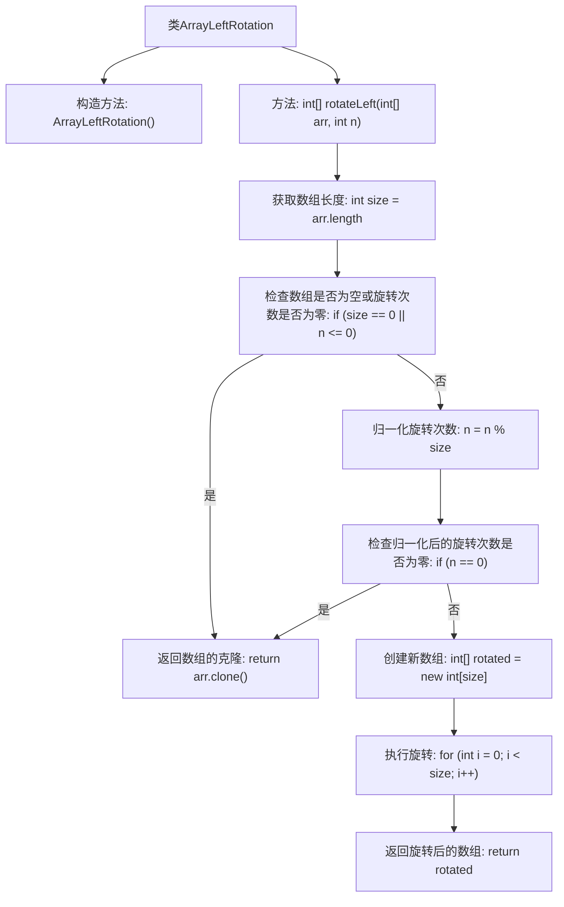

# 基础信息

|      |      |
|------|------|
| 名称 | ArrayLeftRotation |
| 编码语言 | .java |
| 代码路径 | Java/src/main/java/com/thealgorithms/others/ArrayLeftRotation.java |
| 包名 | com.thealgorithms.others |
| 依赖项 | [] |
| 概述说明 | 数组左旋转功能，返回旋转后的新数组。 |

# 说明

实现数组左旋转功能，返回新数组。该功能将数组中的元素向左移动指定次数，超出数组长度的部分从数组末尾重新开始排列。最终生成一个新的数组，其中元素位置按照左旋转后的顺序排列。此操作不改变原数组，仅返回旋转后的新数组。

# 类列表 Class Summary

| 名称   | 类型  | 说明 |
|-------|------|-------------|
| ArrayLeftRotation | class | 实现数组左旋转功能，返回新数组。 |

## 类 ArrayLeftRotation

|      |      |
|------|------|
| 访问范围 | public final |
| 类型 | class |
| 名称 | ArrayLeftRotation |
| 说明 | 实现数组左旋转功能，返回新数组。 |

### UML类图

这段代码定义了一个名为 `ArrayLeftRotation` 的类，该类包含一个私有的构造函数和一个静态方法 `rotateLeft`。`rotateLeft` 方法接受一个整数数组 `arr` 和一个整数 `n` 作为参数，并返回一个新的数组，该数组是输入数组 `arr` 向左旋转 `n` 个位置后的结果。方法首先处理数组为空或旋转次数为零的特殊情况，然后对旋转次数进行归一化处理，最后通过循环将数组元素重新排列到新数组中。

### 内部方法调用关系图

这段代码定义了一个名为 `ArrayLeftRotation` 的类，其中包含一个静态方法 `rotateLeft`，用于对数组进行左旋转操作。流程图展示了方法的执行步骤，包括检查数组是否为空或旋转次数是否为零、归一化旋转次数、创建新数组以及执行旋转操作。最终，方法返回旋转后的数组。

### 字段列表 Field List

| 名称  | 类型  | 说明 |
|-------|-------|------|

### 方法列表 Method List

| 名称  | 类型  | 说明 |
|-------|-------|------|
| rotateLeft | int[] | 该方法将数组左旋n次，处理空数组和零旋转，返回新数组。 |

