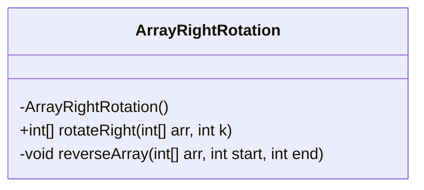
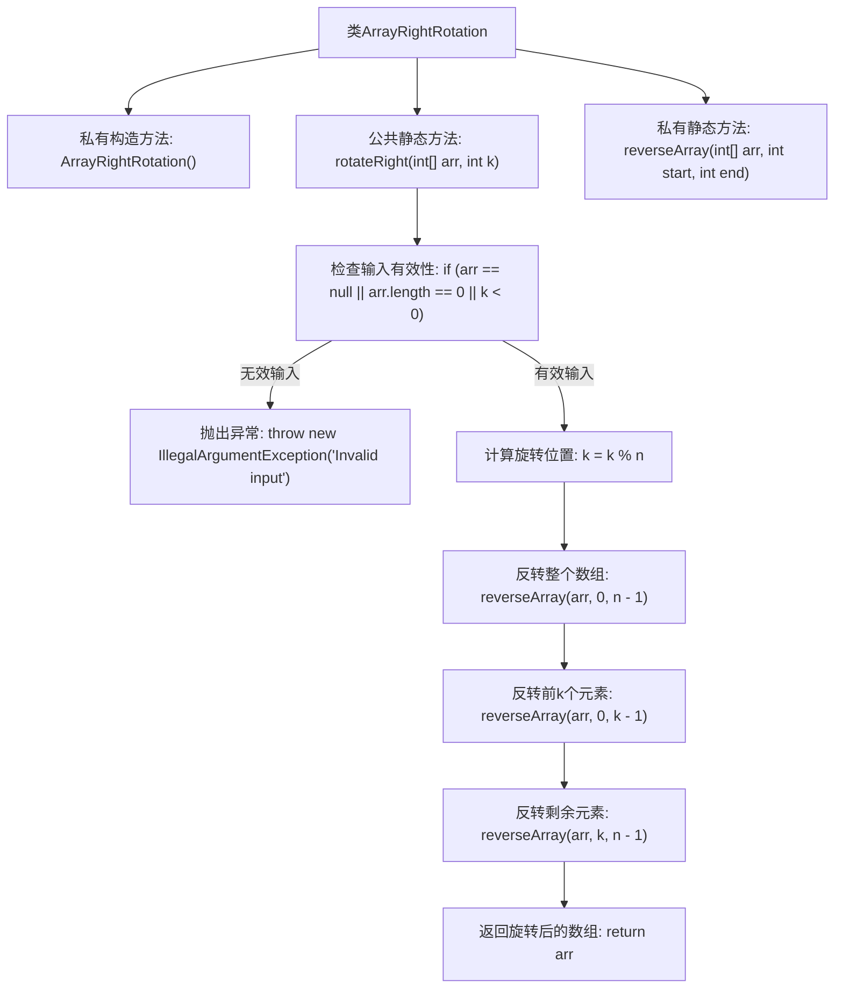

# 基础信息

|      |      |
|------|------|
| 名称 | ArrayRightRotation |
| 编码语言 | .java |
| 代码路径 | Java/src/main/java/com/thealgorithms/others/ArrayRightRotation.java |
| 包名 | com.thealgorithms.others |
| 依赖项 | [] |
| 概述说明 | 数组右旋方法利用三次反转处理异常输入。 |

# 说明

数组右旋方法通过三次反转实现，具体步骤为：首先反转整个数组，然后反转前k个元素，最后反转剩余元素。该方法在处理异常输入时，会进行边界检查和输入验证，确保k值在有效范围内，避免数组越界或其他错误。这种实现方式高效且简洁，适用于各种编程语言和场景。

# 类列表 Class Summary

| 名称   | 类型  | 说明 |
|-------|------|-------------|
| ArrayRightRotation | class | 数组右旋方法，通过三次反转实现，处理异常输入。 |

## 类 ArrayRightRotation

|      |      |
|------|------|
| 访问范围 | public final |
| 类型 | class |
| 名称 | ArrayRightRotation |
| 说明 | 数组右旋方法，通过三次反转实现，处理异常输入。 |

### UML类图

**描述：**  
`ArrayRightRotation` 是一个工具类，用于对整数数组进行右旋转操作。它包含一个私有的构造函数，防止类被实例化。类中定义了两个方法：`rotateRight` 和 `reverseArray`。`rotateRight` 方法接受一个整数数组和一个旋转位置数 `k`，返回右旋转后的数组。`reverseArray` 方法用于反转数组中指定范围内的元素。该类通过三次反转操作实现数组的右旋转，确保代码高效且易于理解。

### 内部方法调用关系图

这段代码定义了一个名为 `ArrayRightRotation` 的类，该类包含一个私有构造方法和两个静态方法。`rotateRight` 方法用于将数组向右旋转指定位置，通过三次反转操作实现。`reverseArray` 方法用于反转数组中指定范围的元素。流程图展示了方法的调用顺序和逻辑流程，从输入检查到数组旋转的完整过程。

### 字段列表 Field List

| 名称  | 类型  | 说明 |
|-------|-------|------|

### 方法列表 Method List

| 名称  | 类型  | 说明 |
|-------|-------|------|
| reverseArray | void | 反转数组指定区间内的元素。 |
| rotateRight | int[] | 数组右旋k位，处理无效输入，优化k值，三次反转实现。 |

