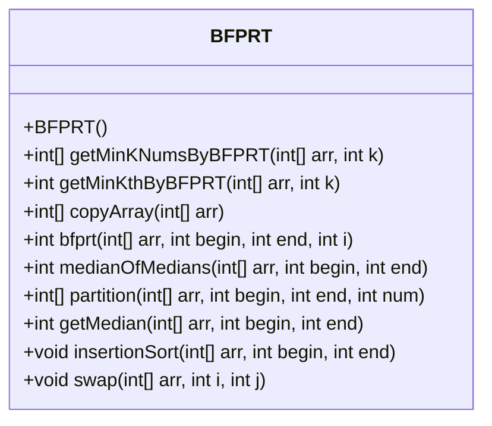
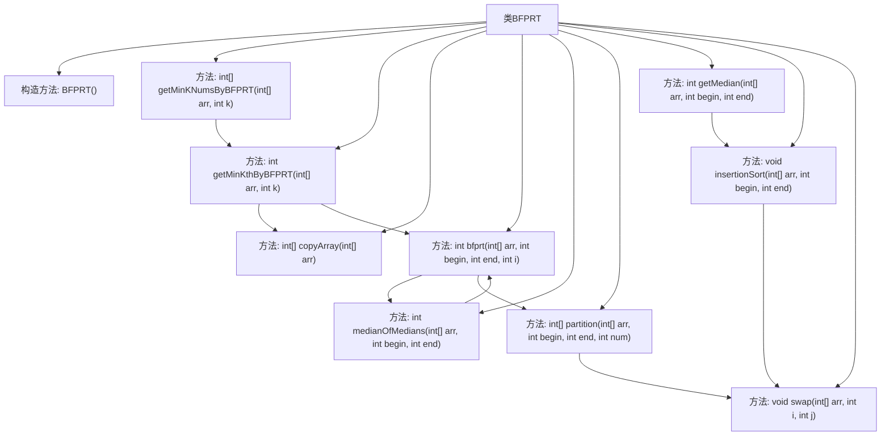

# 基础信息

|      |      |
|------|------|
| 名称 | BFPRT |
| 编码语言 | .java |
| 代码路径 | Java/src/main/java/com/thealgorithms/others/BFPRT.java |
| 包名 | com.thealgorithms.others |
| 依赖项 | [] |
| 概述说明 | BFPRT算法用于查找数组中最小k个元素，涵盖复制、分区和中位数选择。 |

# 说明

BFPRT算法用于查找数组中最小的k个元素，包含复制、分区和中位数选择等功能。首先，算法通过复制数组确保原始数据不变。接着，使用分区方法将数组划分为若干子集，确保每个子集的中位数能够准确反映整体数据分布。然后，通过中位数选择步骤确定中位数的中位数，作为分区的基准点。最后，根据分区结果递归处理，逐步缩小查找范围，最终找到最小的k个元素。该算法通过精确的中位数选择和分区策略，确保高效且准确地完成查找任务。

# 类列表 Class Summary

| 名称   | 类型  | 说明 |
|-------|------|-------------|
| BFPRT | class | BFPRT算法实现数组中最小的k个元素查找，包含复制、分区、中位数选择等功能。 |

## 类 BFPRT

|      |      |
|------|------|
| 访问范围 | public final |
| 类型 | class |
| 名称 | BFPRT |
| 说明 | BFPRT算法实现数组中最小的k个元素查找，包含复制、分区、中位数选择等功能。 |

### UML类图

**描述：**  
`BFPRT`类实现了BFPRT算法，用于在未排序的数组中找到第k小的元素或前k个最小元素。该类包含多个静态方法，包括`getMinKNumsByBFPRT`、`getMinKthByBFPRT`、`copyArray`、`bfprt`、`medianOfMedians`、`partition`、`getMedian`、`insertionSort`和`swap`。这些方法共同协作，通过递归和分治策略，高效地找到目标元素。BFPRT算法的时间复杂度为O(n)，适用于大规模数据处理。

### 内部方法调用关系图

这段代码实现了BFPRT算法，用于查找数组中第k小的元素。代码首先检查k的有效性，然后通过递归调用`bfprt`方法找到第k小的元素，并使用该元素生成包含前k小元素的数组。`bfprt`方法通过`medianOfMedians`找到中位数作为基准，并使用`partition`方法将数组划分为小于、等于和大于基准的三部分。`insertionSort`和`swap`方法用于排序和交换数组元素。整个流程展示了BFPRT算法的核心步骤，包括中位数的选择、数组的划分和递归处理。

### 字段列表 Field List

| 名称  | 类型  | 说明 |
|-------|-------|------|

### 方法列表 Method List

| 名称  | 类型  | 说明 |
|-------|-------|------|
| swap | void | 交换数组中两个元素的位置。 |
| medianOfMedians | int | 计算数组中位数的中位数，用于BFPRT算法。 |
| copyArray | int[] | 静态方法复制整型数组并返回副本。 |
| getMinKNumsByBFPRT | int[] | 使用BFPRT算法获取数组中前k个最小数。 |
| getMedian | int | 静态方法`getMedian`通过插入排序获取数组指定范围的中间值。 |
| bfprt | int | BFPRT算法通过中位数选取和分区递归查找数组中第i小元素。 |
| getMinKthByBFPRT | int | 使用BFPRT算法获取数组中第k小元素。 |
| insertionSort | void | 插入排序算法，对数组指定区间进行排序，通过交换实现升序排列。 |
| partition | int[] | 该方法对数组进行分区，小于num的放左边，大于num的放右边，返回分区边界。 |

