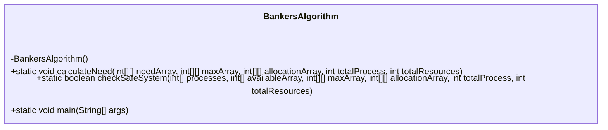
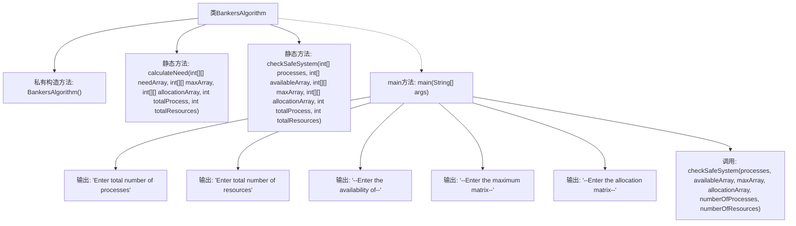

# 基础信息

|      |      |
|------|------|
| 名称 | BankersAlgorithm |
| 编码语言 | .java |
| 代码路径 | Java/src/main/java/com/thealgorithms/others/BankersAlgorithm.java |
| 包名 | com.thealgorithms.others |
| 依赖项 | ['java.util.Scanner'] |
| 概述说明 | 银行家算法实现，计算进程需求并检查系统安全状态。 |

# 说明

银行家算法是一种用于操作系统中的资源分配和死锁避免的算法。该算法通过计算进程的资源需求，并检查系统的安全状态，确保资源分配不会导致系统进入不安全状态，从而避免死锁的发生。具体步骤包括：初始化系统资源，记录每个进程的最大需求、已分配资源和剩余需求，通过安全性检查算法判断系统是否处于安全状态。如果系统安全，则允许资源分配；否则，拒绝分配，防止死锁。

# 类列表 Class Summary

| 名称   | 类型  | 说明 |
|-------|------|-------------|
| BankersAlgorithm | class | 银行家算法实现，计算进程需求并检查系统安全状态。 |

## 类 BankersAlgorithm

|      |      |
|------|------|
| 访问范围 | public final |
| 类型 | class |
| 名称 | BankersAlgorithm |
| 说明 | 银行家算法实现，计算进程需求并检查系统安全状态。 |

### UML类图

**描述：**  
`BankersAlgorithm` 类实现了银行家算法，用于检测系统是否处于安全状态。该类包含三个静态方法：`calculateNeed` 用于计算每个进程的资源需求，`checkSafeSystem` 用于检查系统是否处于安全状态并输出安全序列，`main` 方法用于从用户输入中获取进程和资源信息，并调用 `checkSafeSystem` 进行安全性检查。该类通过计算资源需求和可用资源来确保系统不会进入死锁状态。

### 内部方法调用关系图

这段代码实现了银行家算法，用于检测系统是否处于安全状态。代码首先通过`calculateNeed`方法计算每个进程的资源需求，然后在`checkSafeSystem`方法中检查系统是否处于安全状态。`main`方法负责获取用户输入并调用`checkSafeSystem`方法进行检测。流程图展示了类中的方法调用关系和主要步骤。

### 字段列表 Field List

| 名称  | 类型  | 说明 |
|-------|-------|------|

### 方法列表 Method List

| 名称  | 类型  | 说明 |
|-------|-------|------|
| calculateNeed | void | 计算进程需求矩阵，通过最大矩阵减去分配矩阵。 |
| main | void | Java程序输入进程和资源信息，检查系统安全性。 |
| checkSafeSystem | boolean | 检查系统是否处于安全状态，计算需求矩阵，遍历进程寻找安全序列。 |

