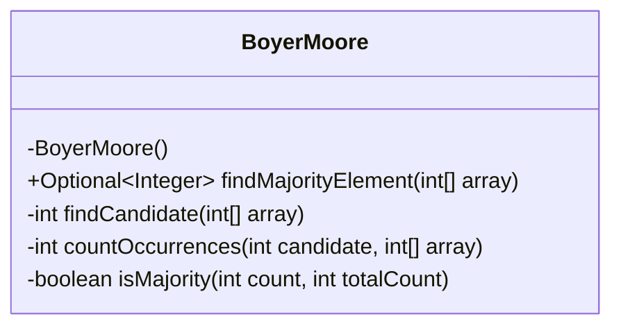
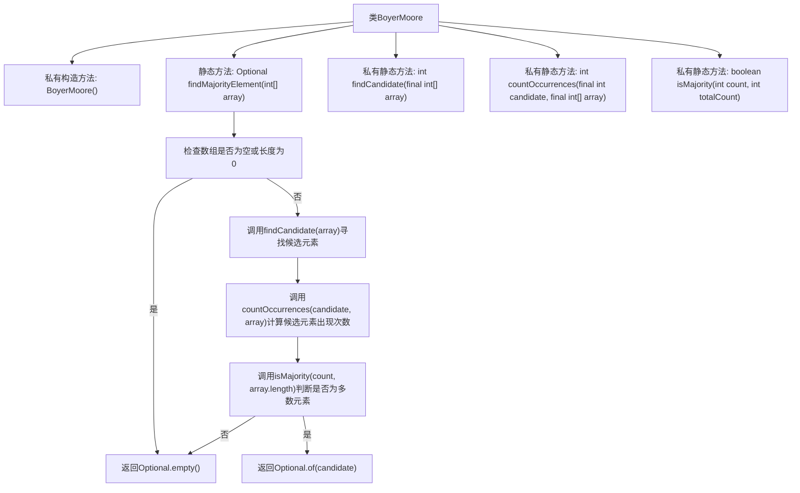

# 基础信息

|      |      |
|------|------|
| 名称 | BoyerMoore |
| 编码语言 | .java |
| 代码路径 | Java/src/main/java/com/thealgorithms/others/BoyerMoore.java |
| 包名 | com.thealgorithms.others |
| 依赖项 | ['java.util.Optional'] |
| 概述说明 | BoyerMoore类通过投票算法寻找数组多数元素。 |

# 说明

BoyerMoore类采用投票算法来高效地查找数组中的多数元素。该算法通过遍历数组，维护一个候选元素及其计数。在遍历过程中，如果当前元素与候选元素相同，则计数增加；否则计数减少。当计数降为零时，更新候选元素为当前元素。最终，候选元素即为数组中的多数元素。这种方法具有线性时间复杂度，适用于大规模数据处理。

# 类列表 Class Summary

| 名称   | 类型  | 说明 |
|-------|------|-------------|
| BoyerMoore | class | BoyerMoore类使用投票算法查找数组中的多数元素。 |

## 类 BoyerMoore

|      |      |
|------|------|
| 访问范围 | public final |
| 类型 | class |
| 名称 | BoyerMoore |
| 说明 | BoyerMoore类使用投票算法查找数组中的多数元素。 |

### UML类图

这段代码定义了一个名为 `BoyerMoore` 的类，用于查找数组中的多数元素。该类包含一个私有的构造函数，防止实例化。`findMajorityElement` 方法通过调用 `findCandidate`、`countOccurrences` 和 `isMajority` 三个私有方法来确定是否存在多数元素，并返回一个 `Optional<Integer>` 结果。`findCandidate` 方法使用 Boyer-Moore 投票算法找出候选元素，`countOccurrences` 方法计算候选元素在数组中的出现次数，`isMajority` 方法判断候选元素是否为多数元素。

### 内部方法调用关系图

这段代码实现了Boyer-Moore投票算法，用于在数组中查找多数元素。首先，`findMajorityElement`方法检查数组是否为空或长度为0，如果是则返回空Optional。否则，调用`findCandidate`方法寻找候选元素，然后通过`countOccurrences`方法计算该候选元素在数组中的出现次数，最后通过`isMajority`方法判断该元素是否为多数元素。如果是，则返回包含该元素的Optional，否则返回空Optional。

### 字段列表 Field List

| 名称  | 类型  | 说明 |
|-------|-------|------|

### 方法列表 Method List

| 名称  | 类型  | 说明 |
|-------|-------|------|
| countOccurrences | int | 统计数组中特定值出现的次数。 |
| findMajorityElement | Optional<Integer> | 方法查找数组中的多数元素，若存在则返回。 |
| findCandidate | int | 该方法通过遍历数组，找到可能的主要候选元素。 |
| isMajority | boolean | 判断count是否超过总数的一半。 |

