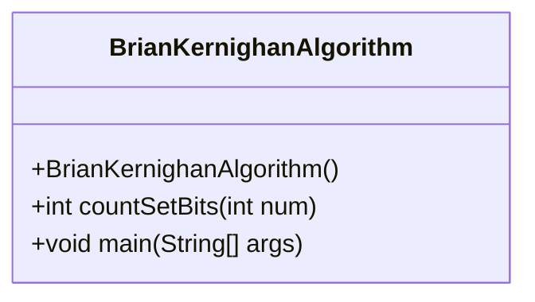
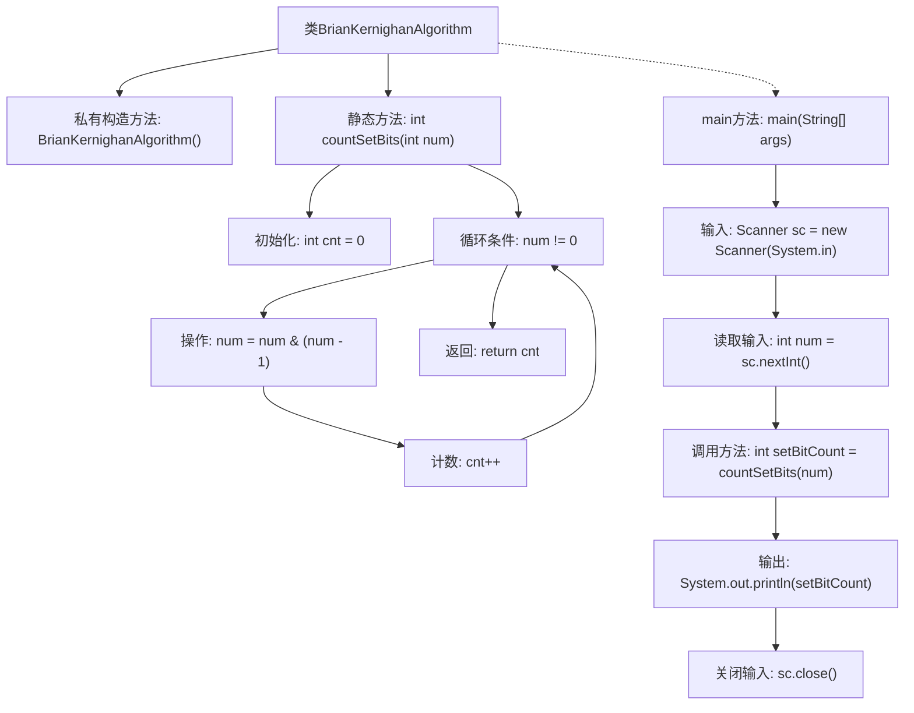

# 基础信息

|      |      |
|------|------|
| 名称 | BrianKernighanAlgorithm |
| 编码语言 | .java |
| 代码路径 | Java/src/main/java/com/thealgorithms/others/BrianKernighanAlgorithm.java |
| 包名 | com.thealgorithms.others |
| 依赖项 | ['java.util.Scanner'] |
| 概述说明 | BrianKernighan算法实现Java计算整数置位数。 |

# 说明

BrianKernighan算法是一种高效计算整数中置位数（即二进制表示中1的个数）的方法。该算法通过不断将整数与其减一后的值进行按位与操作，逐步消除最低位的1，直到整数变为0。每次操作都意味着找到一个1，从而累计得到1的总数。这种方法避免了逐位检查，显著提高了计算效率。在Java实现中，通过循环和按位与操作，可以简洁地实现这一算法。

# 类列表 Class Summary

| 名称   | 类型  | 说明 |
|-------|------|-------------|
| BrianKernighanAlgorithm | class | BrianKernighan算法计算整数中置位数的Java实现。 |

## 类 BrianKernighanAlgorithm

|      |      |
|------|------|
| 访问范围 | public final |
| 类型 | class |
| 名称 | BrianKernighanAlgorithm |
| 说明 | BrianKernighan算法计算整数中置位数的Java实现。 |

### UML类图

**描述：**  
`BrianKernighanAlgorithm` 类包含一个私有构造函数，确保该类不能被实例化。类中定义了一个静态方法 `countSetBits`，用于计算给定整数中二进制表示中置位（即值为1的位）的数量。该方法通过不断将数字与减1后的自身进行按位与操作，直到数字变为0，从而高效地计算置位数量。`main` 方法从标准输入读取一个整数，调用 `countSetBits` 方法计算置位数量，并输出结果。该类展示了如何使用 Brian Kernighan 算法高效地计算二进制数中的置位数量。

### 内部方法调用关系图

这段代码实现了一个名为BrianKernighanAlgorithm的类，其中包含一个静态方法`countSetBits`，用于计算给定整数中置位（即二进制表示中为1的位）的数量。该方法通过不断将数字与自身减一的结果进行按位与操作，直到数字变为0，从而高效地计算置位数量。`main`方法从标准输入读取一个整数，调用`countSetBits`方法计算置位数量，并输出结果。流程图清晰地展示了类结构、方法调用以及程序执行的流程。

### 字段列表 Field List

| 名称  | 类型  | 说明 |
|-------|-------|------|

### 方法列表 Method List

| 名称  | 类型  | 说明 |
|-------|-------|------|
| countSetBits | int | 静态方法计算整数二进制中1的个数。 |
| main | void | Java程序读取整数并输出其二进制中1的个数。 |

