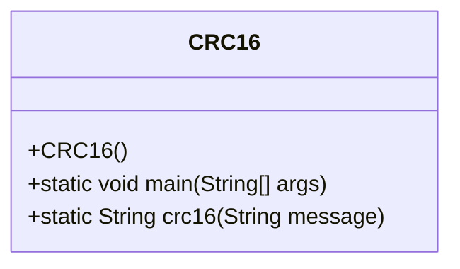
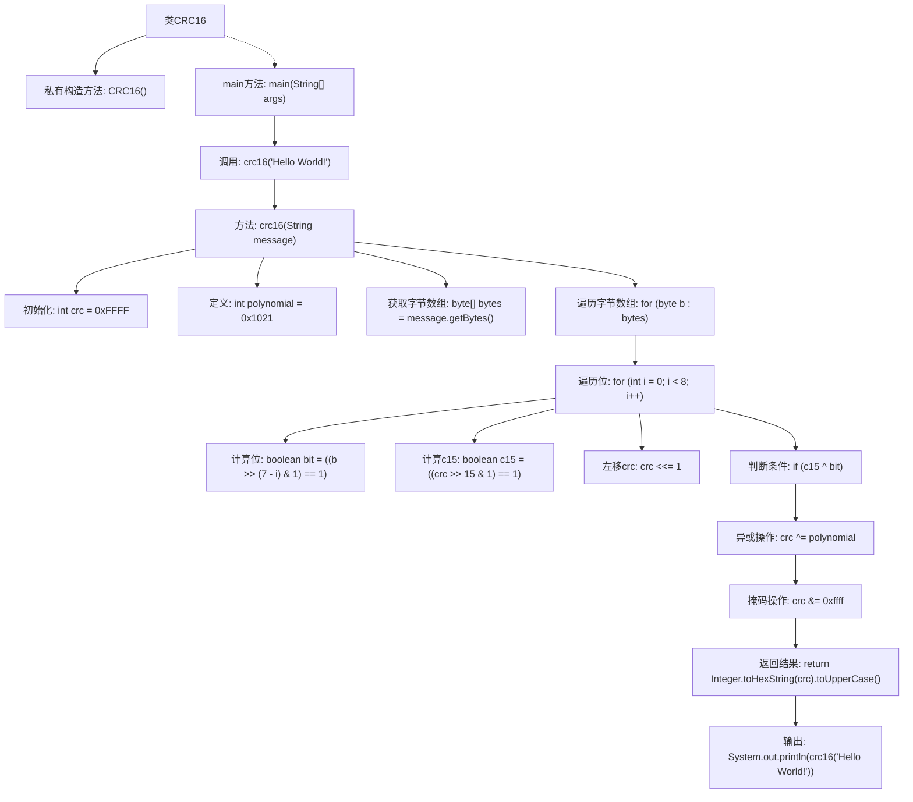

# 基础信息

|      |      |
|------|------|
| 名称 | CRC16 |
| 编码语言 | .java |
| 代码路径 | Java/src/main/java/com/thealgorithms/others/CRC16.java |
| 包名 | com.thealgorithms.others |
| 依赖项 | [] |
| 概述说明 | CRC16类用于计算字符串的CRC16校验值并输出。 |

# 说明

CRC16类实现了CRC16校验算法，用于计算给定字符串的CRC16值并输出结果。该算法通过对字符串中的每个字符进行特定的数学运算，生成一个16位的校验值，通常用于数据完整性验证和错误检测。CRC16校验值可以有效地检测数据传输或存储过程中的错误，确保数据的准确性和可靠性。

# 类列表 Class Summary

| 名称   | 类型  | 说明 |
|-------|------|-------------|
| CRC16 | class | CRC16类实现CRC16校验算法，计算字符串的CRC16值并输出。 |

## 类 CRC16

|      |      |
|------|------|
| 访问范围 | public final |
| 类型 | class |
| 名称 | CRC16 |
| 说明 | CRC16类实现CRC16校验算法，计算字符串的CRC16值并输出。 |

### UML类图

这段代码定义了一个名为 `CRC16` 的类，该类包含一个私有构造函数和一个静态方法 `crc16`，用于计算给定字符串的 CRC16 校验值。`crc16` 方法通过遍历字符串的每个字节，并根据多项式进行位运算来计算校验值，最终返回一个十六进制字符串表示的校验结果。`main` 方法用于测试 `crc16` 方法，输出字符串 "Hello World!" 的 CRC16 校验值。

### 内部方法调用关系图

这段代码实现了一个CRC16校验算法，用于计算给定字符串的CRC16校验值。代码首先初始化CRC值和多项式，然后遍历字符串的每个字节和每个位，通过位运算和异或操作逐步计算CRC值，最后返回计算结果的十六进制表示。该算法适用于数据校验和错误检测场景。

### 字段列表 Field List

| 名称  | 类型  | 说明 |
|-------|-------|------|

### 方法列表 Method List

| 名称  | 类型  | 说明 |
|-------|-------|------|
| main | void | Java主方法调用crc16函数输出字符串的CRC16校验值。 |
| crc16 | String | 该方法计算字符串的CRC16校验值，使用初始值0xFFFF和多项式0x1021。 |

