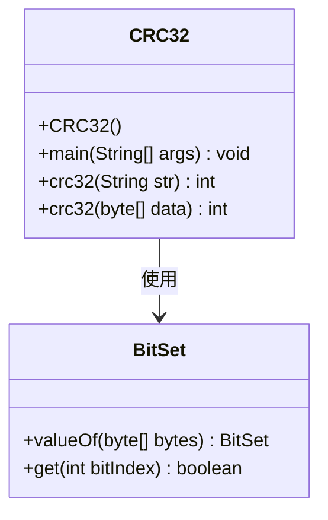
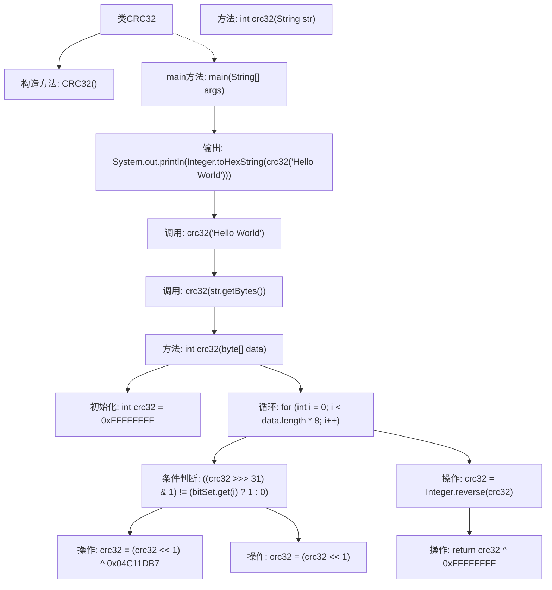

# 基础信息

|      |      |
|------|------|
| 名称 | CRC32 |
| 编码语言 | .java |
| 代码路径 | Java/src/main/java/com/thealgorithms/others/CRC32.java |
| 包名 | com.thealgorithms.others |
| 依赖项 | ['java.util.BitSet'] |
| 概述说明 | CRC32类实现CRC32校验，支持字符串和字节数组输入，输出十六进制校验值。 |

# 说明

CRC32类实现了CRC32校验算法，能够处理字符串和字节数组作为输入数据，并生成对应的十六进制校验值。该功能适用于需要数据完整性验证的场景，确保输入数据的准确性和一致性。通过该方法，用户可以方便地获取数据的CRC32校验结果，用于校验或比对操作。

# 类列表 Class Summary

| 名称   | 类型  | 说明 |
|-------|------|-------------|
| CRC32 | class | CRC32类实现CRC32校验算法，支持字符串和字节数组输入，输出十六进制校验值。 |

## 类 CRC32

|      |      |
|------|------|
| 访问范围 | public final |
| 类型 | class |
| 名称 | CRC32 |
| 说明 | CRC32类实现CRC32校验算法，支持字符串和字节数组输入，输出十六进制校验值。 |

### UML类图

这段代码定义了一个 `CRC32` 类，用于计算字符串或字节数组的 CRC32 校验值。`CRC32` 类包含一个私有的构造函数，防止外部实例化。它提供了两个静态方法 `crc32`，分别接受字符串和字节数组作为输入，并返回计算出的 CRC32 值。在计算过程中，使用了 `BitSet` 类来处理字节数组的位操作。代码的核心逻辑是通过位运算和多项式异或来逐步计算 CRC32 值，最后进行结果反射和最终异或操作，得到最终的校验值。

### 内部方法调用关系图

这段代码实现了一个CRC32校验算法。首先，`main`方法调用`crc32`方法计算字符串"Hello World"的CRC32值，并将其转换为十六进制字符串输出。`crc32`方法有两个重载版本，一个接受字符串，另一个接受字节数组。字节数组版本通过`BitSet`处理数据，初始化CRC32值为0xFFFFFFFF，然后通过循环对每个位进行异或操作，最后对结果进行反转和异或操作，返回最终的CRC32值。

### 字段列表 Field List

| 名称  | 类型  | 说明 |
|-------|-------|------|

### 方法列表 Method List

| 名称  | 类型  | 说明 |
|-------|-------|------|
| crc32 | int | 该方法计算字节数组的CRC32校验值，通过位操作和多项式异或实现。 |
| main | void | Java代码示例：计算字符串"Hello World"的CRC32哈希值并输出十六进制结果。 |
| crc32 | int | 该方法计算字符串的CRC32校验值，通过字节数组实现。 |

