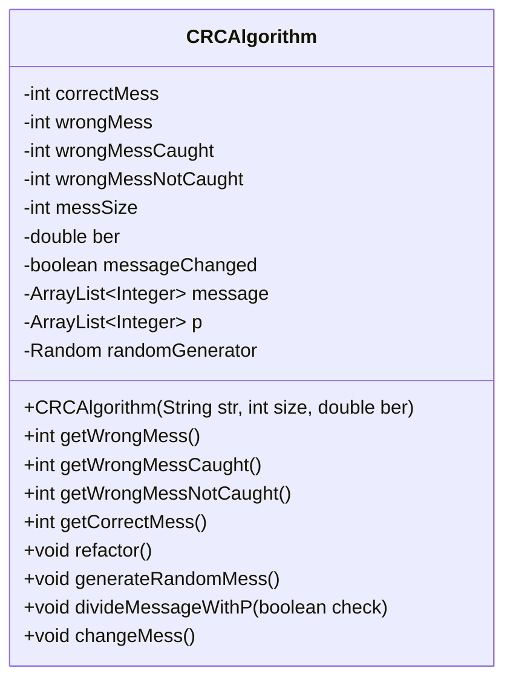

# 基础信息

|      |      |
|------|------|
| 名称 | CRCAlgorithm |
| 编码语言 | .java |
| 代码路径 | Java/src/main/java/com/thealgorithms/others/CRCAlgorithm.java |
| 包名 | com.thealgorithms.others |
| 依赖项 | ['java.util.ArrayList', 'java.util.Random', 'java.util.concurrent.ThreadLocalRandom'] |
| 概述说明 | CRC算法类用于生成随机消息，检测错误，支持消息重构和错误率控制。 |

# 说明

CRC算法类是一种用于生成随机消息并检测错误的工具，支持消息重构和错误率控制。该算法类通过生成随机消息，能够有效检测数据传输或存储过程中可能出现的错误，并允许对消息进行重构以提高数据的完整性和准确性。此外，CRC算法类还提供了错误率控制功能，使用户能够根据需求调整错误检测的敏感度，确保在不同应用场景下实现高效且可靠的数据校验。

# 类列表 Class Summary

| 名称   | 类型  | 说明 |
|-------|------|-------------|
| CRCAlgorithm | class | CRC算法类，用于生成随机消息并检测错误，支持消息重构和错误率控制。 |

## 类 CRCAlgorithm

|      |      |
|------|------|
| 访问范围 | public |
| 类型 | class |
| 名称 | CRCAlgorithm |
| 说明 | CRC算法类，用于生成随机消息并检测错误，支持消息重构和错误率控制。 |

### UML类图

### 描述
`CRCAlgorithm` 类实现了CRC（循环冗余校验）算法，用于检测和纠正数据传输中的错误。类中包含多个私有变量，用于记录正确和错误消息的数量，以及消息的大小和比特错误率（BER）。类提供了生成随机消息、根据BER改变消息、以及通过CRC算法校验消息的方法。通过这些方法，类能够统计在传输过程中被检测到的错误消息和未被检测到的错误消息的数量。

### 内部方法调用关系图

```mermaid
graph TD
    A["类CRCAlgorithm"]
    B["属性: int correctMess"]
    C["属性: int wrongMess"]
    D["属性: int wrongMessCaught"]
    E["属性: int wrongMessNotCaught"]
    F["属性: int messSize"]
    G["属性: double ber"]
    H["属性: boolean messageChanged"]
    I["属性: ArrayList<Integer> message"]
    J["属性: ArrayList<Integer> p"]
    K["属性: Random randomGenerator"]
    L["构造方法: CRCAlgorithm(String str, int size, double ber)"]
    M["方法: int getWrongMess()"]
    N["方法: int getWrongMessCaught()"]
    O["方法: int getWrongMessNotCaught()"]
    P["方法: int getCorrectMess()"]
    Q["方法: void refactor()"]
    R["方法: void generateRandomMess()"]
    S["方法: void divideMessageWithP(boolean check)"]
    T["方法: void changeMess()"]

    A --> B
    A --> C
    A --> D
    A --> E
    A --> F
    A --> G
    A --> H
    A --> I
    A --> J
    A --> K
    A --> L
    A --> M
    A --> N
    A --> O
    A --> P
    A --> Q
    A --> R
    A --> S
    A --> T
```

这段代码定义了一个名为 `CRCAlgorithm` 的类，用于实现CRC（循环冗余校验）算法。该类包含多个属性，用于跟踪正确和错误消息的数量、消息大小、误码率（BER）等。构造方法初始化这些属性，并提供了多个方法来生成随机消息、进行CRC校验、改变消息内容以及重置对象状态。代码的核心功能是通过CRC算法检测和纠正传输中的错误消息，并根据误码率模拟消息在传输过程中可能发生的错误。

### 字段列表 Field List

| 名称  | 类型  | 说明 |
|-------|-------|------|
| wrongMessNotCaught | int | 未捕获的错误消息计数器。 |
| wrongMess | int | 定义了一个私有的整型变量wrongMess。 |
| messSize | int | 定义私有整型变量messSize。 |
| messageChanged | boolean | 私有布尔变量，用于标记消息是否改变。 |
| message | ArrayList<Integer> | 私有整型数组列表存储消息。 |
| wrongMessCaught | int | 私有整型变量wrongMessCaught。 |
| randomGenerator | Random | 声明一个私有随机数生成器实例。 |
| p | ArrayList<Integer> | 私有整数数组列表p。 |
| ber | double | 定义了一个私有的双精度浮点型变量ber。 |
| correctMess | int | 私有整型变量correctMess用于存储正确消息的数量。 |

### 方法列表 Method List

| 名称  | 类型  | 说明 |
|-------|-------|------|
| getWrongMessNotCaught | int | 方法返回未捕获的错误消息数量。 |
| getWrongMessCaught | int | 方法返回错误消息捕获数。 |
| getWrongMess | int | 获取错误信息的整数值。 |
| refactor | void | 重构方法初始化消息列表并重置变更状态。 |
| getCorrectMess | int | 获取正确消息的整数值方法。 |
| divideMessageWithP | void | 方法根据布尔参数处理消息列表，检查并更新消息状态。 |
| generateRandomMess | void | 生成随机消息，大小为messSize，内容为0或1。 |
| changeMess | void | 方法遍历消息数组，随机生成数若小于阈值则翻转位，并计数错误消息。 |

