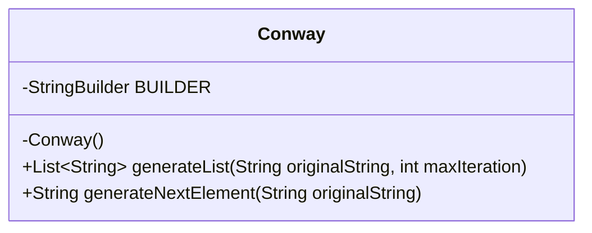
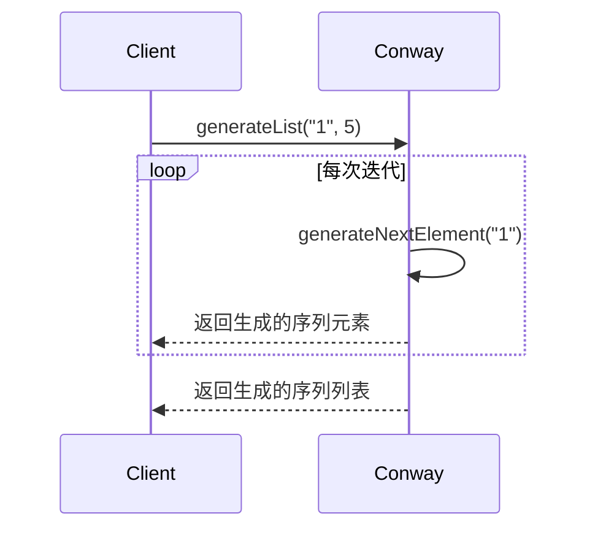
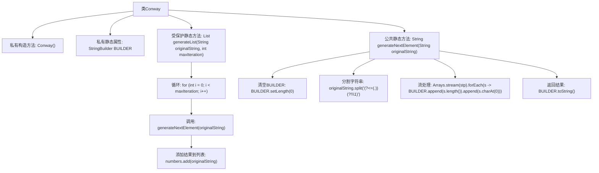

# 基础信息

|      |      |
|------|------|
| 名称 | Conway |
| 编码语言 | .java |
| 代码路径 | Java/src/main/java/com/thealgorithms/others/Conway.java |
| 包名 | com.thealgorithms.others |
| 依赖项 | ['java.util.ArrayList', 'java.util.Arrays', 'java.util.List'] |
| 概述说明 | Conway类生成“数数并说”序列，支持指定次数元素生成。 |

# 说明

Conway类用于生成“数数并说”序列，能够根据指定次数生成序列中的元素。该序列通过描述前一个数字的组成来生成下一个数字，例如从1开始，下一个数字是“一个1”即11，再下一个是“两个1”即21，依此类推。该类的主要功能是支持用户输入一个次数参数，自动生成对应次数的序列元素，便于用户快速获取所需序列内容。

# 类列表 Class Summary

| 名称   | 类型  | 说明 |
|-------|------|-------------|
| Conway | class | Conway类生成“数数并说”序列，支持生成指定次数的序列元素。 |

## 类 Conway

|      |      |
|------|------|
| 访问范围 | public final |
| 类型 | class |
| 名称 | Conway |
| 说明 | Conway类生成“数数并说”序列，支持生成指定次数的序列元素。 |

### UML类图

### 描述
`Conway` 类用于生成康威序列（也称为“数数序列”）。该类包含一个私有的 `StringBuilder` 对象 `BUILDER`，用于在生成序列时构建字符串。`generateList` 方法根据初始字符串和最大迭代次数生成序列列表，而 `generateNextElement` 方法则根据当前字符串生成下一个序列元素。该类通过将字符串分割并计数相同字符的连续出现次数来生成序列。

### 内部方法调用关系图

**描述：**
该代码实现了一个生成康威序列（也称为“看与说”序列）的类`Conway`。类中包含一个私有构造方法，防止实例化。`generateList`方法通过多次调用`generateNextElement`方法生成序列，并将结果存储在列表中返回。`generateNextElement`方法通过分割字符串并计算相同字符的数量来生成下一个序列元素。整个流程通过循环和流处理实现，最终返回生成的序列字符串。

### 字段列表 Field List

| 名称  | 类型  | 说明 |
|-------|-------|------|
| BUILDER = new StringBuilder() | StringBuilder | 定义私有的静态StringBuilder对象BUILDER。 |

### 方法列表 Method List

| 名称  | 类型  | 说明 |
|-------|-------|------|
| generateList | List<String> | 生成字符串列表，通过迭代更新原始字符串，最多迭代指定次数。 |
| generateNextElement | String | 静态方法生成字符串的下一个元素，通过分割原字符串并统计字符重复次数。 |

